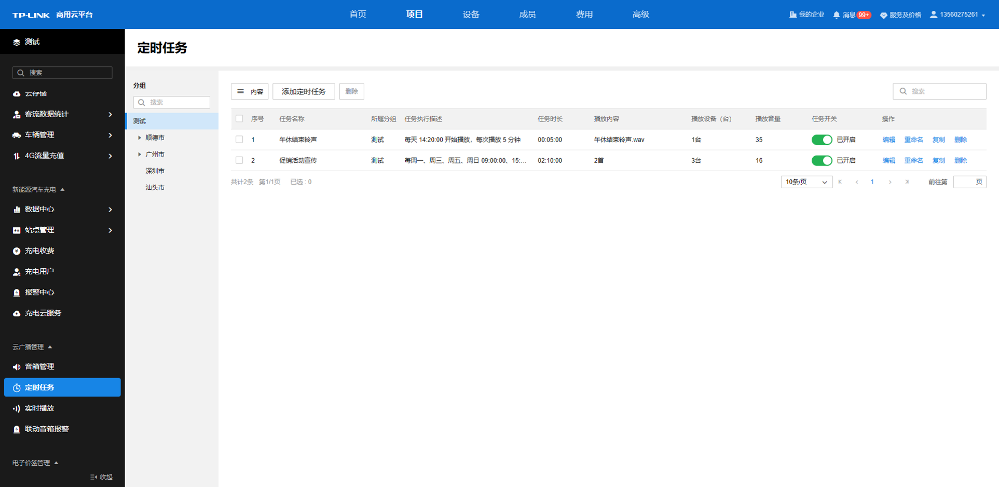
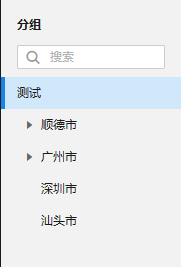

# 定时任务

**进入页面的方法：项目** **> >** **云广播管理** **> >** **定时任务**

TP-LINK 商用云平台定时任务界面可自由添加、编辑、删除定时任务，根据场景需要，灵活制定业务广播、背景音乐、特殊事件广播等。也可定义广播任务播放规则、有效时间、广播设备等，广播功能多样丰富。

定时任务列表条目介绍：

|   
---|---  
内容| 可根据任务执行描述、任务时长、播放内容、播放设备（台）、播放音量等筛选列表显示内容。  
添加定时任务| 为音箱创建新的定时任务。  
删除| 选中某条定时任务条目，可进行删除。或是直接点击对应条目后面的“删除”也可直接将该条目删除。  
编辑| 可重新进入该定时任务条目配置详情页，修改编辑广播音频、广播设备、广播时间与规则的配置。  
重命名| 可对该定时任务条目进行重新命名。  
复制| 可快速复制该任务的广播音频、广播设备、广播时间与规则等配置，进行简单的修改后即可快速创建一条新的定时任务。  
| 可根据任务名称对列表内定时任务条目进行搜索。  
  
可选择左边的分组栏，选中不同的分组以管理对应分组的音箱的定时任务。分组搜索栏可更快捷地根据关键字查询对应的分组名称。

