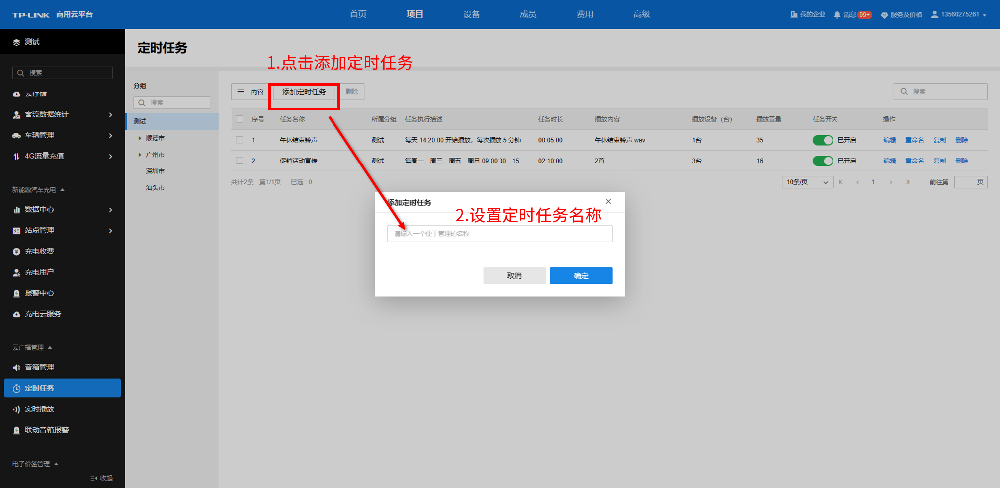
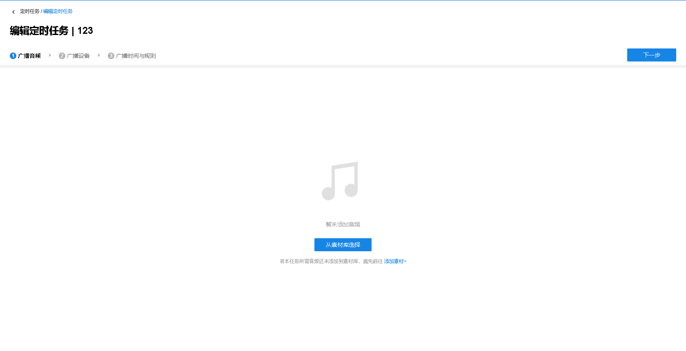
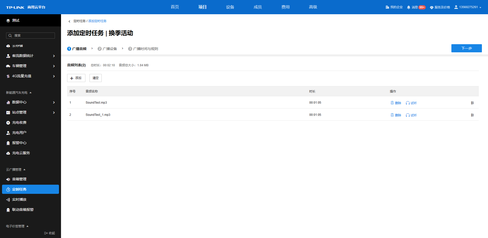
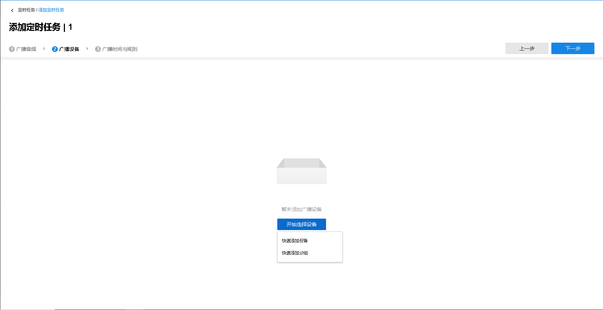
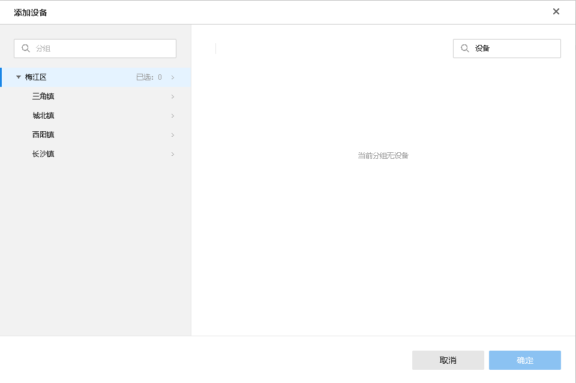
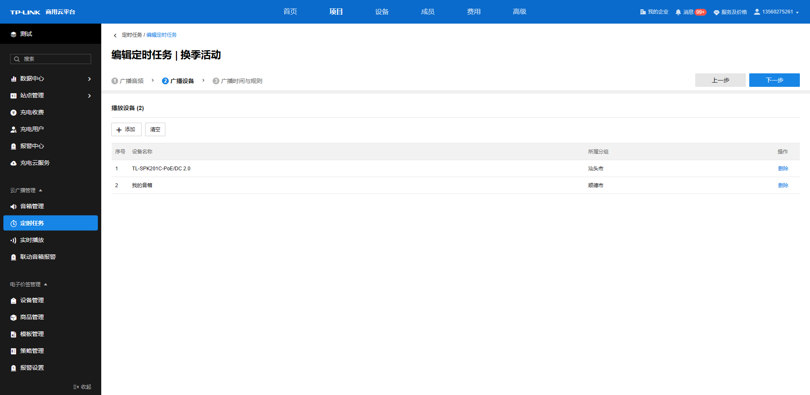
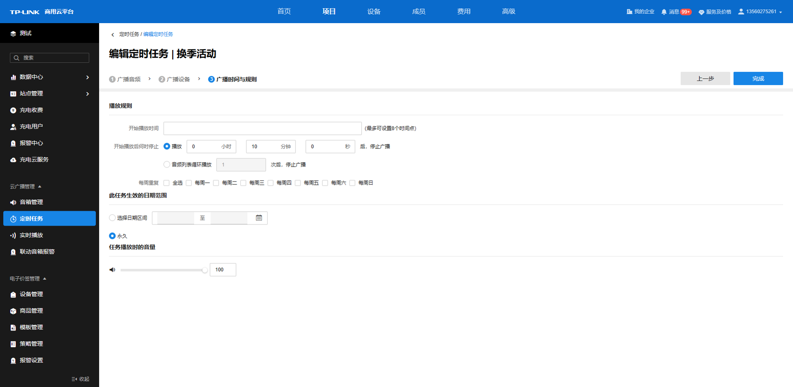

# 添加定时任务

点击页面左上角<添加定时任务>来为音箱添加定时任务，并设置该定时任务的名称，点击<确定>，进入具体的配置步骤。

  * **添加广播音频**

从素材库选择音频添加到该任务的音频列表，若需要选择的音频还未上传到素材库，请先前往素材管理上传所需的素材。每个任务支持选择不超过 800MB 的音频素材。

点击从素材库中选择，勾选素材库中希望使用的音频素材，点击确认即可完成添加。

添加完成的音频以及总时长和音频总大小信息将会在<广播音频>中的<音频列表>中呈现。

音频列表条目介绍：

|   
---|---  
选择素材加入| 从素材库中选择音频加入任务。  
清空| 清除目前音频列表的所有音频文件。  
删除| 点击音频条目后面的“删除”可直接将该音频删除。  
试听| 可试听该音频的效果。  
| 长按可调整列表中音频的播放顺序。  
  
点击试听后，会弹出该音频的试听进度条，可自由拖动进度条来试听不同时段的音频内容，点击播放按钮即可开始试听。

  * **添加广播设备**

添加完广播音频后，需要选择对应的广播设备来执行任务。点击<开始选择设备>，选择快速添加设备或快速添加分组，来进行设备添加。

  1. 快速添加设备

设备添加界面，需要选择对应的分组，勾选对应的设备，点击<确定>完成设备选择。

添加的播放设备将在页面呈现。

播放设备列表条目介绍：

|   
---|---  
添加| 可继续添加广播设备。  
清空| 清除目前播放设备列表的所有条目。  
删除| 点击设备条目后面的“删除”可直接将该设备删除。  
  
  2. 快速添加分组

分组添加界面，勾选要添加的分组，点击确定即可完成分组的选择。

播放设备列表条目介绍：

|   
---|---  
同步组内音箱设备| 开启同步后，此任务将实时同步所选分组及其子分组下的所有音箱设备，即所选分组及其子分组下新增或删除设备后，此任务中的设备列表或同步新增或删除对应设备。  
重新选择分组| 重新选择此任务对应的分组。  
删除| 未开启同步组内音箱设备时，点击设备条目后面的“删除”可直接将该设备删除。  
  
  * **添加广播时间与规则**

该页面可以设置任务开始时间、播放模式、生效日期范围、任务音量等，设置完成后点击<完成>将生成对应的定时任务条目。

|   
---|---  
开始播放时间| 可定义该任务开始播放的时间点，最多可设置 8 个时间点。  
开始播放后何时停止| 有两种模式供选择： 1. 播放设定的时间后，将停止广播任务（即使音频文件仍未播放完毕）； 2. 将音频列表所有音频文件循环播放设定的次数后，停止广播任务。  
每周重复| 可选择该任务每周重复执行的时间，如选择每周一，往后在任务生效的日期 范围内，每周一到达设定的时间点对应的广播设备就会开始执行该任务。  
此任务生效的日期范围| 有两种模式供选择： 1. 选择一段日期区间，在该区间内任务会持续生效； 2. 永久，该任务会永久持续生效。  
任务播放时的音量| 可自由拖动音量条来自由调节音量大小，也可直接输入数值进行调节。
