# 实时任务

实时任务可以提前设置好播放内容，以及在哪些网络音箱设备上播放，需要广播时可随时开启播放任务。

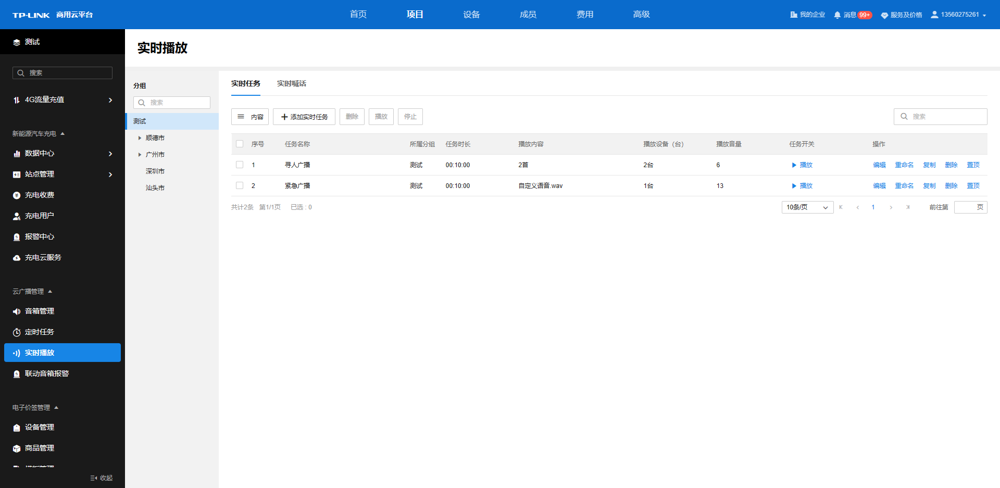

实时任务列表条目介绍：

|   
---|---  
内容| 可根据任务时长、播放内容、播放设备（台）、播放音量等筛选列表显示内容。  
添加实时任务| 为音箱创建新的实时任务。  
删除| 选中某条实时任务条目，可进行删除。或是直接点击对应条目后面的“删除”也可直接将该条目删除。  
播放| 选择实时任务条目，可开始播放该实时任务。  
停止| 选择正在播放的实时任务，可将该任务停止。  
| 点击可以直接播放该实时任务条目。  
| 正在播放的实时任务条目会显示执行中，点击可以将任务停止。  
编辑| 可重新进入该实时任务条目配置详情页，修改编辑广播音频、广播设备、广播时间与规则的配置。  
重命名| 可对该实时任务条目进行重新命名。  
复制| 可快速复制该任务的广播音频、广播设备、广播时间与规则等配置，进行简单的修改后即可快速创建一条新的实时任务。  
置顶| 调整实时任务列表的呈现顺序。  
| 可根据任务名称对列表内实时任务条目进行搜索。  
  
可选择左边的分组栏，选中不同的分组以管理对应分组的音箱的实时任务。分组搜索栏可更快捷地根据关键字查询对应的分组名称。

当某台音箱正在执行实时任务时，若有另一条实时任务条目也需要调用该音箱，会提醒执行任务失败，原因为设备被其他任务占用。需要等正在执行的实时任务完成或手动停止后，才能为该音箱调用其他的实时任务。

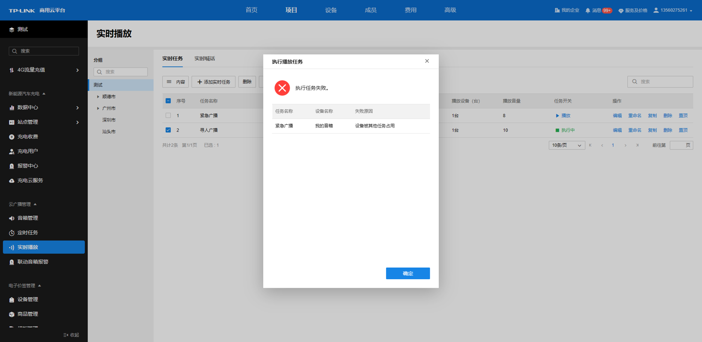

  * **添加广播音频**

从素材库选择音频添加到该任务的音频列表，若需要选择的音频还未上传到素材库，请先前往素材管理上传所需的素材。每个任务支持选择不超过 800MB 的音频素材。

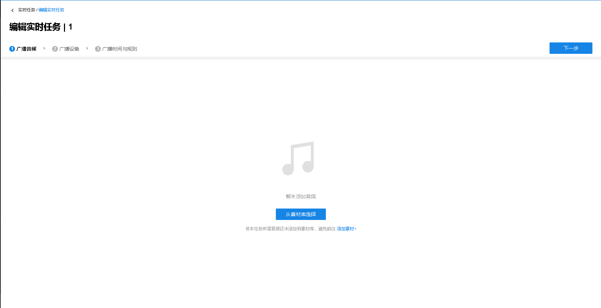

点击从素材库中选择，勾选素材库中希望使用的音频素材，点击确认即可完成添加。

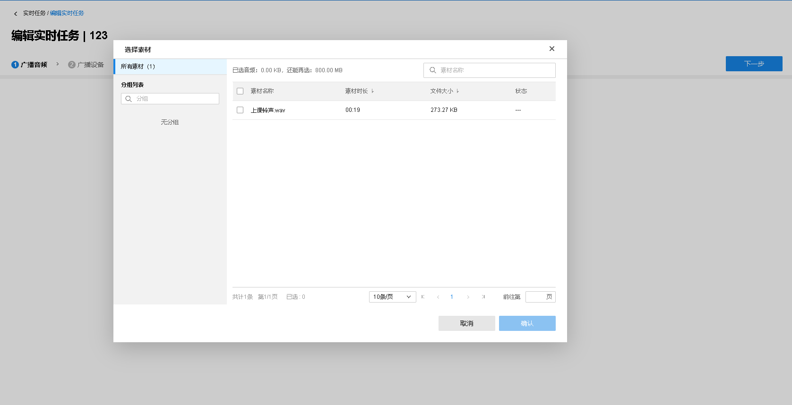

添加完成的音频以及总时长和音频总大小信息将会在<广播音频>中的<音频列表>中呈现。

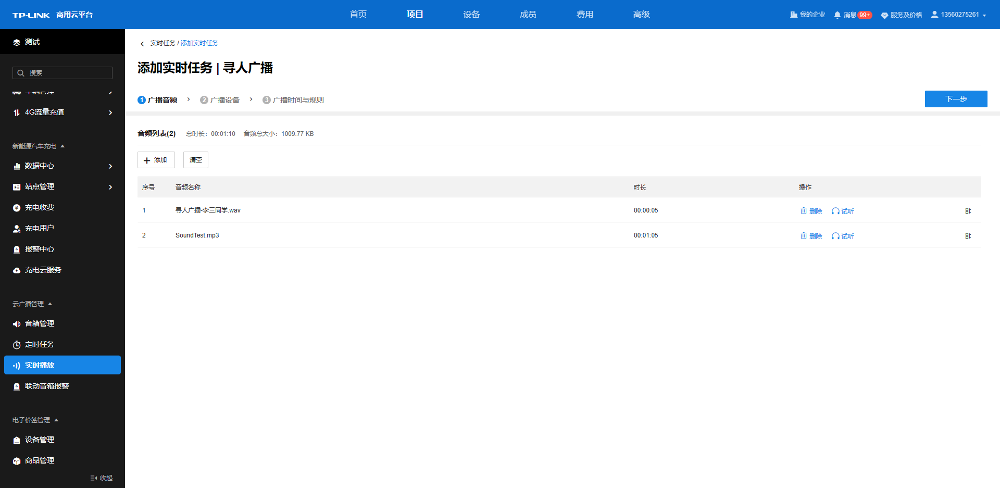

音频列表条目介绍：

|   
---|---  
选择素材加入| 从素材库中选择音频加入任务。  
清空| 清除目前音频列表的所有音频文件。  
删除| 点击音频条目后面的“删除”可直接将该音频删除。  
试听| 可试听该音频的效果。  
| 长按可调整列表中音频的顺序。  
  
点击试听后，会弹出该音频的试听进度条，可自由拖动进度条来听不同时段的音频内容，点击播放按钮即可开始试听。

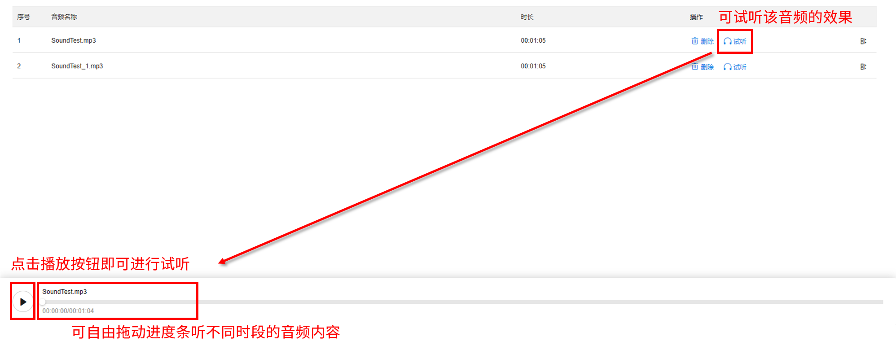

  * **添加广播设备**

添加完广播音频后，需要选择对应的广播设备来执行任务。点击<开始选择设备>，选择快速添加设备或快速添加分组，来进行设备添加。

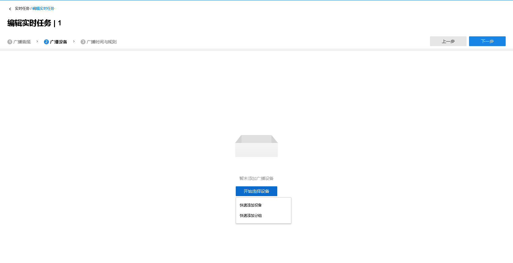

  1. 快速添加设备

设备添加界面，需要选择对应的分组，勾选对应的设备，点击<确定>完成设备选择。

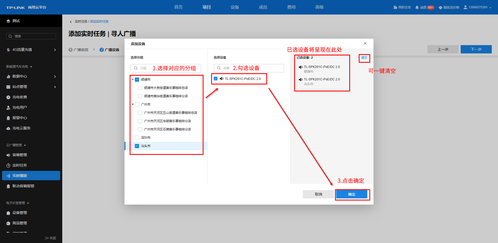

添加的播放设备将在页面呈现。

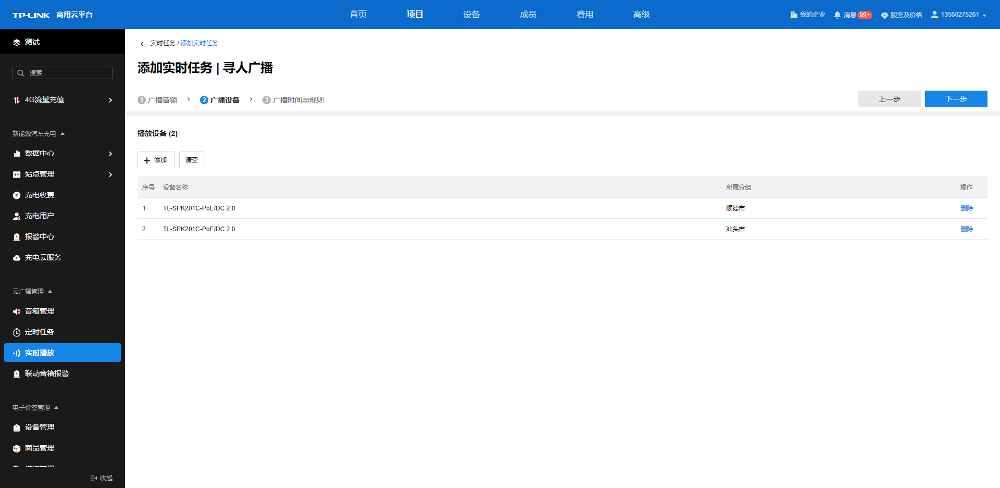

  2. 快速添加分组

分组添加界面，勾选要添加的分组，点击确定即可完成分组的选择。

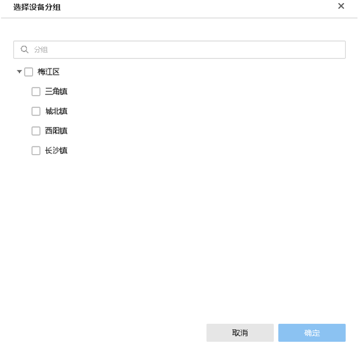

播放设备列表条目介绍：

|   
---|---  
同步组内音箱设备| 开启同步后，此任务将实时同步所选分组及其子分组下的所有音箱设备，即所选分组及其子分组下新增或删除设备后，此任务中的设备列表或同步新增或删除对应设备。  
重新选择分组| 重新选择此任务对应的分组。  
删除| 未开启同步组内音箱设备时，点击设备条目后面的“删除”可直接将该设备删除。  
  
  * **添加广播时间与规则**

该页面可以设置播放规则、任务播放时的音量等，设置完成后点击<完成>将生成对应的实时任务条目。

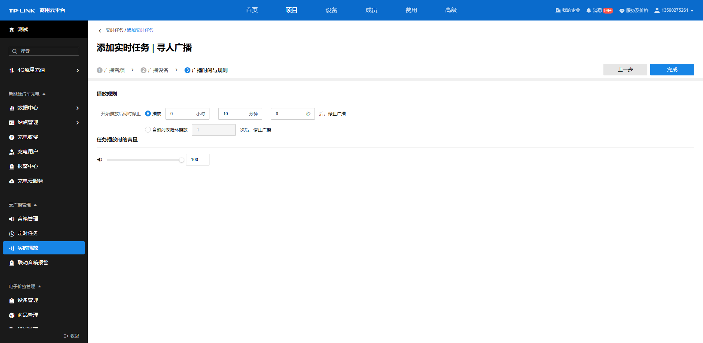

|   
---|---  
开始播放后何时停止| 有两种模式供选择： 1. 播放设定的时间后，停止广播任务（即使音频文件仍未播放完）； 2. 将音频列表所有音频文件循环播放设定的次数后，停止广播任务。  
任务播放时的音量| 可自由拖动音量条来自由调节音量大小，也可直接输入数值进行调节。
