# 实时喊话

实时喊话可以提前设置在哪些网络音箱设备上播放，需要广播喊话时可随时通过电脑麦克风采集音频进行播放。

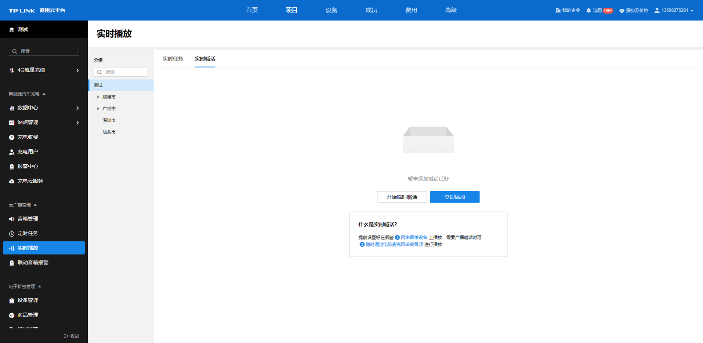

  * **开始临时喊话**

点击<开始临时喊话>或点击实时喊话任务列表上的<临时喊话>可直接对电脑麦克风采集音频并进行播放。

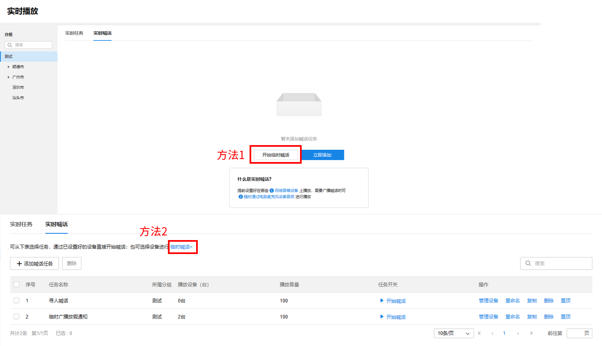

点击选择音箱设备或快速选择分组，开始对选择的设备或分组进行临时喊话。

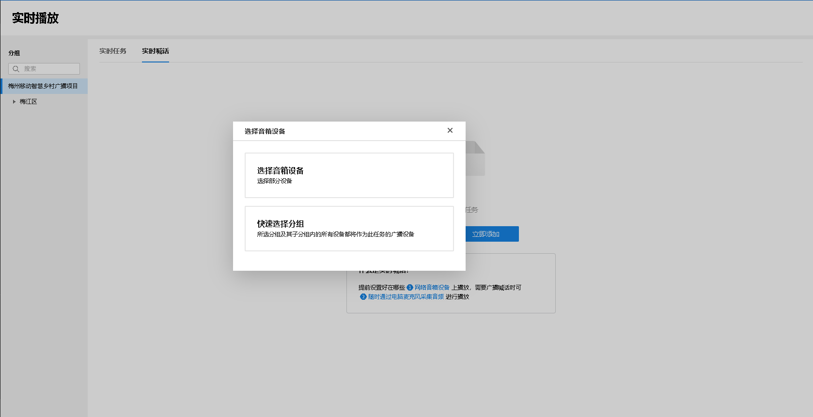

临时喊话界面将显示目前已选的设备数量，并可随时调节设备音量大小，点击<开始采播>，开始采集电脑麦克风音频，并进行播放。

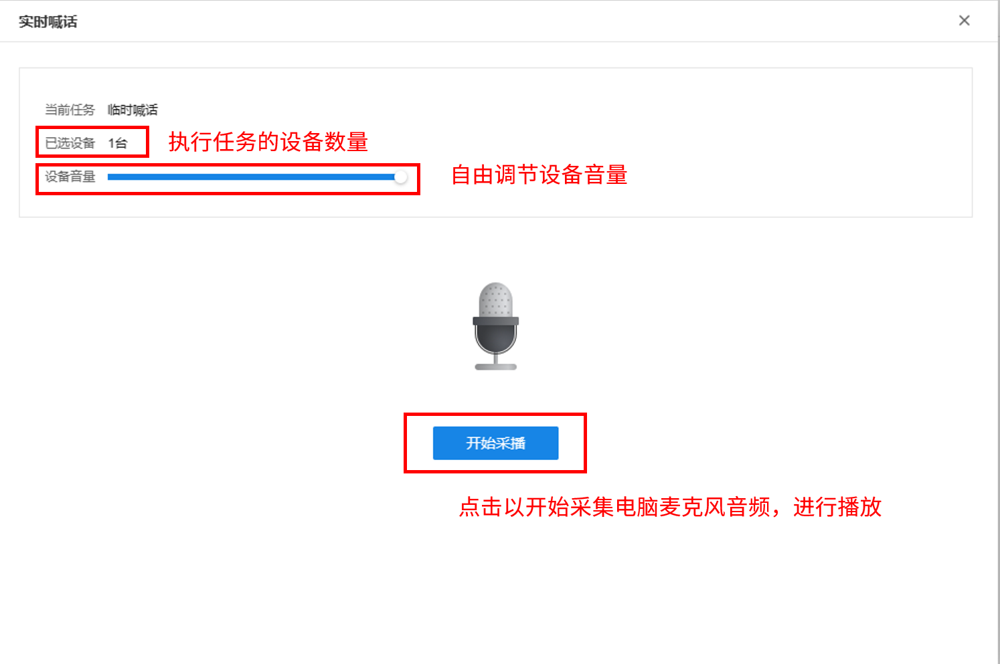

开始采播后，将记录已进行采播的时长。

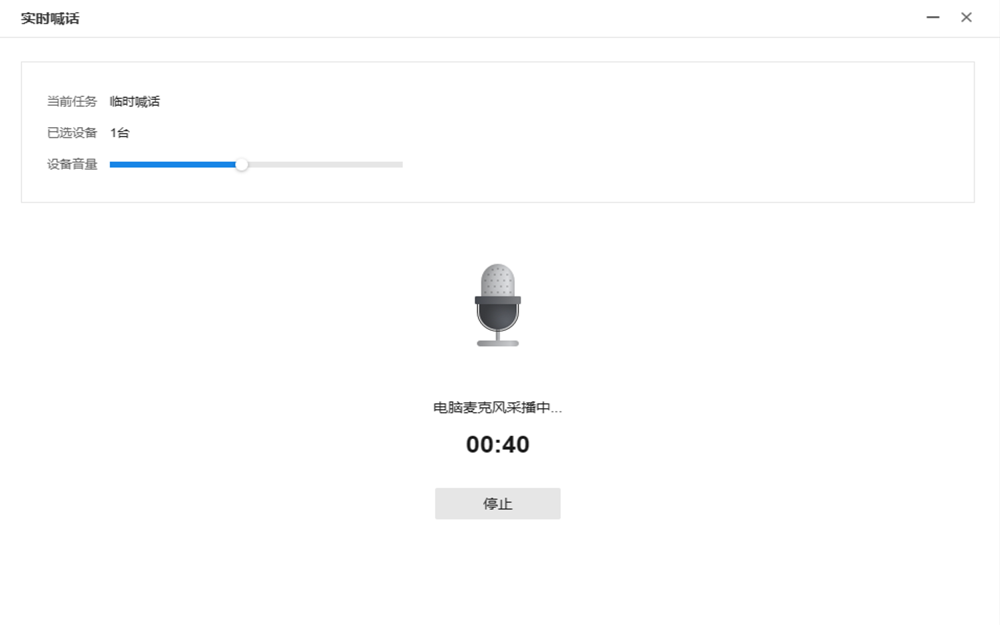

可随时点击停止，以停止临时喊话任务。

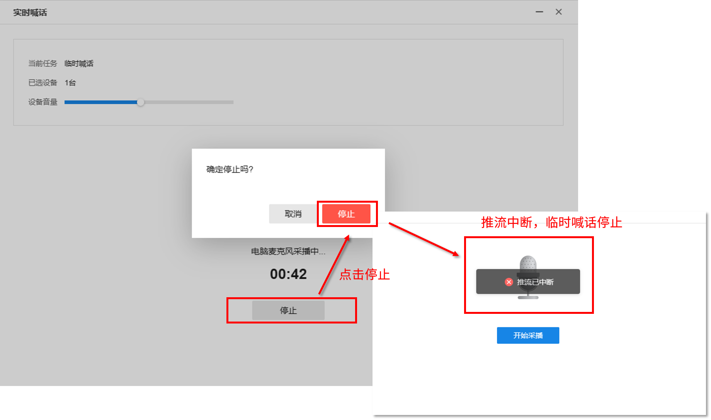

结束临时喊话后，会提醒"是否将本次喊话保存为一条喊话任务，方便下一次直接喊话"。点击<保存>后，将在实时喊话列表生成该临时喊话任务条目，记录该临时喊话任务的播放设备、播放音量等信息，下次可直接对对应设备进行快速临时喊话。

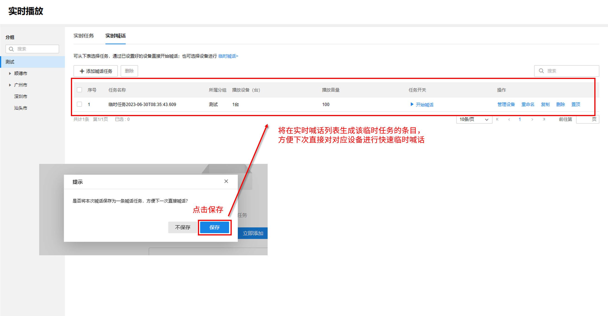

若电脑未连接麦克风设备，进行实时喊话，点击<开始采播>时，会提示"未检测到麦克风设备"，需要连接设备后才能进行实时喊话。

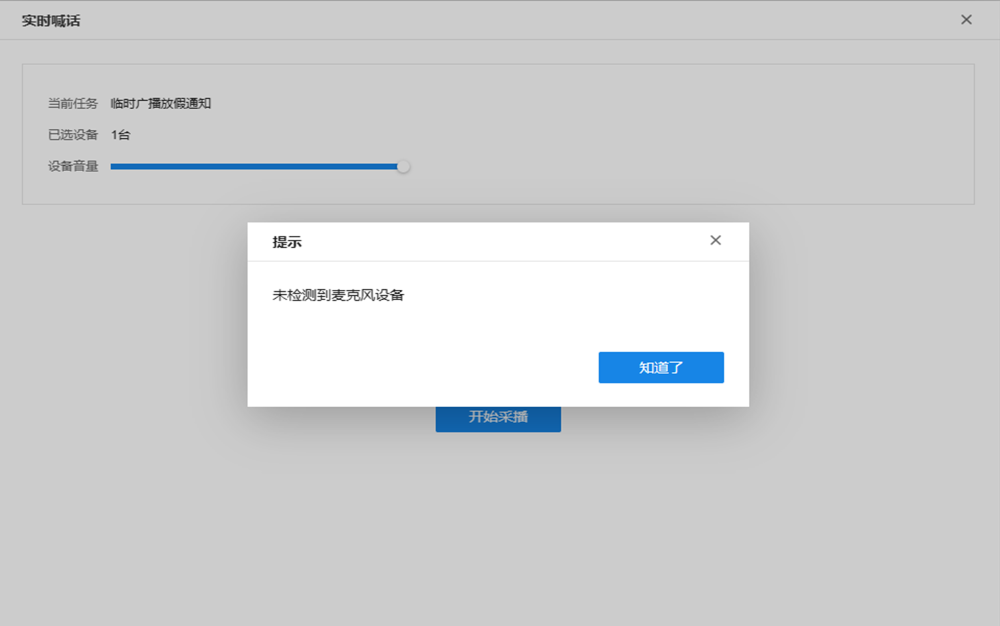

  * **立即添加**

点击<立即添加>可创建一条临时喊话任务，可对该任务自定义名称。

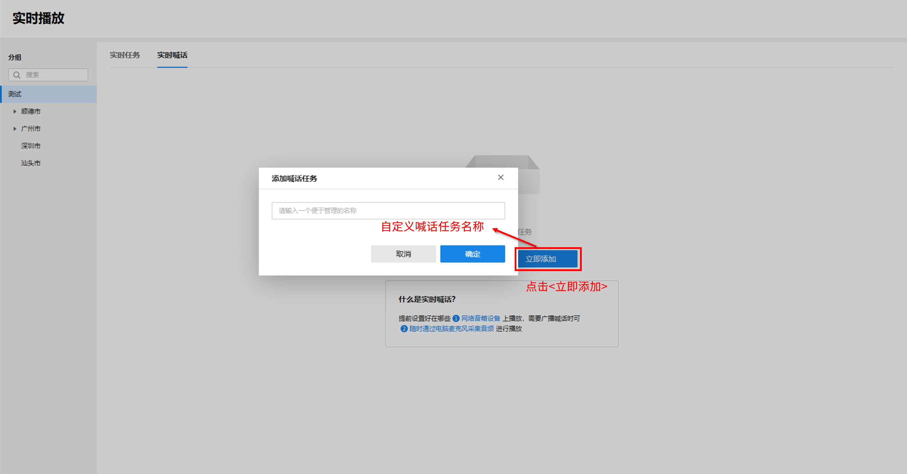

创建喊话任务前，需先点击选择音箱设备或快速添加分组。

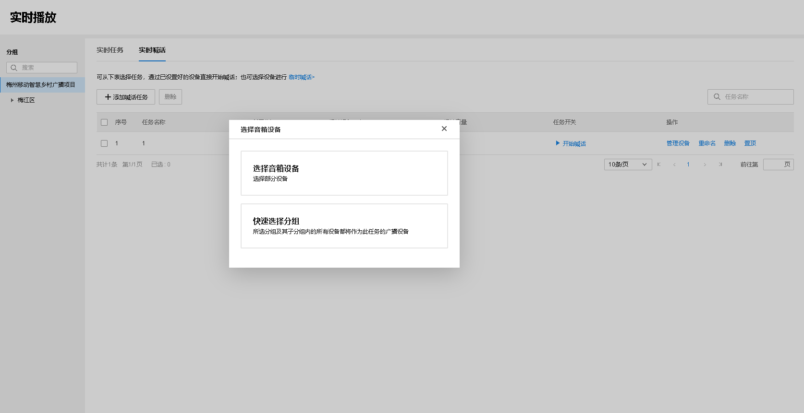

创建的实时喊话任务将以列表形式呈现，显示任务名称、所属分组、播放设备（台）、播放音量、任务开关、操作等信息。

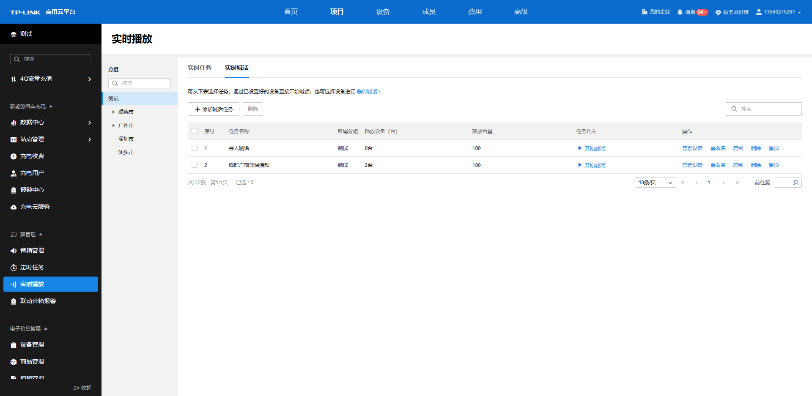

实时喊话列表条目介绍：

|   
---|---  
添加喊话任务| 可添加一条新的实时喊话任务。  
删除| 勾选任意实时喊话任务条目，可进行删除。或是直接点击对应条目后面的“删除”也可直接将该条目删除。  
| 可直接进入该任务的实时喊话界面，进行采播。  
管理设备| 可重新勾选该实时喊话任务执行的广播设备。  
重命名| 可对该实时喊话任务条目进行重新命名。  
置顶| 调整实时喊话任务列表的呈现顺序。  
| 可根据任务名称对列表内实时喊话任务条目进行搜索。  
  
可选择左边的分组栏，选中不同的分组以管理对应分组的音箱的实时喊话任务。分组搜索栏可更快捷地根据关键字查询对应的分组名称。

