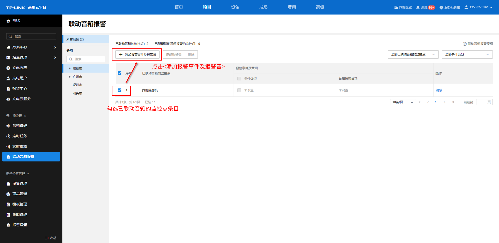
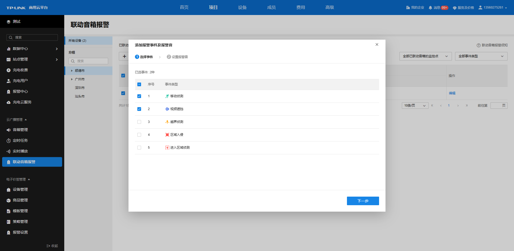
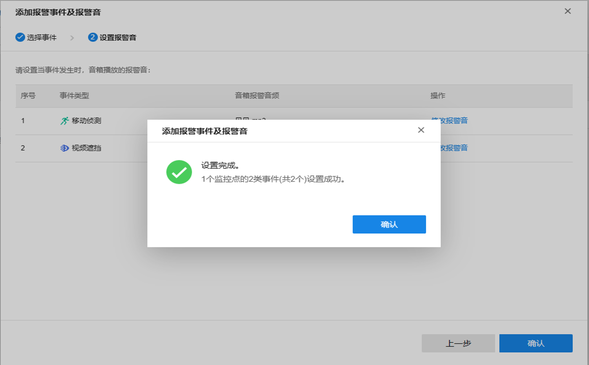
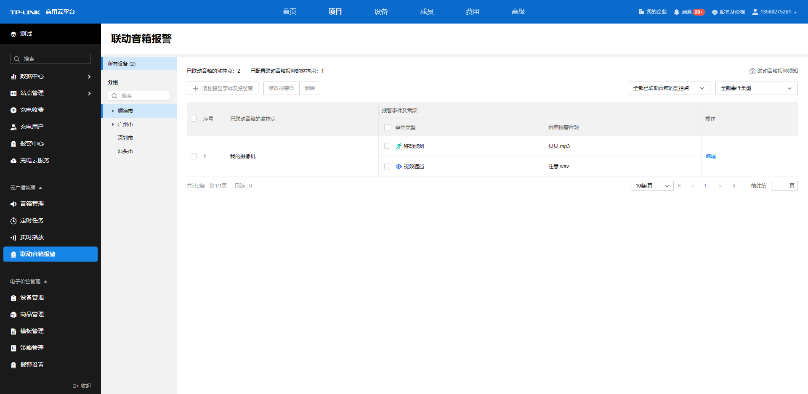

# 添加报警事件及报警音

选中已联动音箱的监控点条目，可以添加报警事件及报警音。

  * **选择事件**

勾选对应的事件类型，触发该事件类型后，音箱将进行联动报警。

  * **设置报警音**

为每一个事件类型设置报警音，当事件发生时，音箱将播放的对应的报警音。

为每一个事件类型设置报警音后，可以修改之前绑定的音频文件。

完成绑定后，点击<确认>，即可完成添加报警事件及报警音。

已添加的报警事件及报警音将会在界面呈现。

