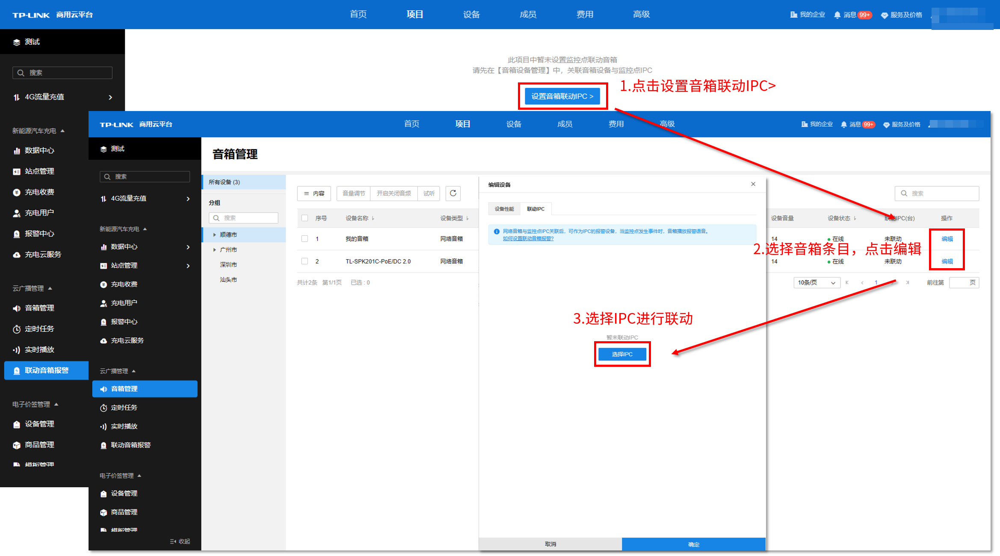
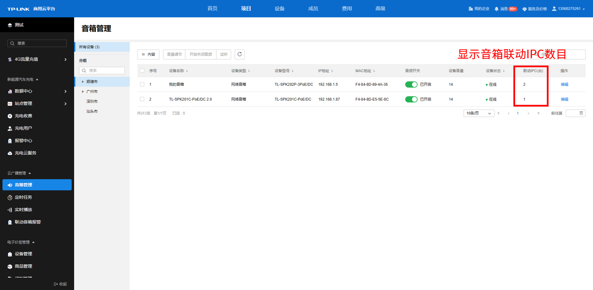
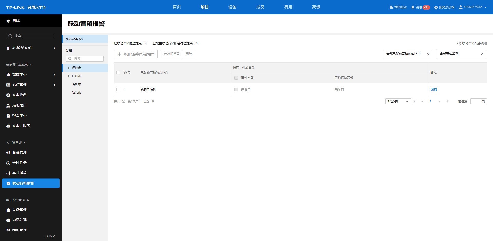
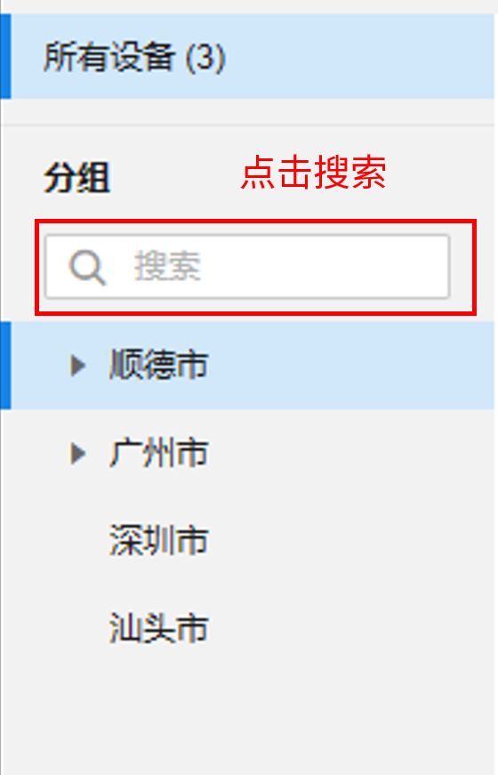
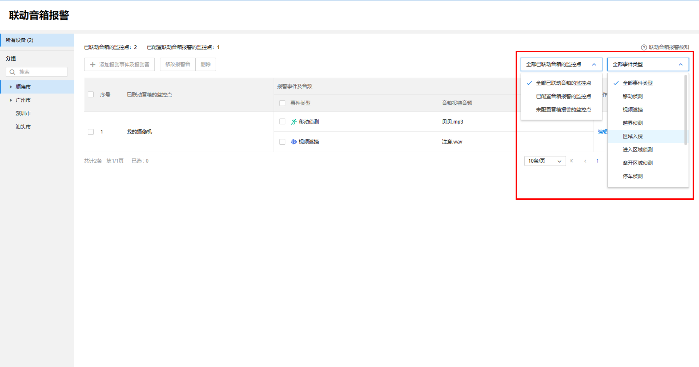

# 设置音箱联动 IPC

点击<设置音箱联动 IPC>，会跳转至音箱管理界面，选择对应的音箱条目，点击<编辑>，可进入设备编辑界面，点击<联动 IPC>页面中的<选择 IPC>以进行 IPC 联动。

页面会显示该项目下所有的分组以及所属的监控点位，**选择对应的分组** **> >** **选择监控点** **> >** **确定** ，完成音箱联动对应分组的监控点位。

完成联动后，该页面会显示该音柱下所有联动的 IPC 的信息，并且可以进行条目的拖动以调整优先级，当多个监控点同时发生事件，音箱将播放优先级最高的 IPC 的报警语音。

联动 IPC 列表条目介绍：

|   
---|---  
添加| 为音箱添加更多的联动 IPC。  
删除| 选中某条联动 IPC 的条目，可解除联动关系，并将该条目删除。  
| 按住上下拖动以调整不同条目的优先级。  
  
完成设置后，音箱管理的页面会显示不同音箱所联动的 IPC 数量。

完成 IPC 联动后，回到**联动音箱报警** 界面，发现此时已联动音箱的监控点将会在页面中显示。

联动音箱报警列表条目介绍：

|   
---|---  
添加报警事件及报警音| 选中一条联动音箱的监控点条目，可为该条目添加不同的报警事件与报警音。  
修改报警音| 勾选任意条目的事件类型，可以修改该条目下之前设置的对应事件类型报警音频，支持上传音频与将文本转化为音频两种方式。  
删除| 勾选任意条目的事件类型，可以删除该事件类型。  
编辑| 可查看设备信息、已设置的联动报警事件，并可以快速添加、删除联动报警事件、修改已设置的联动报警事件的报警音。  
  
可选择左边的分组栏，选中不同的分组以管理对应分组的音箱。分组搜索栏可更快捷地根据关键字查询对应的分组名称。

右上角可对监控点与事件类型进行筛选

