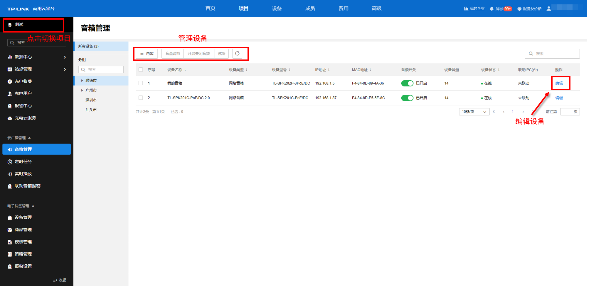

# 音箱管理

TP-LINK 商用云平台支持对当前项目所有的音箱进行统一管理配置，使广播管理更为简洁高效。

**进入页面的方法：项目** **> >** **云广播管理** **> >** **音箱管理**

  1. 点击左上角项目名称可切换项目。
  2. 点击<编辑>可进入“编辑设备”界面。
  3. 选中需要管理的设备后，设备列表上方按钮会被激活，可管理设备。

该项目下所有设备的数量都会呈现在页面上。

音箱管理列表条目介绍：

|   
---|---  
内容| 可根据设备类型、设备型号、ip 地址、MAC 地址、音频开关、设备音量、设备状态、联动 IPC（台）等筛选列表显示内容。  
音量调节| 快捷批量调节音箱的设备音量。  
开启关闭音频| 可快速开启与关闭音箱的音频，关闭后音箱不会播放音频。  
试听| 选择设备，可试听设备的音量与播放效果。  
编辑| 可对设备进行设备性能、联动 IPC 等编辑操作。具体内容设置方法请参考本小节后文“编辑设备”部分  
| 点击同步设备信息。  
| 可根据设备名、MAC 地址或 IP 地址等信息对列表内设备进行搜索。  
  
可选择左边的分组栏，选中不同的分组以管理对应分组的音箱。分组搜索栏可更快捷地根据关键字查询对应的分组名称。

