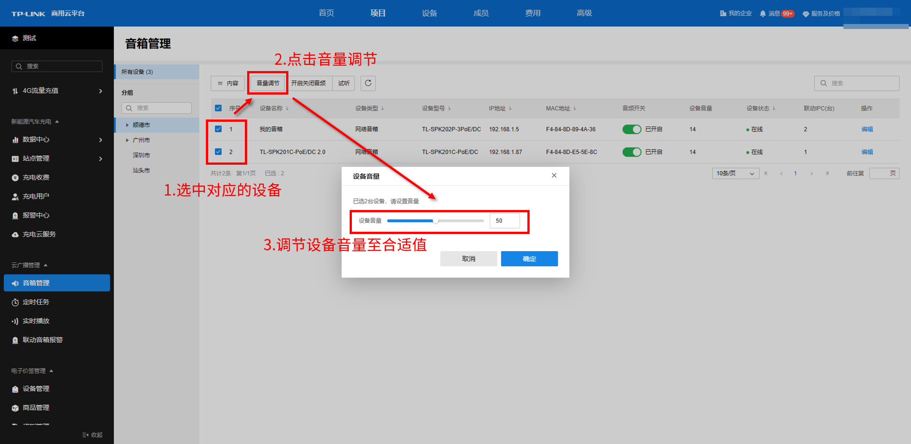
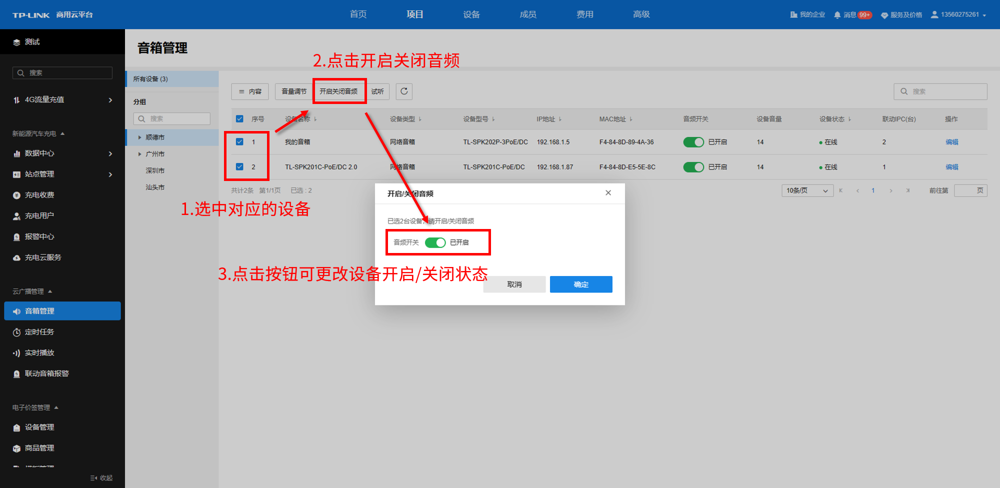
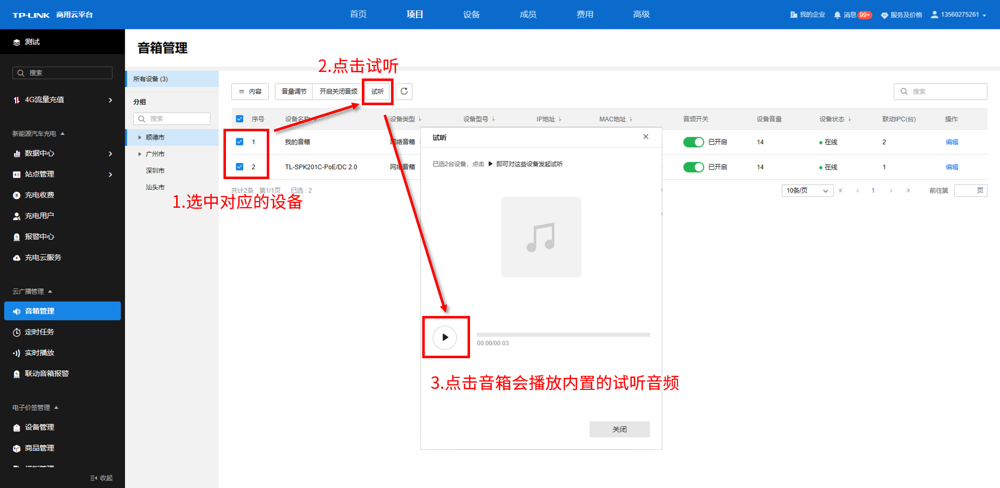
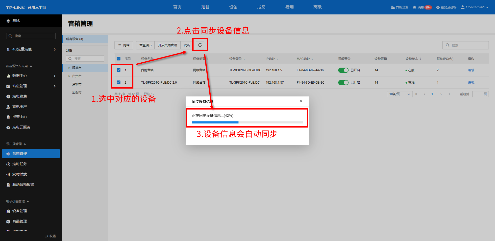

# 管理设备

  * **音量调节**

可批量选中对应的设备，点击<音量调节>，拖动按钮或是直接输入数值来将设备音量调节至合适值。

  * **开启** /**关闭音频**

可批量选中对应的设备，点击<开启关闭音频>，或直接点击单个音箱设备条目的音频开关，拖动按钮来更改设备开启/关闭状态。关闭设备音频开关后，音箱不会再播放音频。

  * **试听**

可批量选中对应的设备，点击<试听>，点击播放按钮，对应的音箱会播放内置的试听音频，辅以判断目前的声音大小和效果是否合适。

  * **同步设备信息**

点击同步设备信息按钮，所有的音箱设备信息会自动同步至最新。

  * 远程配置

点击音箱设备条目的操作栏的远程配置按钮，可以跳转至该设备的 Web 页面进行更多参数的配置。
