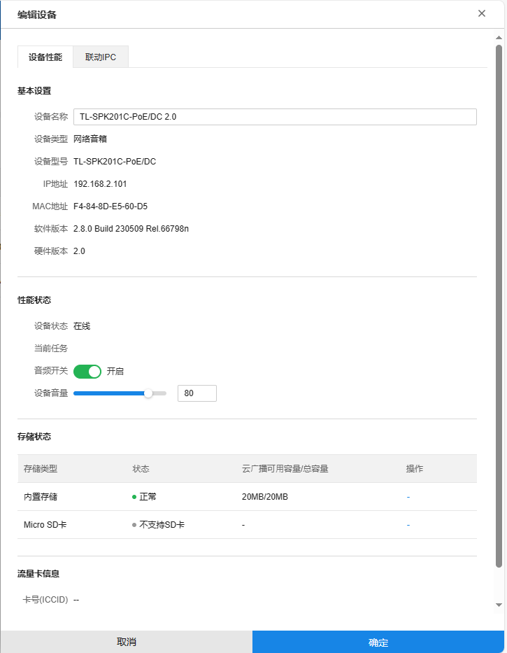
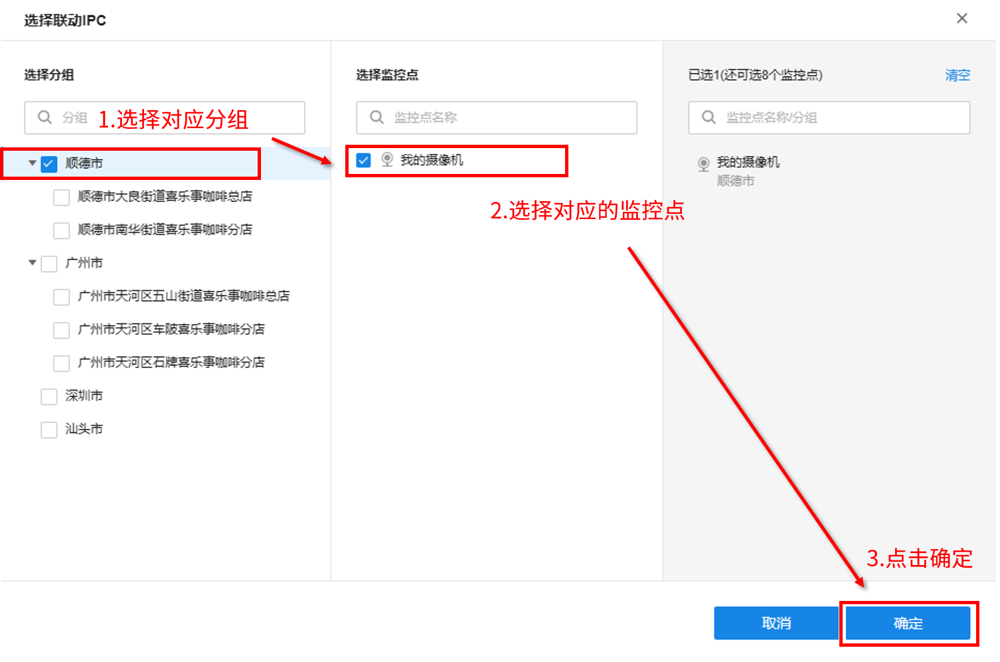
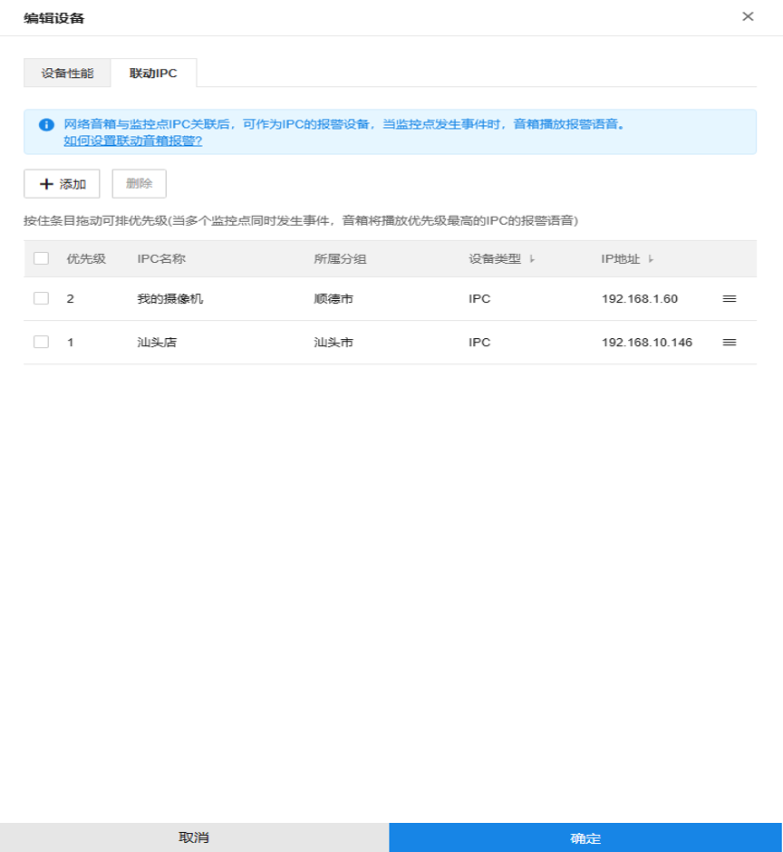
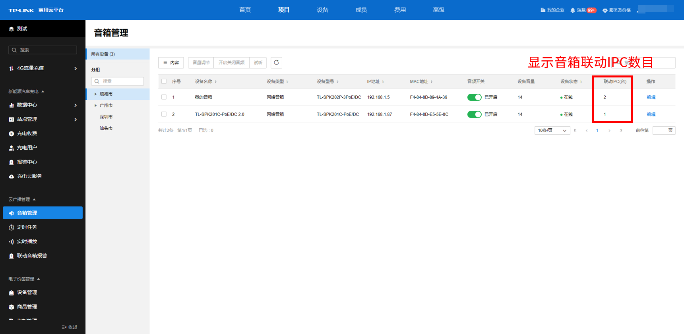

# 编辑设备

点击设备条目中的<编辑>可进入“编辑设备”界面

  * **设备性能**

设备性能界面可对音箱进行基本的配置与设备信息的快速查看。

设备性能列表条目介绍：

|   
---|---  
设备名称| 可设置音箱的名称。  
设备状态| 显示音箱目前的状态：在线/离线。  
当前任务| 显示目前音箱正在执行播放的任务名称。  
音频开关| 可控制音箱是否开启音频，若关闭，即使存在正在执行的任务，音箱也不会发出音频声音。  
设备音量| 可拖动来控制设备的音量大小，也可以直接更改旁边的数字，调整至合适的数值。  
设备信息| 显示音箱的设备类型、设备型号、IP 地址、MAC 地址、软件版本、硬件版本等信息。  
存储状态| 显示存储类型、状态、云广播可用容量/总容量  
流量卡消息| 显示音箱使用的流量卡的卡号信息  
  
  * **联动 IPC**

联动 IPC 界面可对音箱进行 IPC 的快捷联动与目前联动 IPC 的信息查看。

若该音箱暂未联动 IPC，页面显示如下图，此时可直接点击选择 IPC 以进行 IPC 联动。

页面会显示该项目下所有的分组以及所属的监控点位，**选择对应的分组** **> >** **选择监控点** **> >** **确定** ，完成音箱联动对应分组的监控点位。

完成联动后，该页面会显示该音柱下所有联动的 IPC 的信息，并且可以进行条目的拖动以调整优先级，当多个监控点同时发生事件，音箱将播放优先级最高的 IPC 的报警语音。

联动 IPC 列表条目介绍：

|   
---|---  
添加| 为音箱添加更多的联动 IPC。  
删除| 选中某条联动 IPC 的条目，可解除联动关系，并将该条目删除。  
| 按住上下拖动以调整不同条目的优先级。  
  
完成设置后，音箱管理的页面会显示不同音箱所联动的 IPC 数量。

> 说明：
> 
> 网络音箱与监控点 IPC 关联后，可作为 IPC 的报警设备，当监控点发生事件时，音箱播放报警语音，需要在后面的“联动音箱报警中”进行相关的设置，详细设置见本小节后文“联动音箱报警”部分。
> 
> 每个音箱最多只能联动 9 台 IPC。
> 
> 优先级共有 9 个，数字越大优先级越高，即优先级 2 比优先级 1 要高，当这两个监控点同时发生事件，音箱将播放优先级 2 条目的 IPC。
