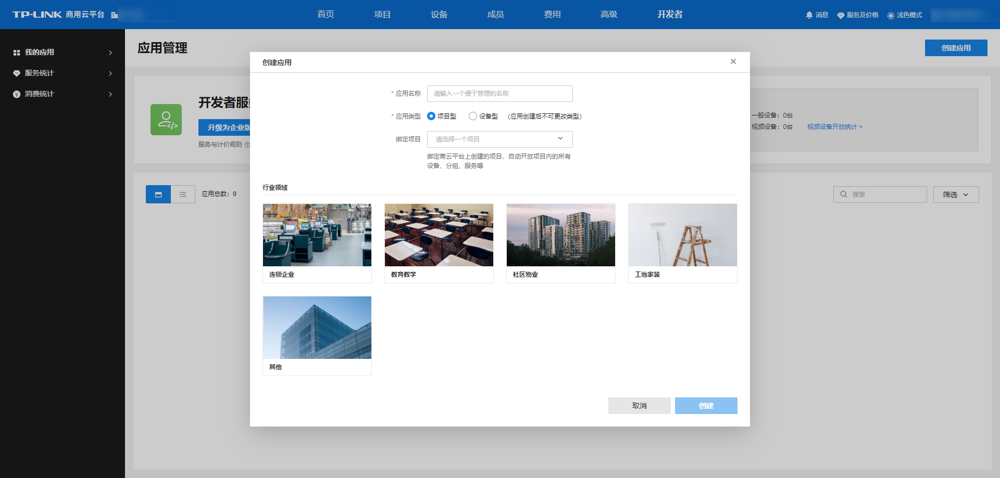

# 创建应用

**进入页面的方法：开发者 >>我的应用>>应用管理>>创建应用**

应用是进行二次开发的对象。开发者需创建应用来管理开放的设备。开发者可根据不同的场景创建 1 个或多个应用，以便清晰地管理不同设备，并灵活地配置开发者管理权限。开发者可创建两种类型的应用：设备型应用和项目型应用。两种应用的功能和相应的开放接口存在区别，开发者可根据需求选择。

> 说明：
> 
> 设备型应用可灵活对接多个项目下设备或未添加到项目内的设备，灵活度高，但不支持调用项目维度功能的接口，如分组管理、客流统计、车辆管理；
> 
> 项目型应用与企业下的项目绑定，项目下的设备会自动同步到应用中，可以通过项目的组织结构对设备进行管理，并调用一些项目维度功能的开放接口，如分组管理、客流统计、车辆管理等。
