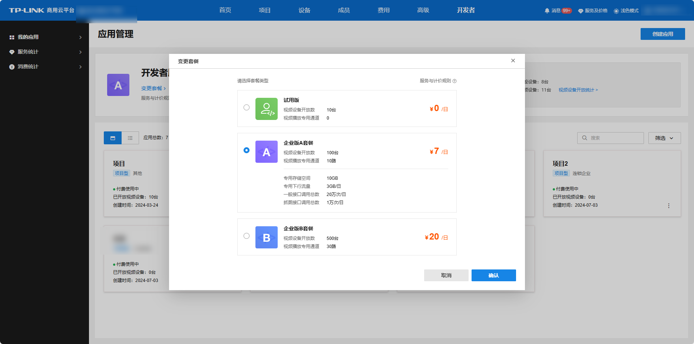
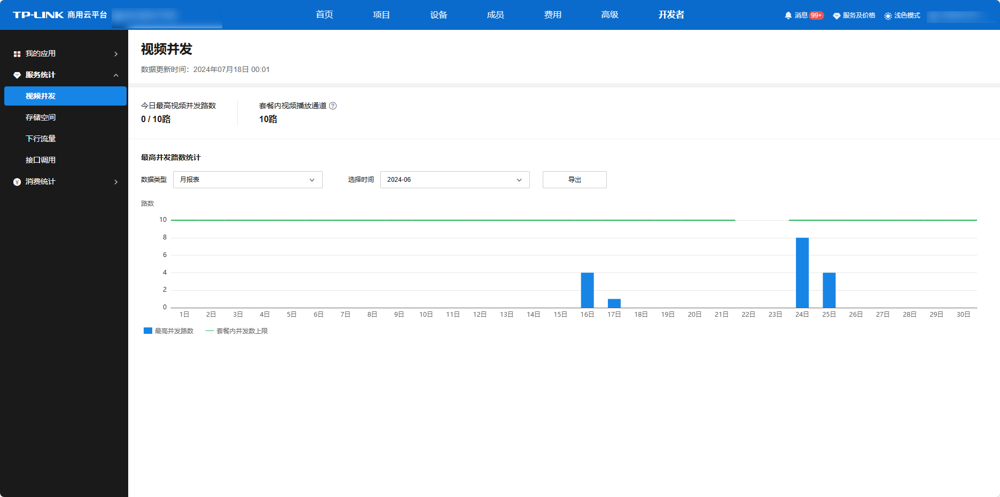
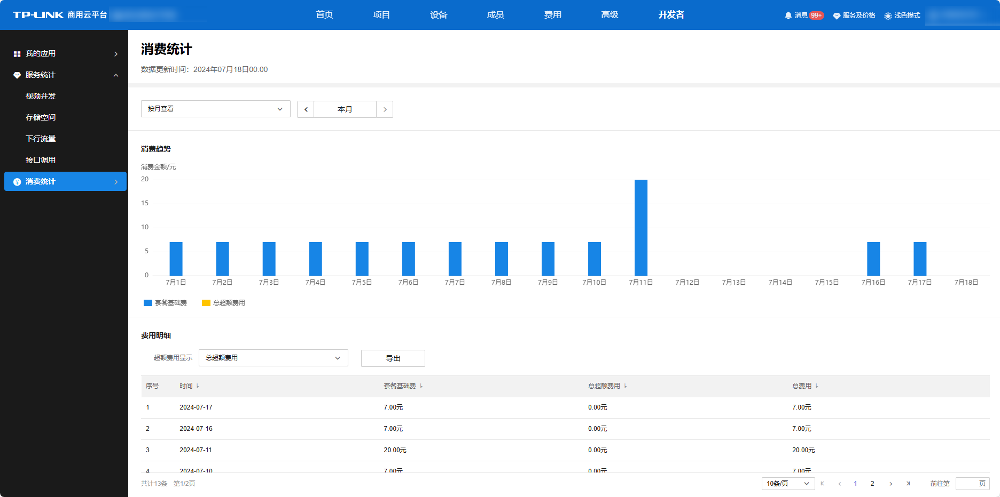

# 套餐选购

#### 套餐介绍

**进入页面的方法：开发者 >>我的应用>>应用管理**

开发者可在“应用管理”页面开通套餐。套餐说明如下：

**免费服务有：**

1、**每台设备** 有 2 路**免费** 的取流路数，单次取流可持续时间为 10min。

2、试用版套餐，可用于对接测试。试用版套餐仅可在限额内使用。

> 说明：
> 
> 试用版套餐的限制有：仅可开放 10 台视频类设备；仅可开放 1 个应用；无视频播放专用通道；专用存储空间、专用下行流量、一般接口调用总数和抓图接口调用总数远低于企业版套餐。

**付费服务有：**

1、企业版套餐

2、超额收费项

> 说明：
> 
> 1、企业版套餐开通后按**套餐基础费** 和**超额用量** 组合计费，每日 24 点结算，从账户余额中扣费。每日服务用量不超过套餐限额时，只收取套餐基础费。超出套餐限额时，对超出部分收取超额费；
> 
> 2、若当日套餐发生过变更，按当日最高级套餐计算套餐基础费和超额费；
> 
> 3、账户欠费时，企业版套餐自动停用。

套餐服务说明：

服务类别| 说明  
---|---  
视频设备开放数| 开发者开放 IPC、NVR 等视频类设备的数量。  
视频播放专用通道| 开发者专用的视频播放通道。每台 IPC 有 2 路免费的取流路数，开发者取流超出免费路数时将占用该通道。“持续播放专用通道”无法应用于开发者服务。  
专用存储空间| 开发者存储图片/视频等文件的专用空间。开发者可将文件存储于此空间，并在需要时下载或删除文件。如，云录制接口的抓图/录像将存储于此空间。  
专用下行流量| 开发者下载图片/视频等文件的专用流量。如，下载云录制的抓图/录像将消耗此流量。预览/回放等视频取流不消耗此流量。  
一般接口调用总数| 开发者调用一般接口时，将消耗此接口调用次数。  
抓图接口调用次数| 开发者调用抓图/录像类接口时，将消耗此接口调用次数。如，调用云录制接口将消耗此流量。  
  
#### 套餐选择

您在理解开发者服务计费规则后，可按需选择套餐。以下建议仅供参考：

1、开放设备数量 ≤10，可选择试用版套餐；

2、假设企业版套餐内的视频播放专用通道、专用存储空间、专用下行流量、一般接口调用总数、抓图接口调用总数均满足项目需求，则可根据需要开放的视频设备数选择套餐。例如，需要开放 500 台设备，可以购买企业版 B 套餐；

假设开放的视频设备数介于两个套餐规格之间，可对比“较低企业版套餐+超额收费项”和“较高企业版套餐”价格。例如，开放 300 台视频类设备，可以考虑两种选择：“企业版 A 套餐+超额收费项”和“企业版 B 套餐”。经计算，“企业版 A 套餐+超额收费项”的费用为 17 元/日，而“企业版 B 套餐”的费用为 20 元/日，因此推荐购买企业版 A 套餐，超出的视频设备开放数按超额收费项付费。

#### 服务统计

**进入页面的方法：开发者 >>我的应用>>服务统计**

开发者可在“服务统计”页面按日/月查看视频并发路数、存储空间消耗、下行流量消耗、一般/抓图接口调用次数，以便做好服务管控和套餐选择。

#### 消费统计

**进入页面的方法：开发者 >>我的应用>>消费统计**

开发者可在“消费统计”页面按月/年查看总体消费趋势，查看总超额收费项明细和各项超额收费项明细，费用信息一目了然。

