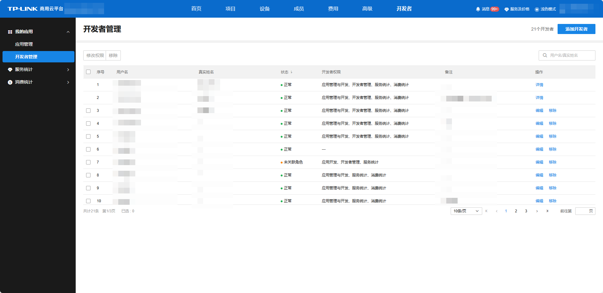

# 添加开发者

**进入页面的方法：开发者 >>我的应用>>开发者管理>>添加开发者**

应用创建后，可将企业内开发人员添加为开发者。可通过“开发者管理”配置开发人员权限。

应用管理与开发（全部应用）：赋予开发者该权限后，开发者可创建、删除、查看、编辑应用，可开放本企业下所有的项目或设备。

仅应用开发（可指定应用）：赋予开发者该权限后，开发者仅可查看、编辑指定应用，调用指定应用下的接口。

服务统计：赋予开发者该权限后，开发者可查看服务用量统计数据。

消费统计：赋予开发者该权限后，开发者可查看服务费用统计数据。

开发者管理：赋予开发者该权限后，开发者可添加、删除、编辑开发者。
