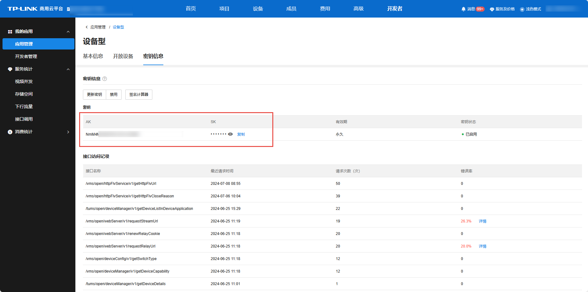

# 获取密钥

**进入页面的方法：开发者 >>我的应用>>应用管理>>应用>>密钥信息**

每个应用对应唯一密钥（AK/SK），开发者需要通过 AK/SK 计算签名以调用 API。开发者可在“密钥信息”中获取 AK/SK，可通过“签名计算器”验证计算签名的正确性。

各语言的签名计算示例代码详见[TP-LINK 商用云平台接口文档](<https://open.tp-link.com.cn/>)。

> 说明：
> 
> 计算签名的目的：确保请求来自密钥持有者，同时防止传输数据被篡改，保障财产安全。
