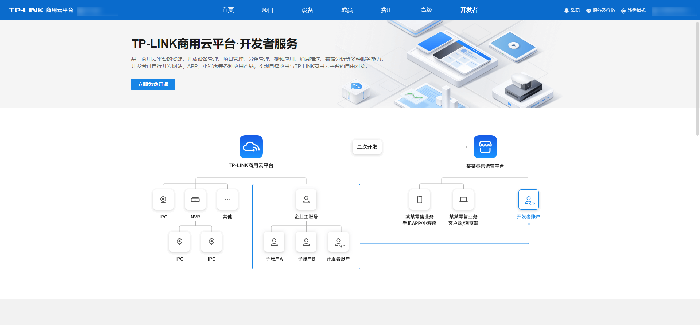

# 开发者服务简介

开发者服务，基于 TP-LINK 商用云平台，提供设备接入管理、视频取流、抓图、录像、消息推送、项目管理等多种开放能力。开发者可自行开发网站、客户端、APP、小程序等各种应用产品，实现自建应用与 TP-LINK 商用云平台的自由对接。API 及 SDK 获取地址：[TP-LINK 开发者平台](<https://open.tp-link.com.cn/>)。

> 注意：
> 
> 企业主账号为首个可见“开发者”菜单的用户。企业成员如需使用开发者服务，最初可由企业主账号在“开发者-我的应用-开发者管理”将成员添加为开发者。事实上，只要账号拥有“开发者管理”权限，即可添加开发者。
