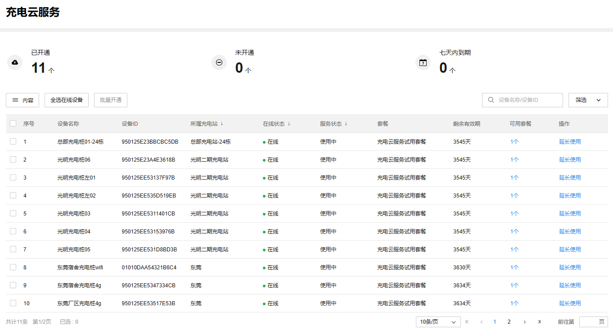

# 充电云服务

充电云服务是 TP-LINK 向充电站管理员提供的管理电动汽车充电桩设备的增值服务。开通充电云服务后，管理员可以在 TP-LINK 商云平台上添加电动汽车充电桩设备，创建并运营充电站，设置充电收费规则，向电动汽车车主提供充电服务，收取充电订单费用。

**进入页面的方法：项目 >> 新能源汽车充电 >> 充电云服务**

|   
---|---  
内容| 支持选择列表是否展示设备名称、设备 ID、所属充电站、服务状态等内容。  
全选在线设备| 批量勾选列表中处于在线状态的充电桩设备。  
批量开通| 针对勾选的充电桩设备批量开通充电云服务。  
筛选| 支持按所属充电站、设备状态、服务状态筛选充电桩设备。  
搜索| 支持按设备名称、设备 ID 筛选充电桩设备。  
延长使用| 充电桩云服务套餐还在使用中，可以购买新套餐，延长有效期。  
立即续费| 充电桩云服务套餐已过期，需要重新购买。  
  
> 说明：
> 
> 在充电云服务有效期内，TP-LINK 会为开通云服务的电动汽车充电桩提供满足其正常工作所需要的 4G 流量，但该流量额度是有上限的，并非无限流量。云服务为充电桩提供的 4G 流量只能用于 TP-LINK 电动汽车充电桩联网，严禁接入除 TP-LINK 电动汽车充电桩之外的其他设备来消耗 4G 流量。
