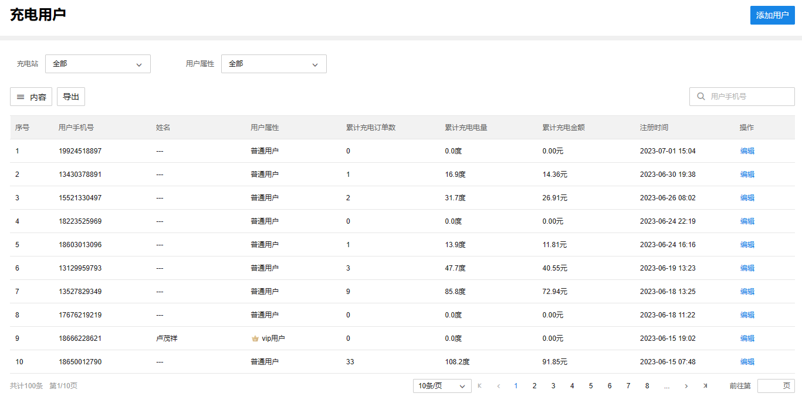
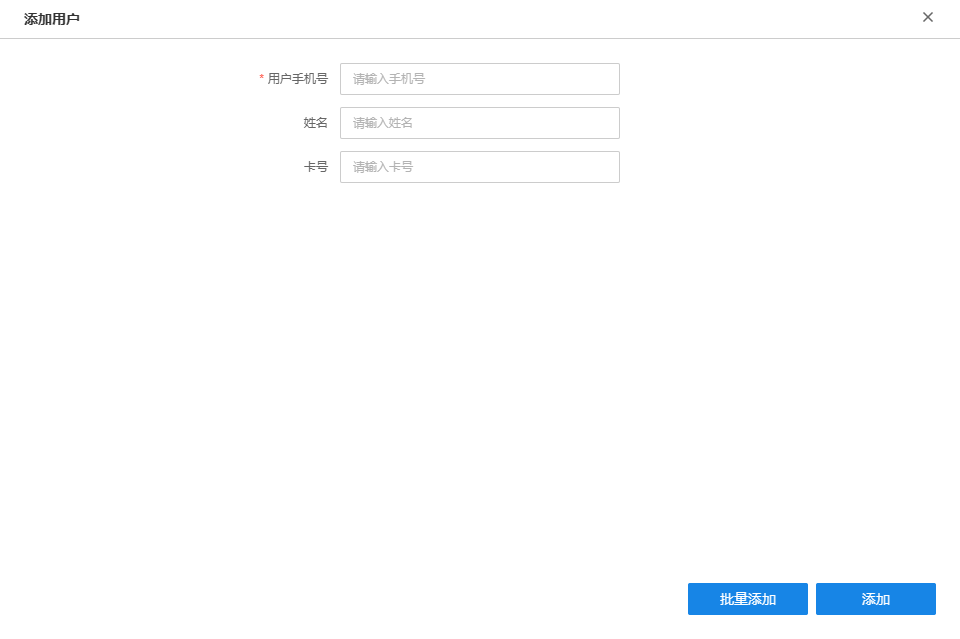
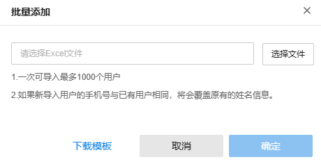
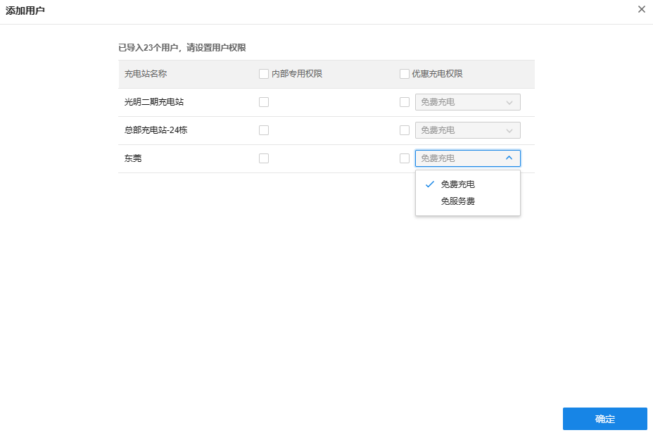
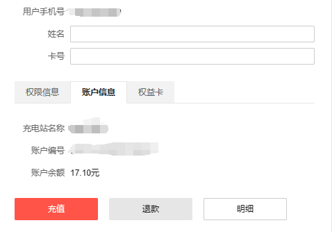
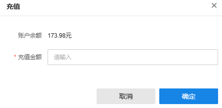
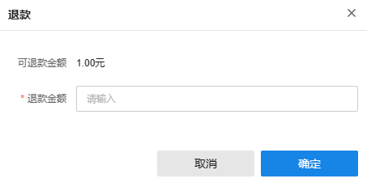
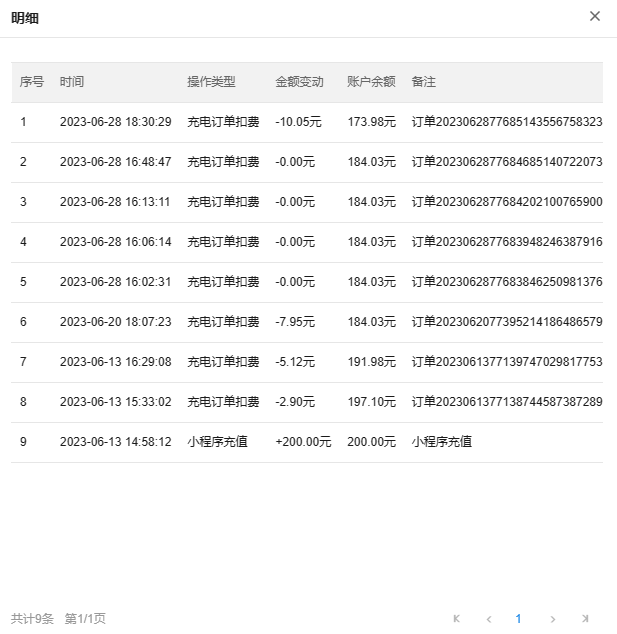

# 充电用户

TP-LINK 商用云平台支持管控充电用户权限。

**进入页面的方法：项目** **> >** **新能源汽车充电** **> >** **充电用户**

|   
---|---  
添加用户| 支持单个或批量添加用户。  
内容| 支持选择列表是否展示用户手机号、姓名、用户属性等内容。  
筛选| 支持按充电站、用户属性筛选充电用户。  
搜索| 支持按手机号搜索充电用户。  
编辑| 支持编辑充电用户权限、账户等信息，并可查看用户购买的权益卡。  
  
  * **添加用户**

点击页面右上角“添加用户”，可以单个或批量添加用户。

  1. **单个添加用户**

（1）填写用户手机号、姓名、卡号。

（2）**设置充电权限** ：设置用户在充电站的权限。

|   
---|---  
内部专用权限| 拥有内部专用权限的用户，才能在属性为内部专用的充电站进行扫码充电。  
优惠充电权限| 拥有优惠充电权限的用户，可以在指定充电站享受充电免费或免服务费的优惠。 免费充电：充电不收费，电费和服务费全免。 免服务费：充电只收电费，不收服务费。  
  
  2. **批量添加用户**

（1）**批量添加用户** ：点击批量添加，下载模板，填写用户手机号和姓名后，选择文件批量导入。

（2）**批量设置权限** ：批量设置用户在充电站的权限。

> 说明：
> 
> 批量添加一次最多可导入 1000 个用户。
> 
> 如果新导入的用户手机号在系统中已存在，将会覆盖原有的姓名、权限等信息。

  * **充值账户**

系统会为充电用户在指定充电站开通账户，用户可以进行充值、退款操作。

充电站管理员可以在商云ｗｅｂ上查看充电用户账户信息，并进行线下充值、退款操作。

**进入页面的方法：项目** **> >** **新能源汽车充电** **> >** **充电用户** >> **编辑** >> **账户信息**

  1. **充值** ：充电站管理员可以帮充电用户对账户进行充值。

  2. **退款** ：充电站管理员可以帮充电用户对账户进行退款操作。

> 说明：
> 
> 商云 Web 端只支持对商云平台充值的金额进行退款。微信充值的金额需要在小程序上申请退款。

  3. **明细** ：充电站管理员可以查看充电用户账户消费明细。

