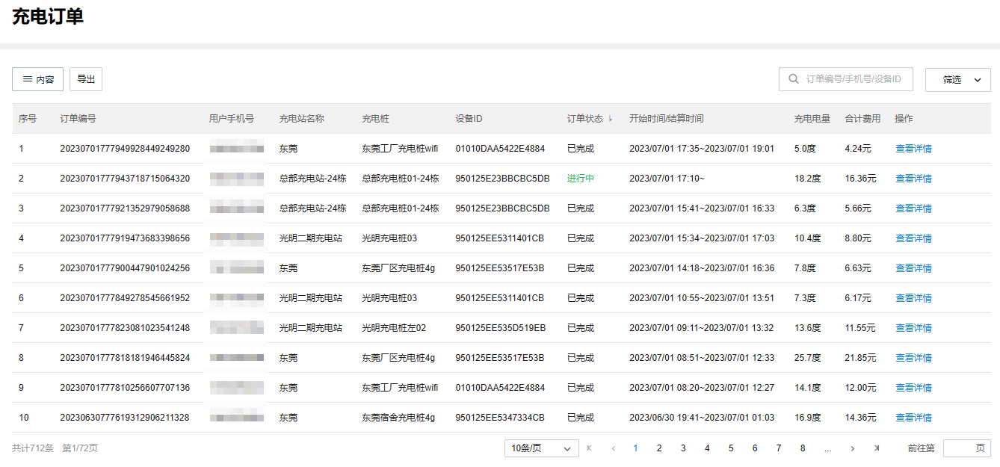

# 充电订单

TP-LINK 商用云平台支持展示项目中所有充电站的充电订单。

**进入页面的方法：项目** **> >** **新能源汽车充电** **> >** **充电订单**

|   
---|---  
内容| 支持选择列表是否展示订单编号、用户手机号、充电站名称等内容。  
查看详情| 可以查看充电订单基本信息、费用信息、充电过程变化曲线。  
筛选| 支持按充电站、订单状态、起止时间、分账状态来筛选充电订单。  
导出| 支持以 excel 表格形式导出充电订单。  
搜索| 支持按订单编号、充电用户手机号、充电桩设备 ID 来搜索充电订单
