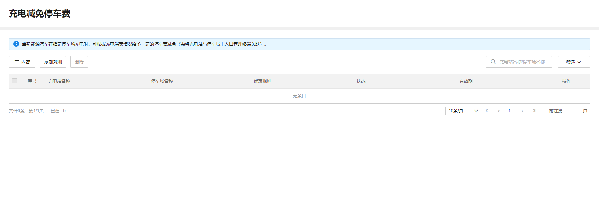
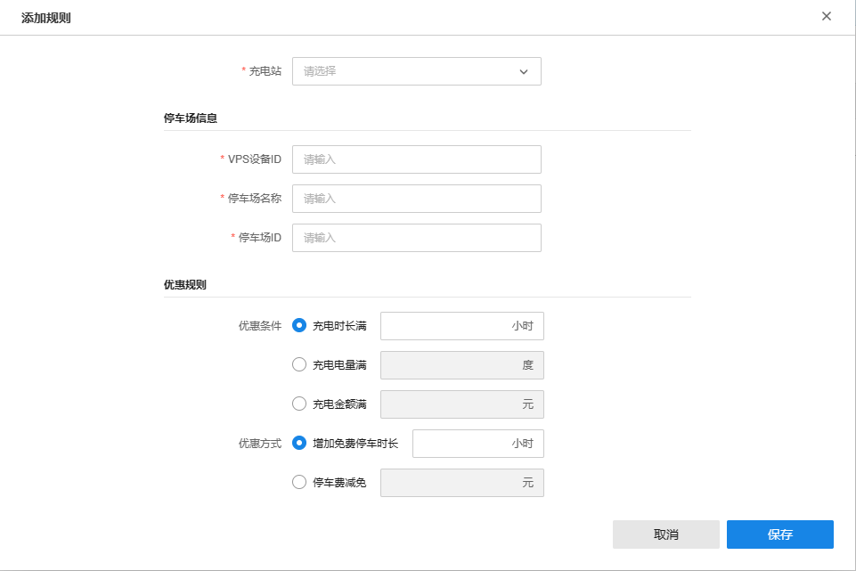

# 充电减免停车费

TP-LINK 商用云平台支持设置充电减免停车费，当新能源汽车在指定停车场充电时，可根据充电消费情况给予一定的停车费减免。

**进入页面的方法：项目 >> 新能源汽车充电 >> 充电运营>> 充电减免停车费**

|   
---|---  
内容| 支持展示表格要显示的内容，包括停车场名称，优惠规则，状态等。  
添加规则| 支持添加新的充电减免停车费规则。  
删除| 支持删除选中的规则。  
搜索| 可按充电站名称和停车场名称搜索充电减免停车费规则。  
筛选| 可按充电站、停车场和状态筛选充电减免停车费规则。  
  
  * 添加规则

点击页面右上角“添加规则”，可以新建充电减免停车费规则。

|   
---|---  
充电站| 支持选择实施充电减免停车费的充电站。  
停车场信息| 填写对应停车场信息。  
优惠规则| 填写对应优惠规则，包括优惠条件和优惠方式。  
VPS 设备 ID| 支持填写对应 VPS 设备的 ID。  
停车场名称| 支持填写对应的停车场名称。  
停车场 ID| 支持填写对应的停车场 ID。  
优惠条件| 取得优惠资格的条件，可设置为充电时长、充电电量或者充电金额满足一定的条件。  
优惠方式| 优惠的方式，支持设定增加免费停车时长，或者停车费减免。
