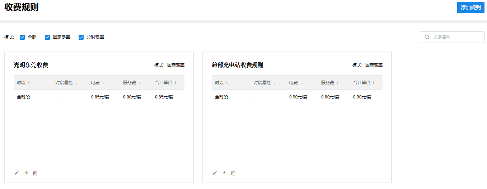
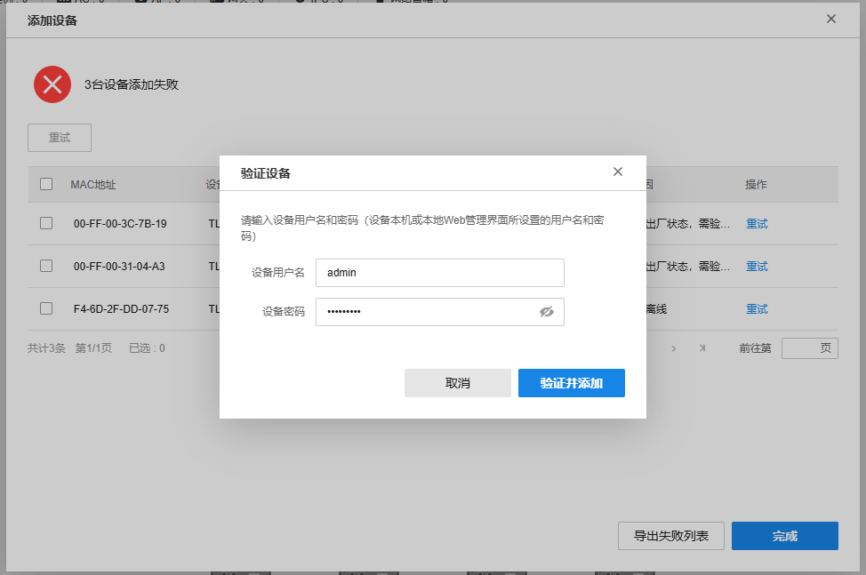
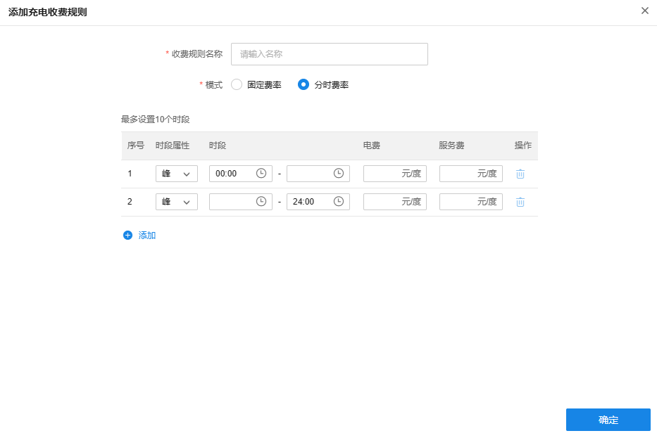

# 充电收费规则

TP-LINK 商用云平台支持为充电站设置充电收费规则。

**进入页面的方法：项目 >> 新能源汽车充电 >> 充电运营>> 充电收费规则**

|   
---|---  
添加规则| 支持为充电站创建充电收费规则。  
模式| 支持按固定费率、分时费率筛选充电收费规则。  
搜索| 支持按收费规则名称搜索充电站。  
| 支持编辑充电收费规则。  
| 复制当前充电收费规则。复制后的充电收费规则仅名称不同，其余设置相同。  
| 删除该充电收费规则。  
  
  * 添加规则

点击页面右上角“添加规则”，可以新建充电收费规则。

  1. 固定费率模式：电费、服务费为固定值

  2. 分时费率模式：电费、服务费在不同时间段，数值不同。

|   
---|---  
时段属性| 设置尖、峰、谷、平时段。  
时段| 设置各个时段的起止时间。  
电费| 设置各个时段的电费金额。  
服务费| 设置各个时段的服务费金额。  
添加| 可以添加时段，最多设置 10 个时段。  
删除| 可以删除时段。  
  
> 说明：
> 
> 所有时段起止时间不能有重复，且合起来必须组成 00：00 ～ 24：00，否则收费规则无法保存生效。
