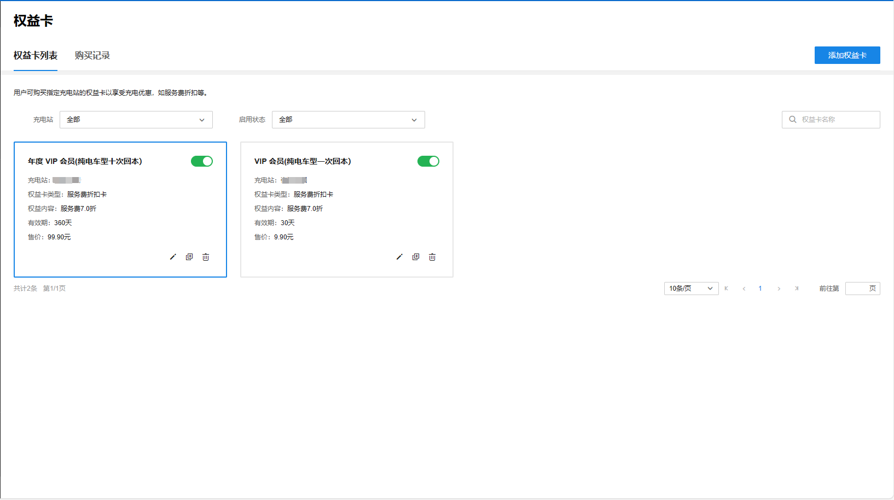
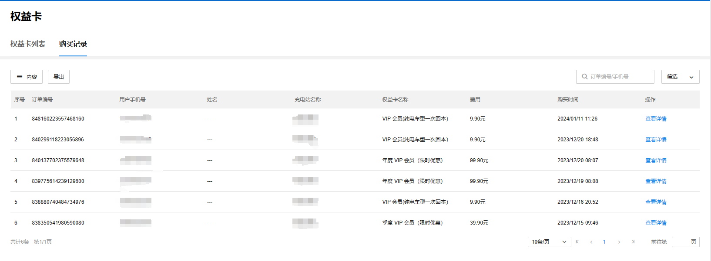
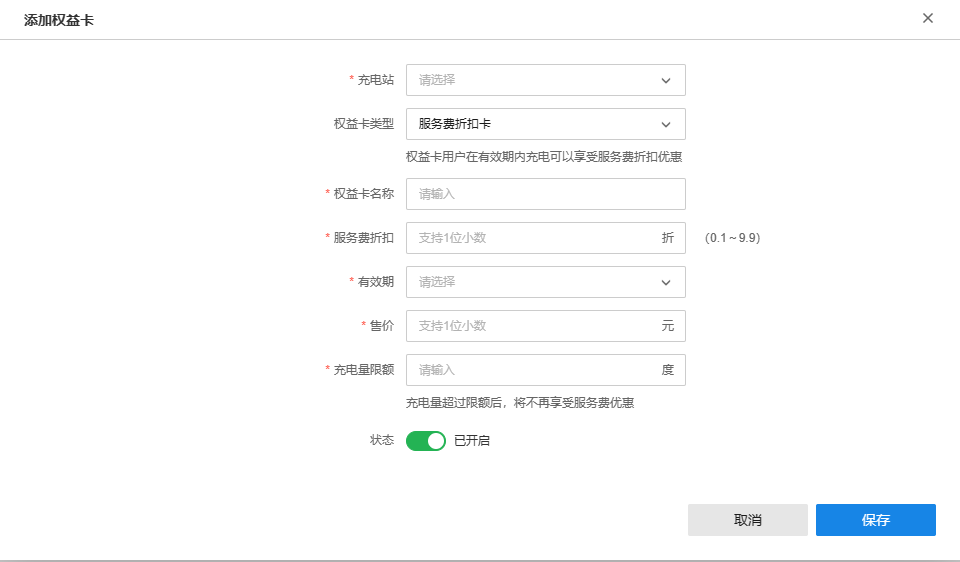

# 权益卡

TP-LINK 商用云平台支持为对应充电站设置可购买的权益卡，享受特定优惠。

**进入页面的方法：项目 >> 新能源汽车充电 >> 充电运营>> 权益卡**

#### 权益卡列表

支持展示可购买的权益卡，并添加新的权益卡。

|   
---|---  
添加权益卡| 支持添加新的权益卡。  
权益卡列表| 展示当前筛选条件下可购买的权益卡种类。  
购买记录| 支持展示权益卡的购买记录。  
筛选| 可按充电站和启用状态筛选权益卡。  
搜索| 可按权益卡名称搜索权益卡。  
| 支持编辑权益卡规则。  
| 复制当前权益卡规则。复制后的权益卡规则仅名称不同，其余设置相同。  
| 删除该权益卡规则。  
  
#### 购买记录

支持查阅权益卡的购买记录。

|   
---|---  
内容| 支持选择表格要展示的内容，包括订单编号、用户手机号、姓名等。  
导出| 支持以 excel 表格形式导出充电订单。  
筛选| 可按充电站和起止时间筛选权益卡购买记录。  
搜索| 可按订单编号和手机号筛选权益卡购买记录。  
  
#### 添加权益卡

|   
---|---  
充电站| 支持设置权益卡要绑定的充电站。  
权益卡类型| 支持设置权益卡减免费用类型。  
权益卡名称| 支持设置权益卡名称。  
服务费折扣| 支持设置权益卡服务费折扣。  
有效期| 支持设置权益卡有效期，分为月卡（30 天）、季卡（90 天）和年卡（360 天）。  
售价| 支持设置权益卡售价。  
充电量限额| 支持设置权益卡充电量限额，充电量超过限额后，将不再享受服务费优惠。  
状态| 支持设置权益卡初始状态是否可用。
