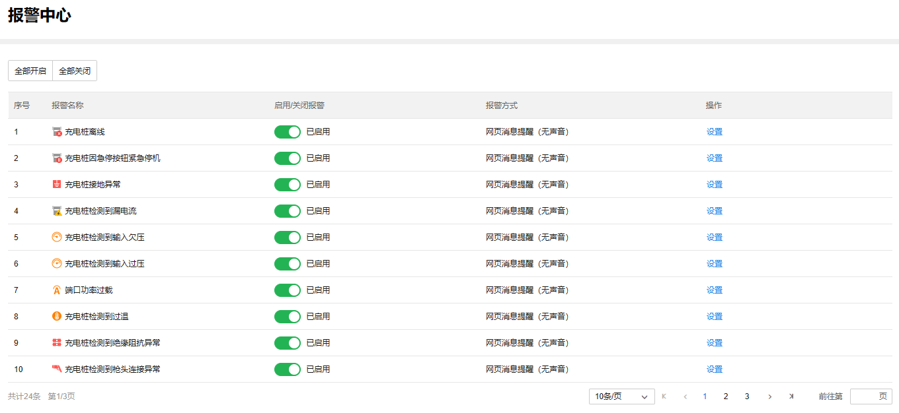
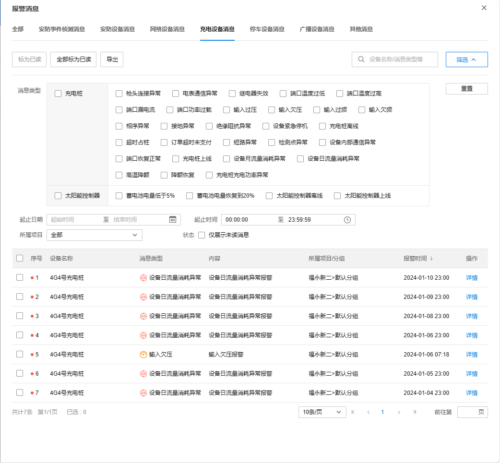

# 报警中心

TP-LINK 商用云平台支持实时监测充电桩和充电站的运行状态，出现异常会在消息页面展示报警消息。

**进入页面的方法：项目** **> >** **新能源汽车充电** **> >** **报警中心**

全部开启| 批量开启全部报警类型。  
---|---  
全部关闭| 批量关闭全部报警类型。  
启用／关闭报警| 启用／关闭单个报警类型。  
设置| 设置报警消息提供方式。  
  
  * 消息

TP-LINK 商用云平台支持在消息页面查看和展示报警消息。

