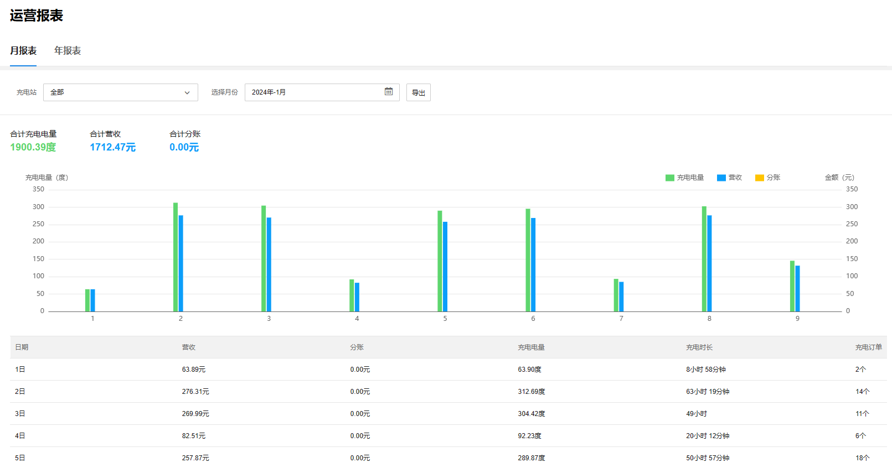
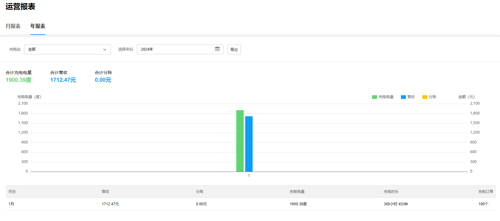

# 运营报表

TP-LINK 商用云平台支持自动生成并展示项目中全部或单个充电站的运营报表。

**进入页面的方法：项目 >> 新能源汽车充电 >> 数据中心>> 运营报表**

#### 月报表

展示指定的充电站在指定月份的运营报表，包含每日营收、分账金额、充电电量、充电时长、充电订单数据。

支持选择充电站和月份，支持以 excel 表格形式导出报表。

#### 年报表

展示指定的充电站在指定年份的运营报表，包含每月营收、分账金额、充电电量、充电时长、充电订单数据。

支持选择充电站和年份，支持以 excel 表格形式导出报表。

