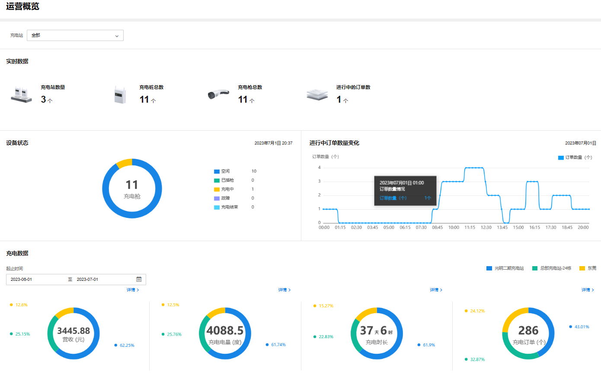

# 运营概况

TP-LINK 商用云平台支持查看项目中全部或单个充电站的运营情况。

**进入页面的方法：项目 >> 新能源汽车充电 >> 数据中心>> 运营概况**

#### 实时数据

展示项目中所有充电站的数量、充电桩数量、充电枪数量、进行中充电订单的数量。

#### 设备状态

展示项目中所有充电桩的工作状态和数量，采用不同颜色代表空闲、已插枪、充电中、故障、充电结束状态。

鼠标点击饼图，可以查看各个状态的充电桩数量和占比。

#### 进行中订单数量变化

以曲线图展示当天项目中所有进行中充电订单数量随时间的变化。

鼠标点击曲线，可以查看各个时间点充电订单的数量。

#### 充电数据

展示项目中全部充电站在指定时间段内的营收、充电电量、充电时长、充电订单数据。

点击详情可以查看各个充电站营收、充电电量、充电时长、充电订单数据。
