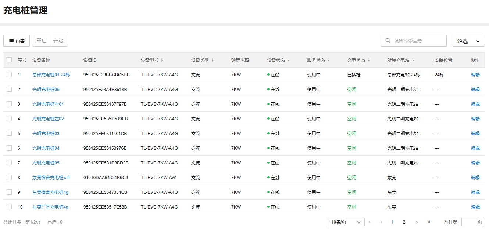

# 充电桩管理

TP-LINK 商用云平台支持管理项目中所有添加的充电桩。

**进入页面的方法：项目** **> >** **新能源汽车充电** **> >** **站点管理** **> >** **充电桩管理**

|   
---|---  
内容| 支持选择列表是否展示设备名称、设备 ID、设备型号、设备类型等内容。  
重启| 支持选择单个或多个充电桩进行重启。  
升级| 支持选择单个或多个充电桩进行升级，支持在线升级或本地升级。  
筛选| 支持按充电站、设备类型、设备状态、服务状态、充电状态来筛选充电桩。  
搜索| 支持按设备名称、设备型号来搜索充电桩。  
编辑| 支持查看充电桩设备信息和网络状态。 支持修改设备名称和地理位置、安装位置。 4G 版充电桩支持修改 SSID 名称和密码。  
  
> 说明：
> 
> 对“充电中”状态的充电桩进行重启或升级操作，系统会结束充电并结算订单。
