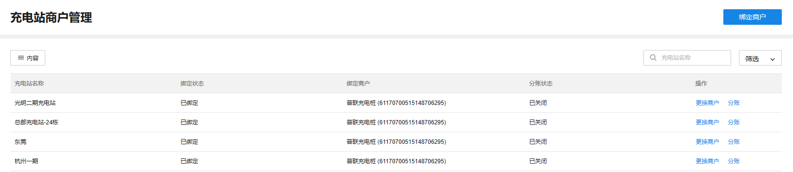
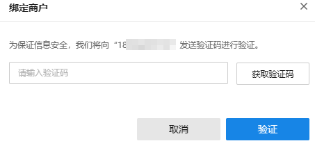
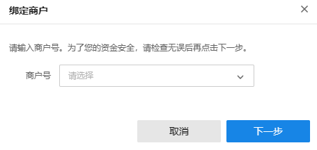
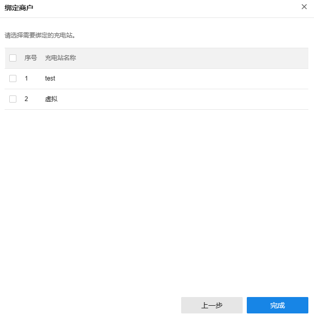
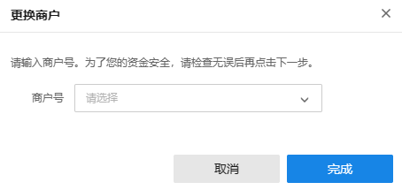
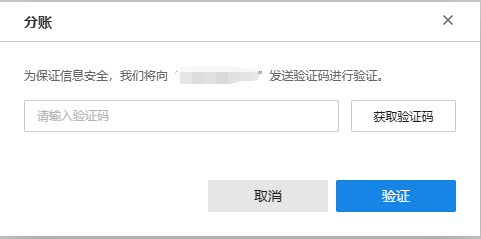
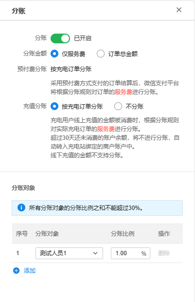

# 充电站商户管理

TP-LINK 商用云平台支持设置充电站绑定收款商户，并设置分账功能，将收款商户订单金额的一部分或全部按照一定的比例分给设置好的分账对象。

**进入页面的方法：项目** **> >** **新能源汽车充电** **> >** **站点管理** **> >** **充电站商户管理**

|   
---|---  
绑定商户| 支持为充电站绑定收款商户。  
内容| 支持选择列表是否展示充电站名称、商户绑定状态、绑定商户信息等内容。  
筛选| 支持按商户绑定状态筛选充电站。  
搜索| 支持按充电站名称搜索充电站  
更换商户| 支持更换充电站绑定收款商户。  
分账| 支持更换充电站分账对象。  
  
#### 绑定商户

  1. **短信验证** ：充电站管理员要完成短信验证，才能为充电站绑定收款商户。

  2. **选择商户** ：选择要绑定的收款商户。

  3. **选择充电站** ：选择要绑定商户的充电站。

#### 更换商户

**1.** **短信验证** ：充电站管理员要完成短信验证，才能更换充电站绑定的商户。

**2.** **更换商户** ：选择要更换的收款商户。

#### 分账

  1. 短信验证：充电站管理员要完成短信验证，才能更换充电站绑定的分账对象。

选择分账对象：选择要进行分账的对象。

|   
---|---  
分账| 设置是否要开启分账，开启后要对分账金额和分账对象进行一系列设置才能使用。  
分账金额| 设置充电订单仅对服务费分账，或对订单总金额进行分账。  
预付费分账| 决定用预付费方式支付充电订单的金额是否分账，随分账总开关开启而开启。根据分账金额的选择方式决定充电订单的分账部分。  
充值分账| 决定用提前充值方式的余额支付充电订单的金额是否分账，可选择开启或关闭。根据分账金额的选择方式决定充电订单的分账部分。  
分账对象| 设置当前充电站绑定的商户的分账对象。可选择分账对象和具体分账比例。  
  
> 说明：
> 
> 只有充电站管理员有权限管理商户。通过短信验证后，才能绑定商户、或更换 商户或分账。
