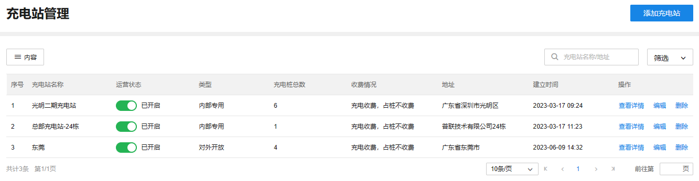
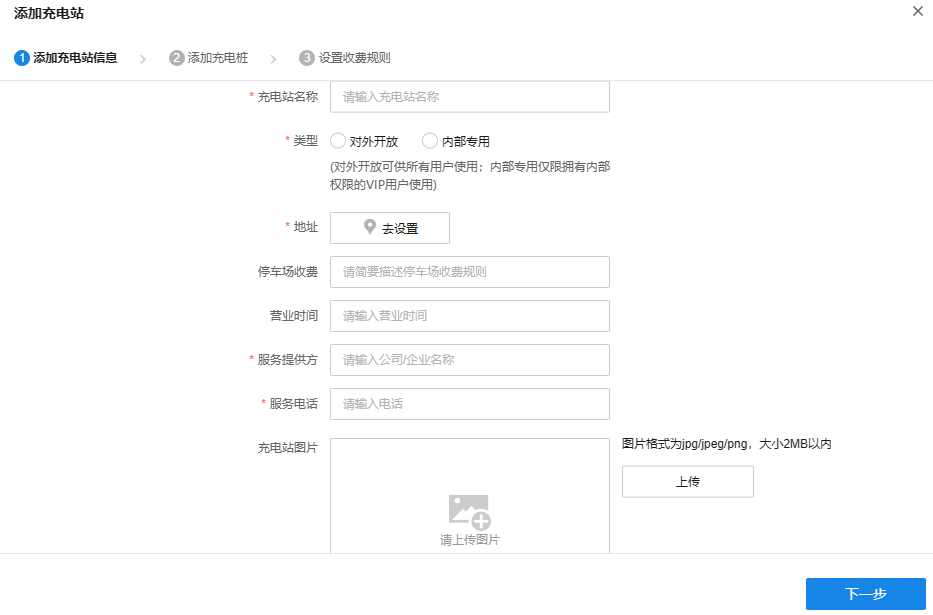
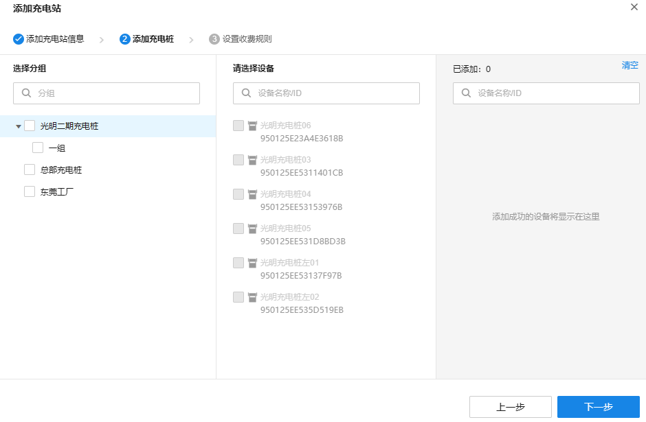
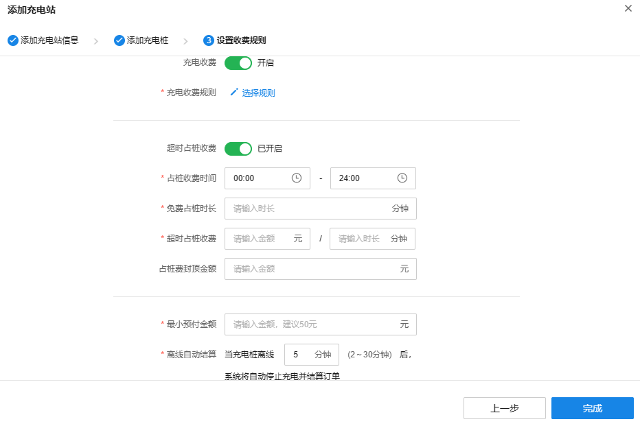

# 充电站管理

TP-LINK 商用云平台支持展示项目中所有创建的充电站。

**进入页面的方法：项目** **> >** **新能源汽车充电** **> >** **站点管理** **> >** **充电站管理**

|   
---|---  
添加充电站| 支持新建充电站。  
内容| 支持选择列表是否展示充电站名称、运营状态、类型、充电桩总数等内容。  
筛选| 支持按类型、收费情况、运营状态来筛选充电站。  
搜索| 支持按充电站名称、地址来搜索充电站  
运营状态| 支持设置充电站运营状态。只有开启运营的充电站才能提供充电服务。  
查看详情| 支持查看充电站名称、状态等基本信息、是否收费、计费规则等。  
编辑| 支持修改充电站基本信息、加入的充电桩、收费规则等。  
删除| 支持删除创建的充电站。  
  
#### 添加充电站

点击页面右上角“添加充电站”，可以新建充电站。

  1. 添加充电站信息：填写充电站名称、类型、地址等基本信息，设置完成后，点击<下一步>。

|   
---|---  
充电站名称| 设置充电站名称。  
类型| 设置充电站类型，支持选择<对外开放>或<内部专用>。 对外开放：充电站对所有人开放，任意用户都可以扫码充电。 内部专用：充电站只允许拥有内部使用权限的 VIP 用户扫码充电。  
地址| 设置充电站地址，以便在小程序上提供充电站导航。  
停车场收费| 填写充电站所在停车场收费情况，以便在小程序上展示。  
营业时间| 填写充电站营业的时间段，以便在小程序上展示。  
服务提供方| 填写运营充电站的组织信息，以便在小程序上展示。  
服务电话| 填写充电站运营方的客服电话，以便在小程序上展示。  
充电站图片| 上传充电站的图片，以便在小程序上展示。  
  
  2. 添加充电桩：选择要加入充电站的充电桩，设置完成后，点击<下一步>。

  3. 设置收费规则：设置充电站的收费规则，点击<完成>即完成创建充电站。

|   
---|---  
充电收费| 设置充电是否收费，开启后需要设置充电收费规则。  
充电收费规则| 设置充电收费规则，支持选择已有收费规则或新建收费规则。  
超时占桩收费| 设置超时占桩是否收费，开启后需要设置相应收费规则。 占桩收费时间：设置占桩收费规则生效时间段。 免费占桩时长：设置充电结束后允许免费占桩的时长。 超时占桩收费：设置超时占桩计费规则。 占桩费封顶金额：设置占桩费最大值，超过封顶金额后不再随时间增加。  
最小预付金额| 设置小程序上采用预付费方式启动充电需要预先支付的最小金额。  
离线自动结算| 设置充电桩离线时间阈值，充电过程中离线超过该阈值后，系统将自动停⽌充电并结算订单。充电过程中离线不超过该时间，系统会继续充电。
