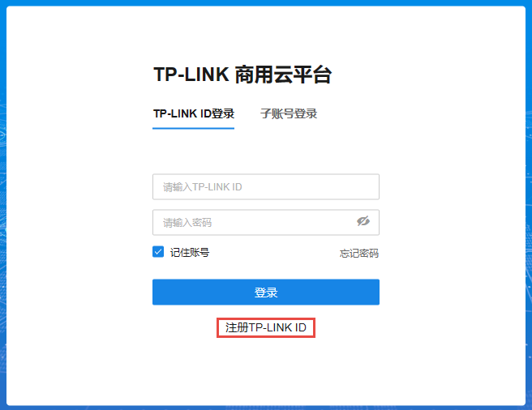
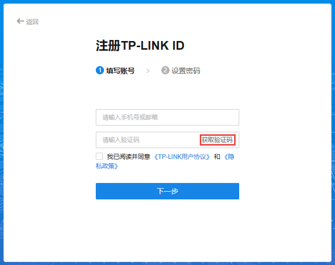
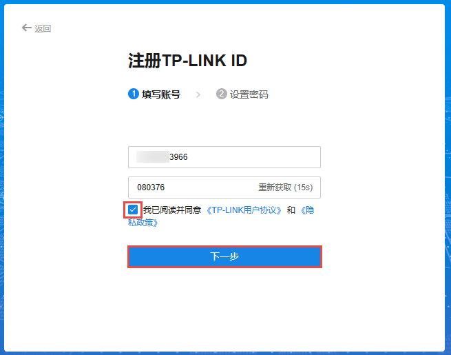
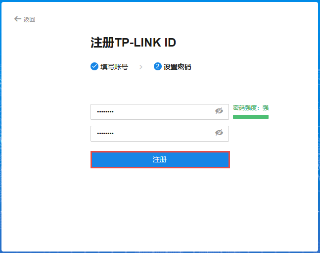

# 注册账号

  1. 进入[TP-LINK 商用云平台官网](<https://smbcloud.tp-link.com.cn/login.html#/>)，点击下方<注册 TP-LINK ID>。

  2. 支持使用手机号或邮箱注册 TP-LINK ID，输入手机号或邮箱，点击<获取验证码>。

输入验证码后，勾选下方选项，点击<下一步>。

  3. 设置并确认账号密码，点击<注册>即可。

注册成功后，将自动跳转到 TP-LINK 商用云平台 Web 登录界面。
