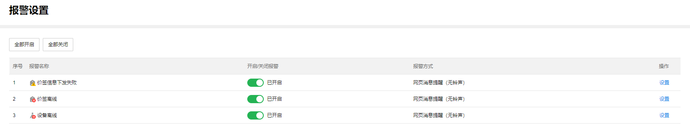

# 报警设置

针对特定的电子价签事件，可以设置对应的报警信息。

**进入页面的方法** : **项目** **> >** **电子价签管理** **> >** **报警设置**

报警条目介绍：

|   
---|---  
报警名称| 触发报警的时间。  
开启/关闭报警| 关闭后则后续该事件发生不会触发报警。  
报警方式| 触发事件后报警的方式。  
设置| 可设置当前条码的报警方式。
