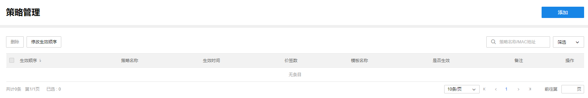
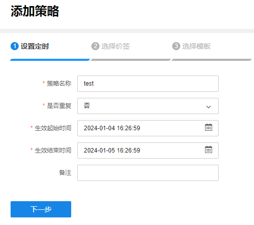
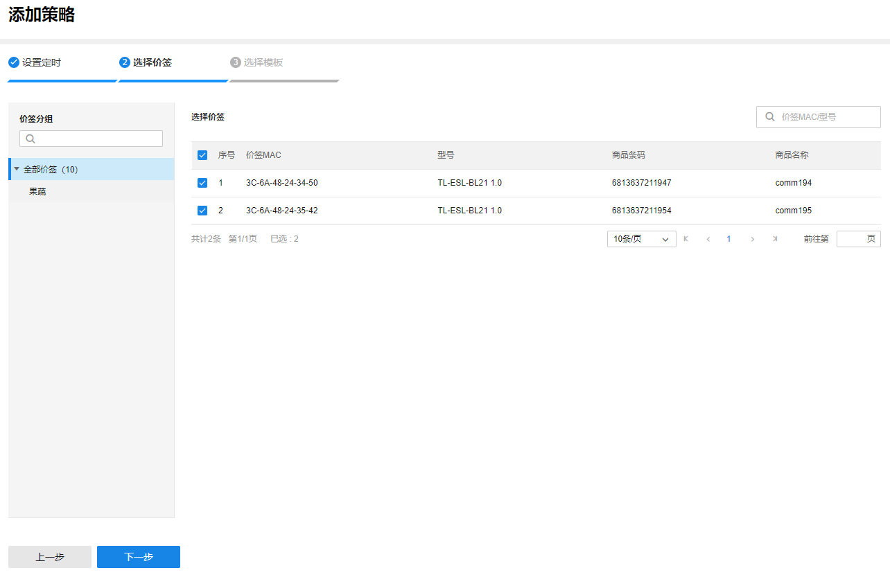
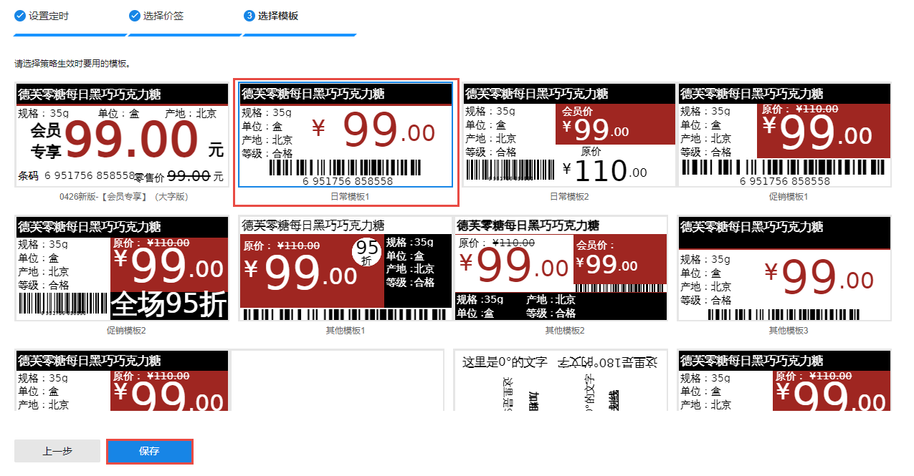

# 策略管理

在使用的过程中，为应对各种经营方案，价签需要定期修改模板，用户可提前在商云设置价签需要修改模板的策略，后续由商云负责在生效时间内控制电子价签展示显示信息。

**进入页面的方法** : **项目** **> >** **电子价签管理** **> >** **策略管理**

策略条目介绍：

|   
---|---  
生效顺序| 代表策略条目的优先级，数字越小优先级越高。当一个商品在某段时间内设置了多个策略的情况下，优先级高的定时调节生效。  
策略名称| 该策略的名称。  
生效时间| 该策略的有效时间范围。  
价签数| 该策略涵盖的价签数目。  
是否生效| 可开启或关闭，关闭后该定时调价不再生效。  
编辑| 可编辑该定时调价信息，可编辑的信息包括：名称、重复方式、生效时间、影响的价签、生效的模板。  
  
**添加策略：**

点击<添加>，首先设置该策略的名称、是否重复，若选择否，则该定时调价只生效一次，需设置具体的生效时间；若选择是，则需要设置重复方案，包含按月重复、按周重复、按日重复及每次的生效时间。

设置完成后点击<下一步>，选择需要改价的商品。

点击<下一步>，设置需要修改的模板，点击<保存>后完成添加。

