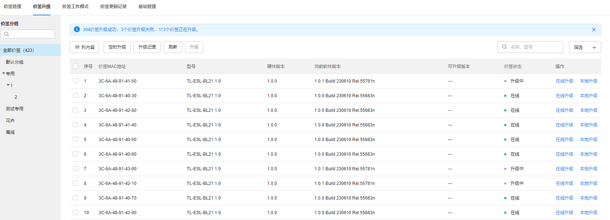
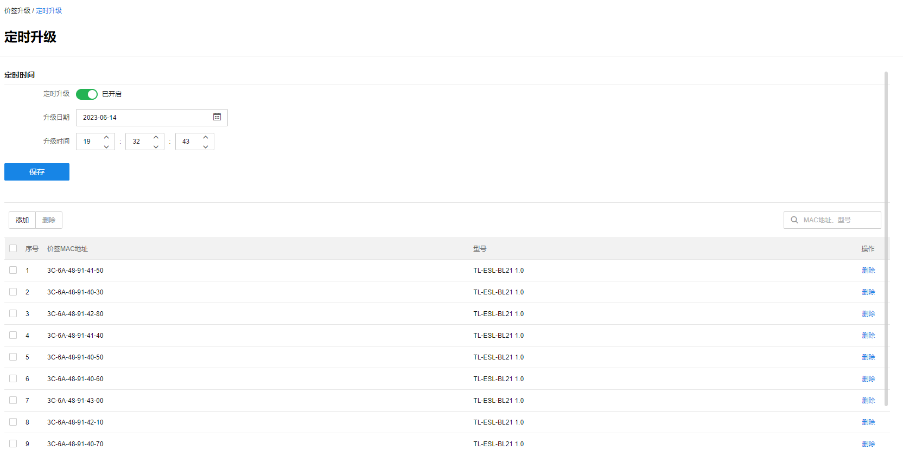
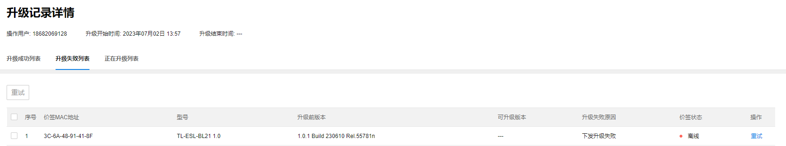

# 价签升级

#### 在线升级

选择需要升级的价签，点击<在线升级>，系统会自动检测最新的价签固件，如有新固件，则自动对选中的价签升级。

#### 本地升级

选择需要升级的价签，点击<本地升级>，选择需要升级的固件，则自动对选中的价签升级选中固件。

> 注意：
> 
> 价签升级过程中，价签将不响应任何操作。
> 
> 价签升级完成的时间与本次升级的价签数目有关。

#### 定时升级

由于升级过程中可能导致价签断联，影响正常的经营活动，故可使用定时升级的方案，在门店休息的时候对价签进行升级。

定时升级：设置定时升级的日期和具体时间，添加需要定时升级的价签，选择开启定时升级，点击<保存>。

#### 升级记录

可查看电子价签的升级记录，点击详情可查看该升级记录中升级成功的价签、升级失败的价签和正在升级的价签，对于升级失败的价签，可多选后点击<重试>对价签重新升级。

