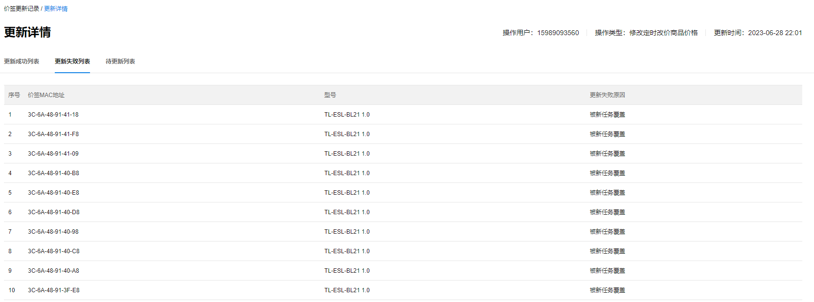

# 价签更新记录

系统上对价签进行每一次编辑操作，如：价签绑定商品、价签修改模板、定时改价生效，都视为一次价签更新，用户可在此页面查看操作的结果。

更新记录条目介绍：

|   
---|---  
更新时间| 进行某次价签更新的时间。  
操作用户| 进行本次价签更新的用户账号。  
操作类型| 导致每次更新的具体操作。  
更新的状态| 记录本次更新是否已完成。  
更新失败价签数| 展示本次更新中失败的价签数目。  
  
#### 查看详情

用户可在此页面查看某次任务的更新详情，更新的记录分为三个列表，分别为更新成功列表、更新失败列表及待更新列表。

