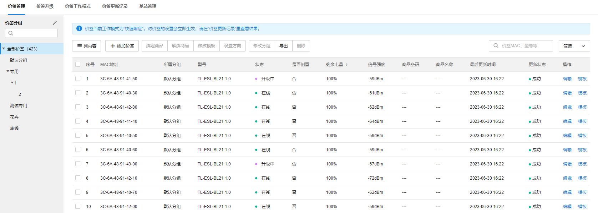
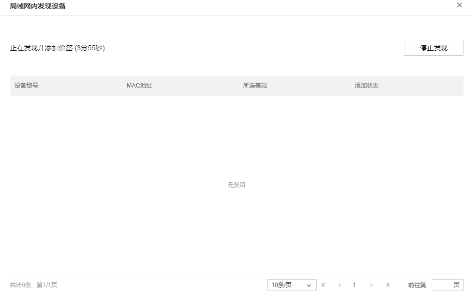
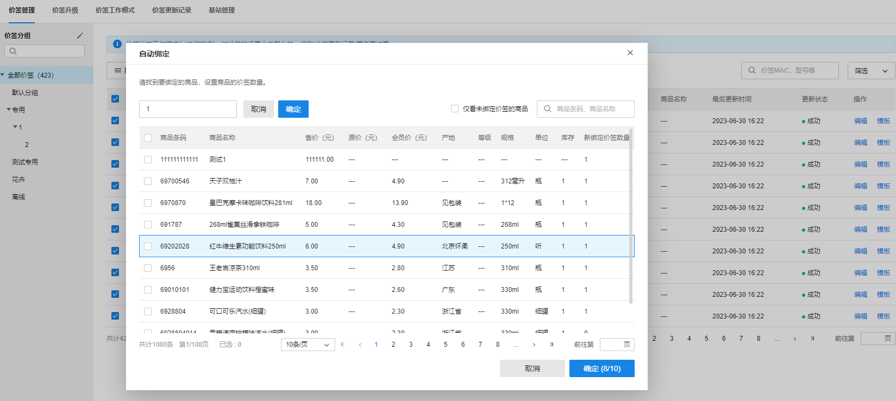
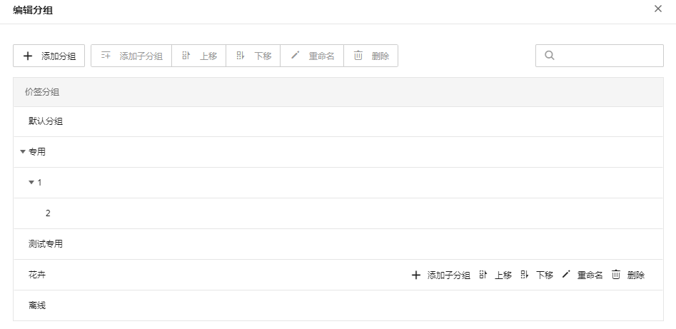

# 价签管理

用户可在此页面添加价签、绑定商品、解绑商品、修改模板、设置方向、修改分组、导出价签、删除价签。

价签列表条目介绍：

|   
---|---  
MAC 地址| 价签的唯一标识。  
所属分组| 价签的所在分组。  
型号| 价签的型号。  
状态| 价签目前的状态。  
是否倒置| 价签的放置状态，如有安装价签装反的时候可通过倒置操作使显示正常。  
剩余电量| 价签的剩余电量，分为 100%、75%、50%、25%、0%，合计 5 档。  
信号强度| 价签的信号强度，强度过低有掉线的风险。  
商品条码| 价签绑定的商品的条码。  
商品名称| 价签绑定的商品的名称。  
最后更新时间| 最后一次操作该价签的时间。  
更新状态| 最后一次操作该价签是否操作成功。  
编辑| 点击<编辑>，可设置当前价签的倒置状态，可选择当前价签需要绑定的商品，或解绑商品，使价签恢复至未绑定商品状态。  
模板| 点击<模板>，可设置当前价签绑定的模板。  
  

**添加价签：**

点击<添加价签>，先输入需要添加的价签数目。

点击<估算时长>，系统会展示预计添加所需时间。

点击<开始添加>，系统发现的价签满足添加数目或发现环境中再无其他价签时，自动结束添加流程。

**绑定商品：**

点击<绑定商品>，选择<手动绑定>，选择要绑定的价签，及需要绑定的商品，点击<确定>即可完成绑定；

选择<自动绑定>，可输入每个商品需要绑定的价签数目，或点击<批量设置价签数目>，输入每个商品需要绑定的价签数目。

点击<确定>后，系统将自动绑定价签和商品。

> 注意：
> 
> 绑定商品所需的价签数目，不能超过选择价签数目，否则会导致无法绑定。

|   
---|---  
解绑商品| 选择需要解绑的价签，点击<解绑商品>，点击<解绑>，即可解绑选中价签。  
设置方向| 选择需要设置方向的价签，点击<设置方向>，选择“正置”或者“倒置”，点击<确定>，即可设置选中价签的图案展示方向。  
修改分组| 选择要修改分组的价签，点击<修改分组>，选择要修改的分组，点击<确定>，即可修改价签分组。  
导出价签| 点击<导出>即可导出所有价签信息。  
删除价签| 选择需要删除的价签，点击<删除>，系统提示是否确认删除，点击<确认>即可删除价签。  
  

**编辑分组：**

点击价签分组旁边的编辑图标，即可进入编辑分组的页面。

可进行的编辑操作包括：添加分组、添加子分组、删除分组、重命名、上移下移分组。
