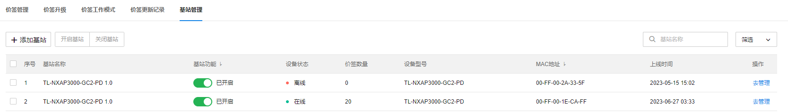

# 基站管理

用户可以在此页面添加基站、开启/关闭基站、查看基站的设备状态、携带的价签数目、设备型号、mac 地址及上线时间。

#### 添加基站

点击<添加基站>，系统会自动跳转至“设备”页面，点击<添加设备>，选择<添加网络设备>，相关功能请参考 [添加设备](<um_1_3_4>)。

#### 开启/关闭基站

点击设备列表中的“基站功能”列，即可开关基站，也可多选设备，点击<开启基站><关闭基站>即可批量开关基站。
