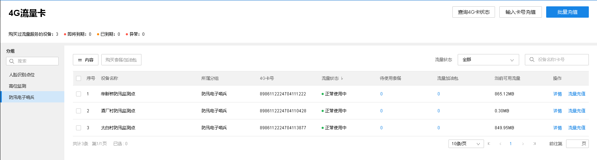
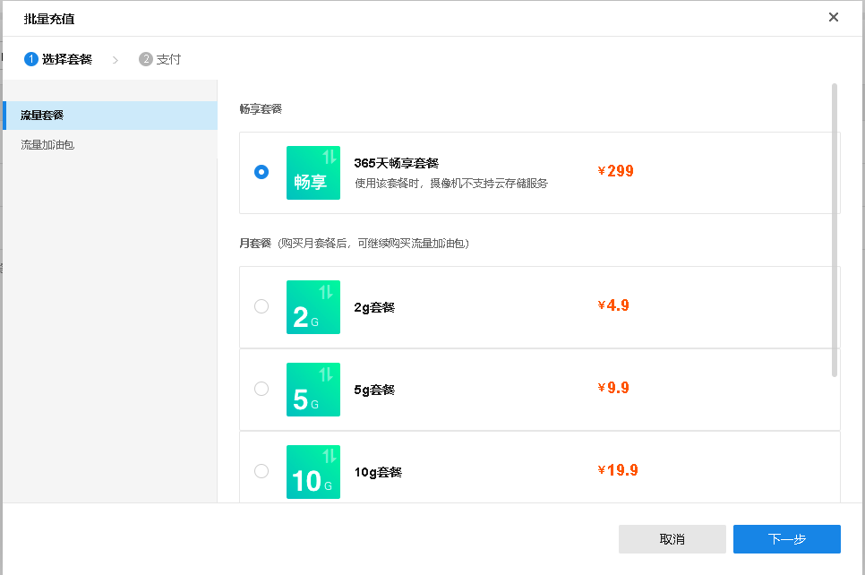
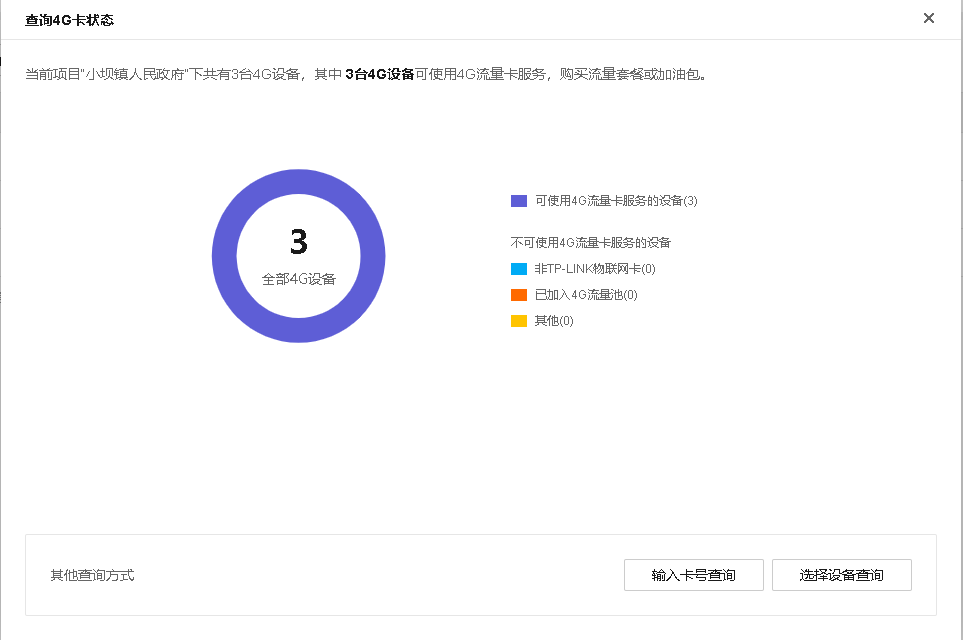

# 4G 流量卡

**进入页面：项目 >> 监控管理 >> 4G 流量池充值>> 4G 流量卡**，可以查看 4G 摄像机流量套餐及使用情况。

勾选监控点，点击上方<购买套餐/加油包>，可以充值流量。

点击右上角<查询 4G 卡状态>，可以所选分组 4G 摄像机的 4G 卡状态。

另外还可以对流量卡进行充值，点击<输入卡号充值>，可以对当个摄像机进行充值，勾选监控点，点击<批量充值>，可以对所选点位进行批量充值。
