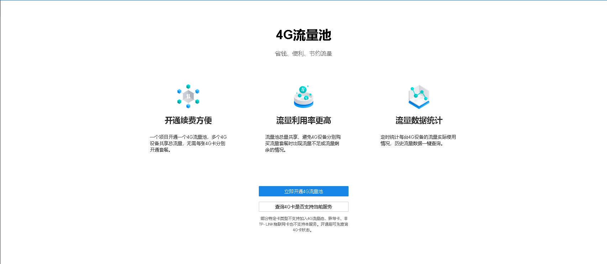
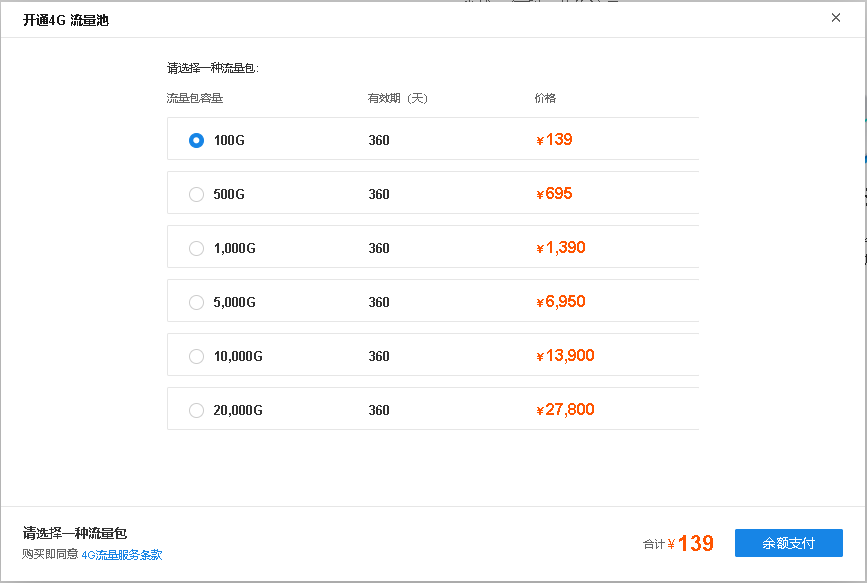
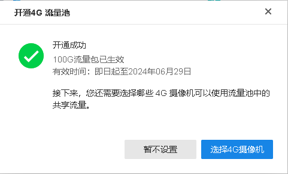
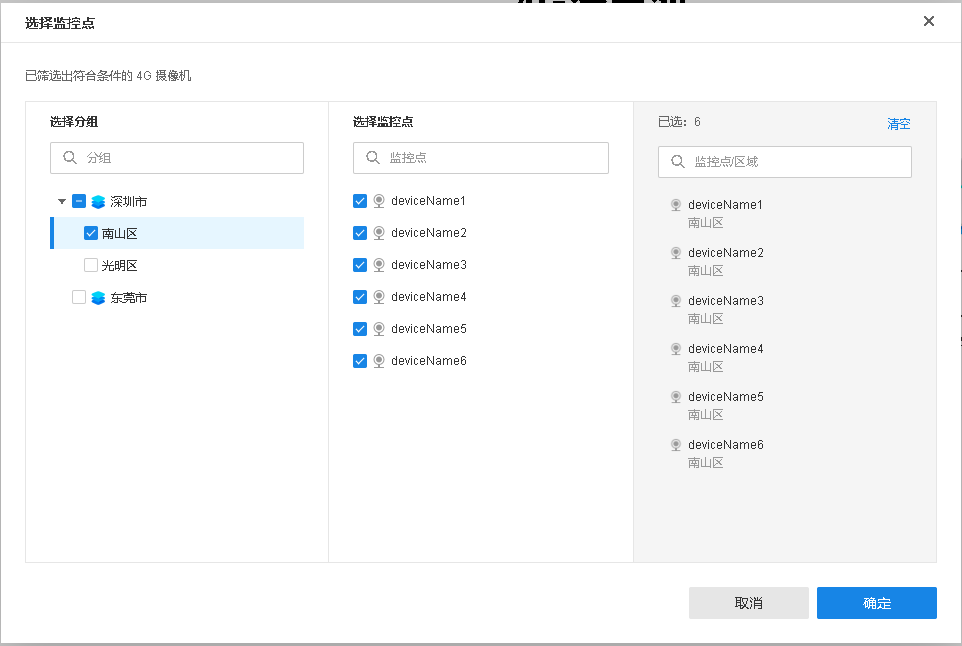
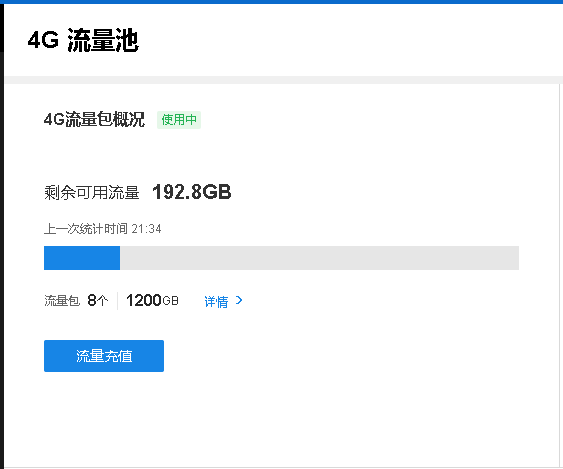
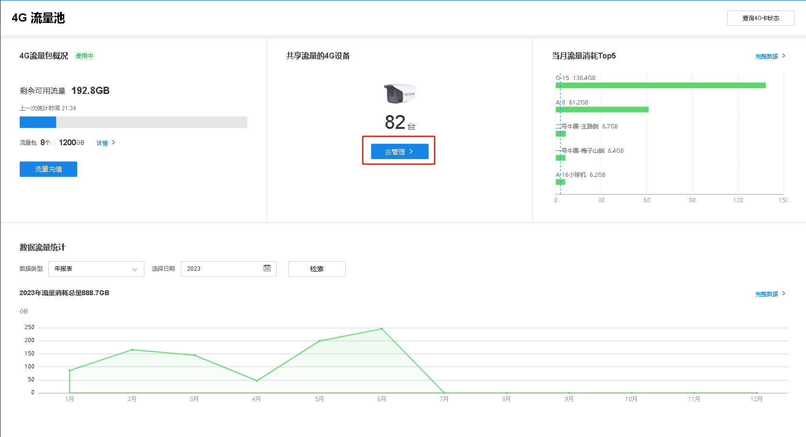
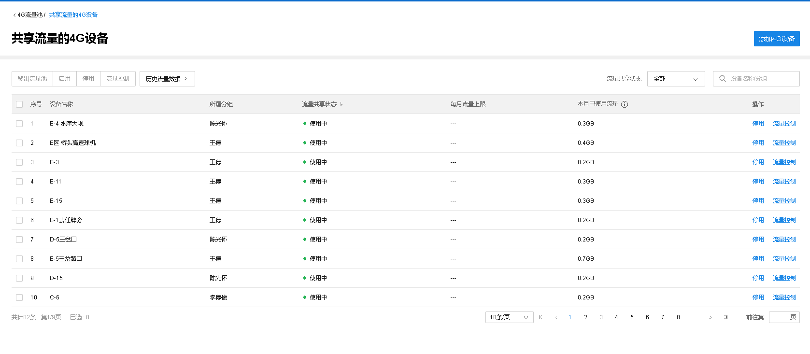

# 4G 流量池

#### 开通 4G 流量池

**进入页面：项目** **> >** **监控管理** **> > 4**G**流量池充值** **> > 4**G**流量池** ，点击<立即开通 4G 流量池>。

选择流量池套餐服务器，点击<余额支付>。

开通成功后，<选择 4G 摄像机>。

勾选区域下需要加入流量池的 4G 摄像机，点击<确定>。

#### 4G 流量池管理

##### 流量充值

点击<流量充值>，选择套餐类型给 4G 流量池充值。

点击<详情>，可以查看历史 4G 流量包的使用情况。

##### 管理 4G 摄像机

**进入页面：项目 >> 监控管理 >> 4G 流量池充值 >> 4G 流量池**，点击<去管理>。

勾选监控点，点击上方按钮可将摄像机移出流量池、停用、启用以及设置流量控制，设备列表可以查看每个点位本月已使用流量。

点击右上角<添加 4G 设备>，可以添加项目下符合要求的 4G 摄像机到流量池中。

> 说明：
> 
> 摄像机的 4G 流量卡需要为我们搭配的 4G 物联卡才支持添加到流量池，请使用自带 4G 流量卡的 4G 产品。
