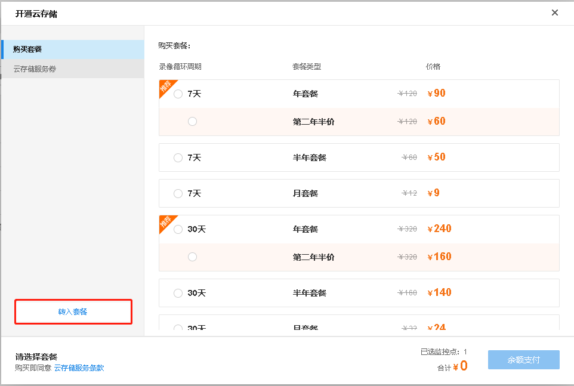
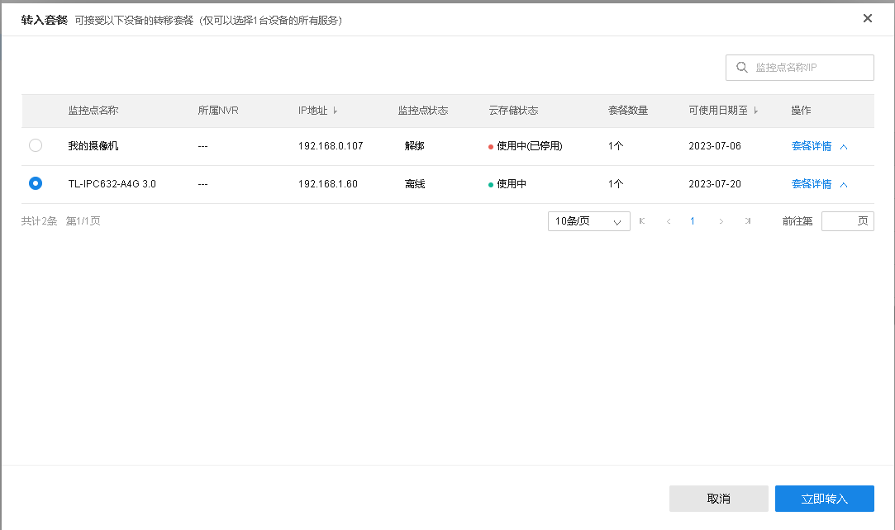

# 转移套餐给其他设备

再商云平台中，同一个项目的监控点，支持云存储互相转移。

如果项目下有可以被转移的云存储套餐，勾选要接受转移的监控点，点击<开通云存储>或<延长使用>，在套餐页面点击<转入套餐>。

选择需要的套餐，点击<立即转入>。

> 说明：
> 
> 被转移监控点的云存储套餐未过期，且要处于离线或从商云上解绑的状态
> 
> 接受转移的监控点下无云存储套餐或云存储套餐已过期。
