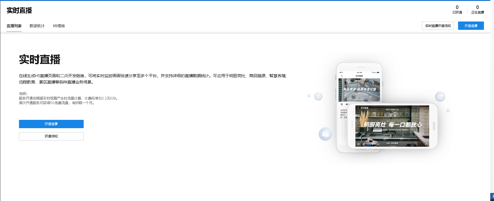
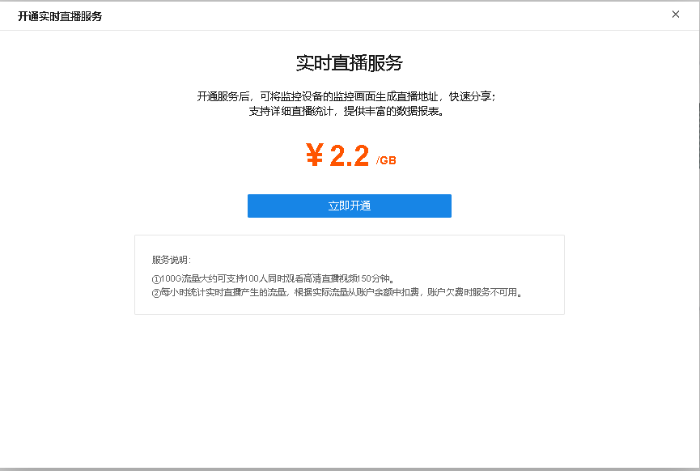
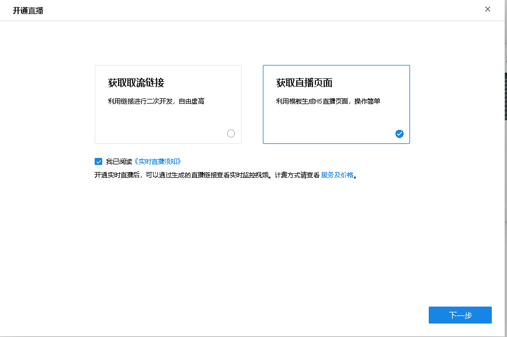
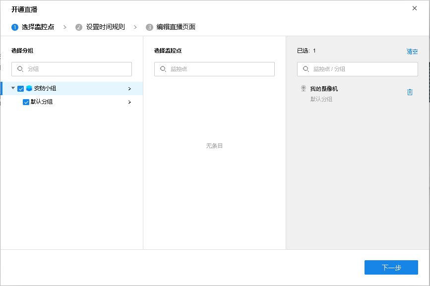
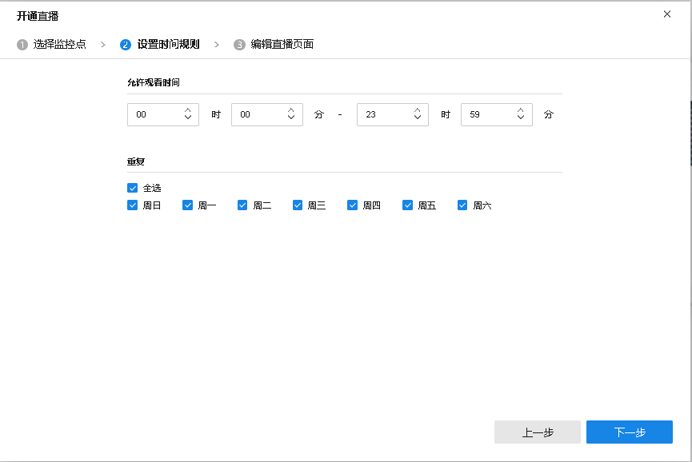
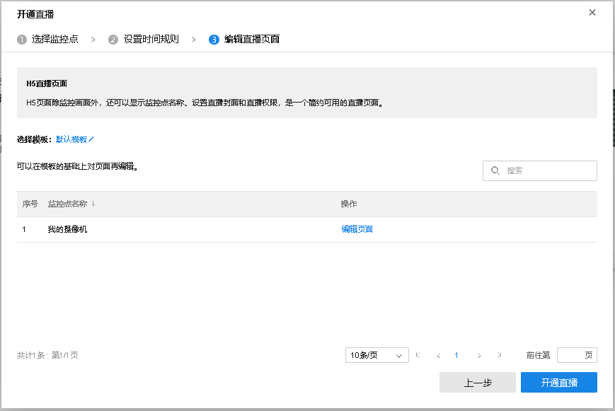
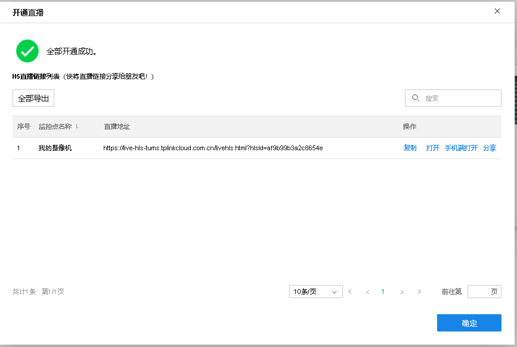

# 开通直播

**进入页面：项目** **> >** **监控管理** **> >** **实时直播** **> >** **直播列表** ，点击<开通直播>。

实时直播服务按流量收费，价格为 2.2 元/GB。

  1. 可以选择是否要生成 H5 直播页面，点击<下一步>。

  2. 勾选区域下的监控点，点击<下一步>。

  3. 设置允许观看时间，点击<下一步>。

  4. 选择或编辑 H5 页面模板，点击<开通直播>。

  5. 开通后会生成直播地址链接，点击<确定>即可。

