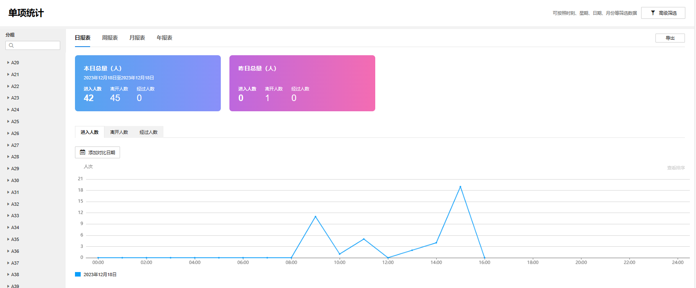
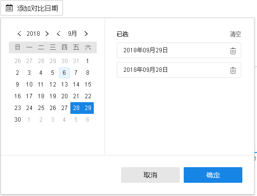

# 单项统计

**进入页面：项目** **> >** **监控管理** **> >** **客流数据统计** **> >** **单项统计** ，在页面“监控区域”栏选择区域及监控点，可查看具体监控点的客流数据，进入和离开人数总量。可以选择具体日期，也可以选择查看某一周、某个月甚至某一年的数据：

以日报表为例，点击右上角<导出日报表>，可导出当前日期的客流数据。

选择周报表、月报表、年报表，可以导出某一周、某个月甚至一年的客流数据。

点击<添加对比日期>，可选择对比同一监控点不同日期的客流数据。

