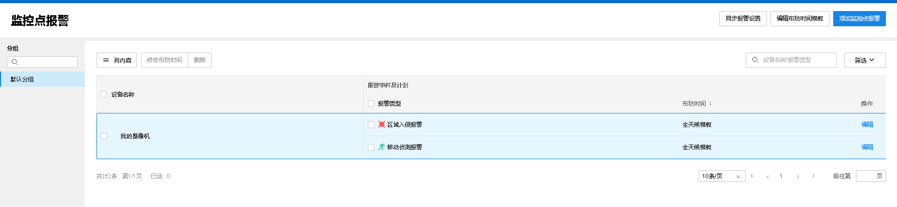
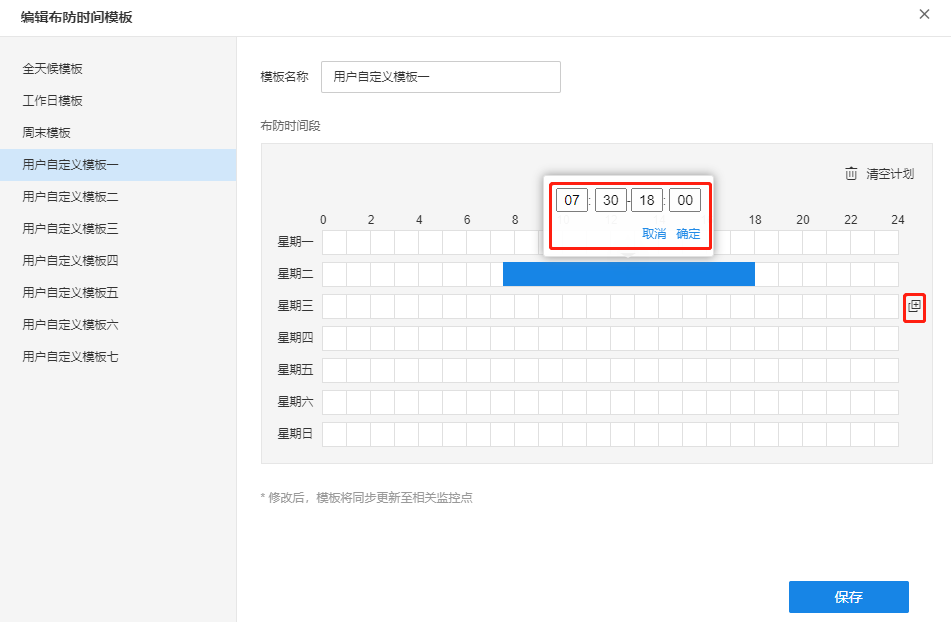
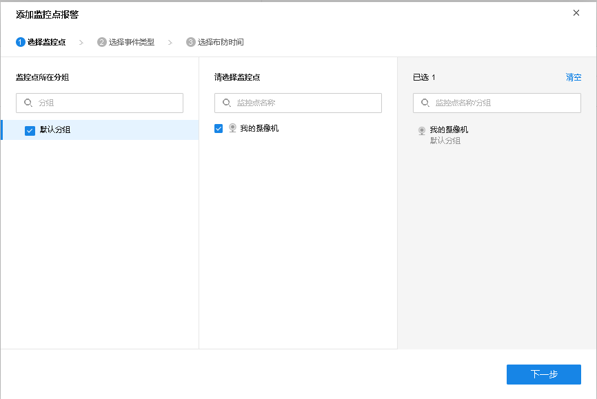
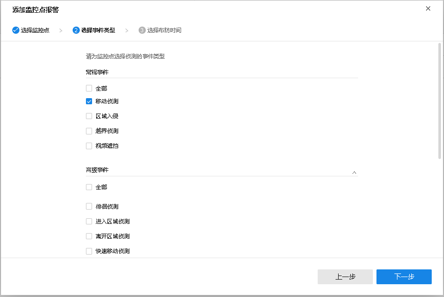
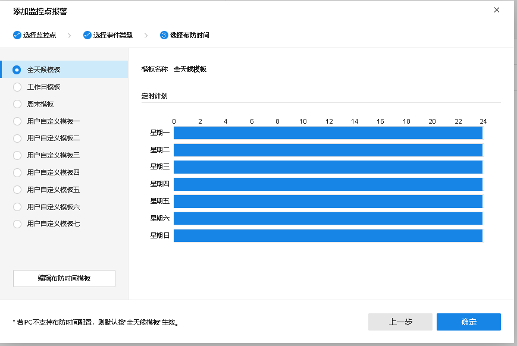
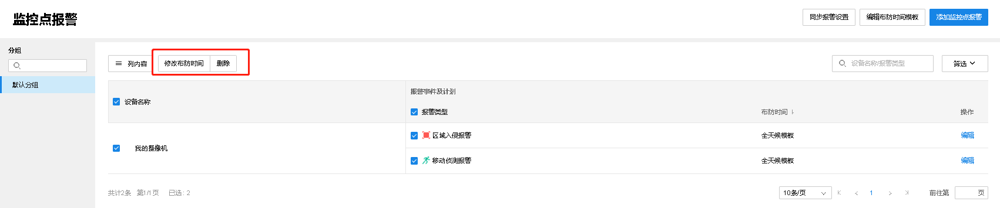

# 监控点报警

#### 添加监控点报警

商云支持多样化的智能事件告警配置，包括移动侦测、区域入侵、越界侦测、视频遮挡等常规事件以及人形侦测、电瓶车检测、停车检测、外接传感器报警等高级事件，设备触发事件时系统主动报警。

**进入页面：项目** **> >** **监控管理** **> >** **报警设置** **> >** **监控点报警** ，可以查看和设置监控点报警。

  * **编辑布防时间模板**

点击右上角<编辑布防时间模板>，可自定义时间模板，点击后方按钮，可将设置复制到其他日期。

  * **添加监控点报警**

点击页面右上角<添加监控点报警>，按照以下步骤操作：

  1. 选择监控点，点击<下一步>。

  2. 选择事件类型，点击<下一步>。

  3. 选择布防时间模板，点击<确定>。

#### 管理监控点报警

勾选需要管理的监控点报警设置，可以修改布防时间或删除报警设置。

