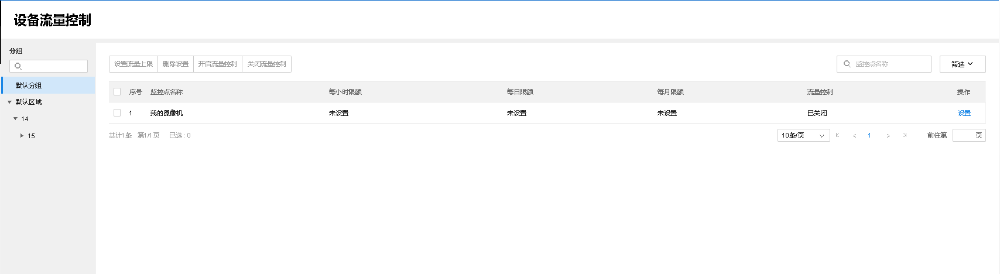
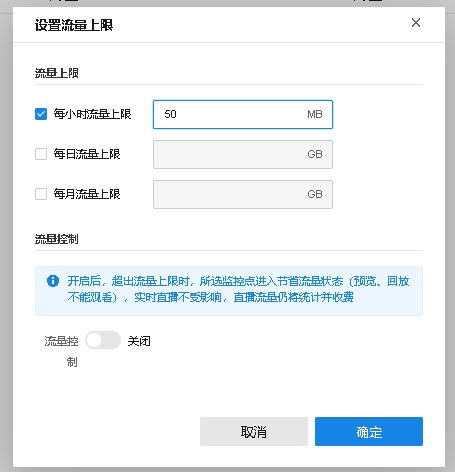

# 视频监控流量控制

**进入页面：项目 >> 监控管理** **> >** **视频监控** **> >** **视频监控流量控制** ，可以设置监控点位的流量上限，用以节约流量消耗。

勾选需要管理的监控点，点击上面的<设置流量上限>，可以设置监控点每小时、每日、每月的流量上限，也可以直接开启<流量控制>，开启后无法预览和回放，直播功能不受影响。

上方工具栏还可以删除设置、批量开启和关闭流量控制。
