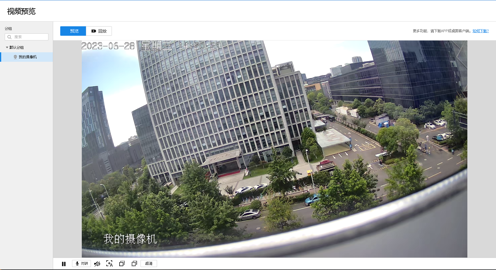
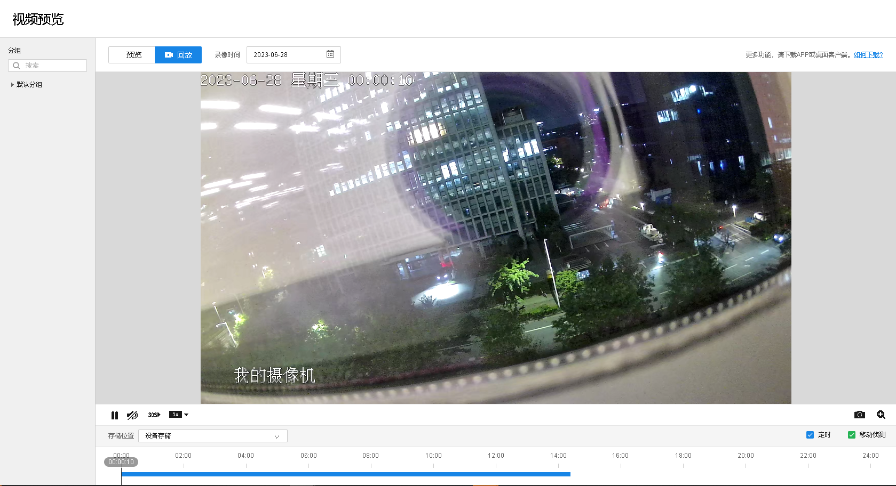

# 视频预览

#### 预览

TP-LINK 商用云平台支持在线直接预览监控点画面，无需插件，且可以进行语音对讲等操作。

**进入页面：项目** **> >** **监控管理** **> >** **视频监控** **> >** **视频预览**

图标| 功能  
---|---  
| 暂停播放  
| 继续播放  
| 开启实时语音对讲  
| 自动对焦  
| 聚焦前景  
| 聚焦背景  
| 当前画面清晰度为超清，点击切换画面清晰度为流畅。  
| 当前画面清晰度为流畅，点击切换画面清晰度为超清。  
  
#### 回放

TP-LINK 商用云平台支持在线回放监控点历史录像，点击<回放>进入页面。

图标| 功能  
---|---  
| 暂停播放  
| 继续播放  
| 点击调节画面音量  
| 静音  
| 快进 30s  
| 倍速播放录像，支持 1/16、1/8、1/4、1/2、1、2、4、8、16 倍速播放。  
| 截图  
| 电子放大
