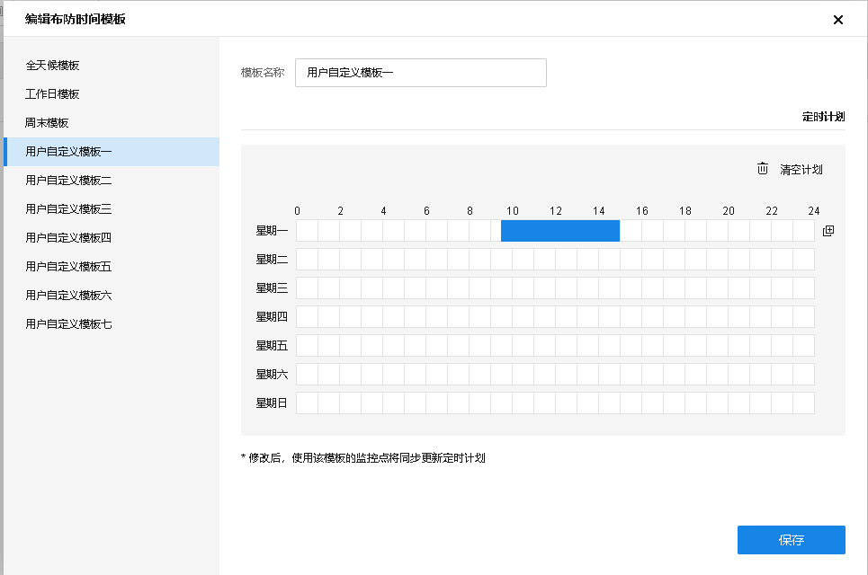
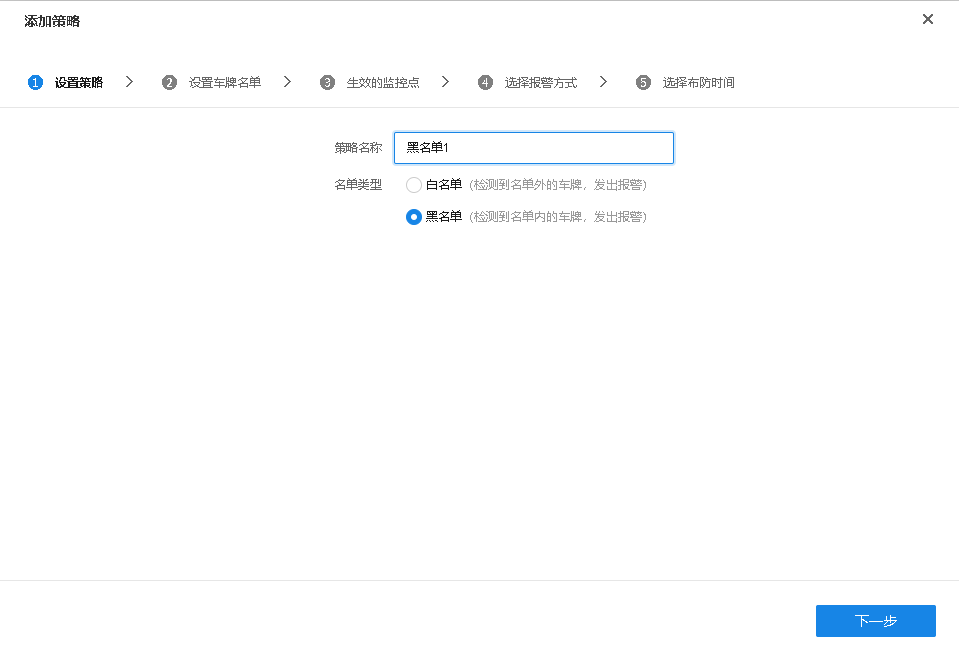
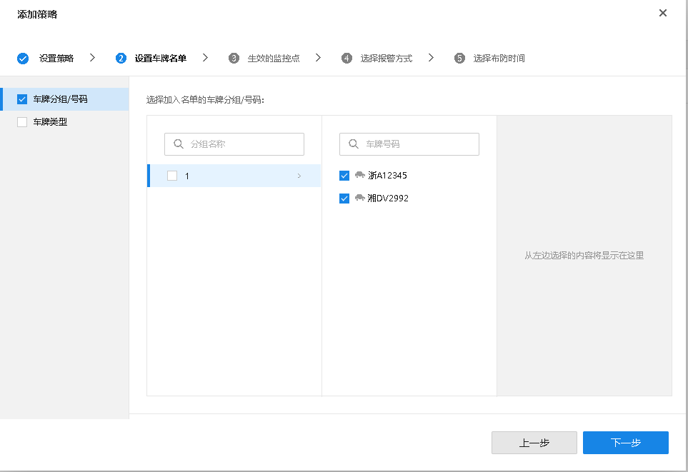
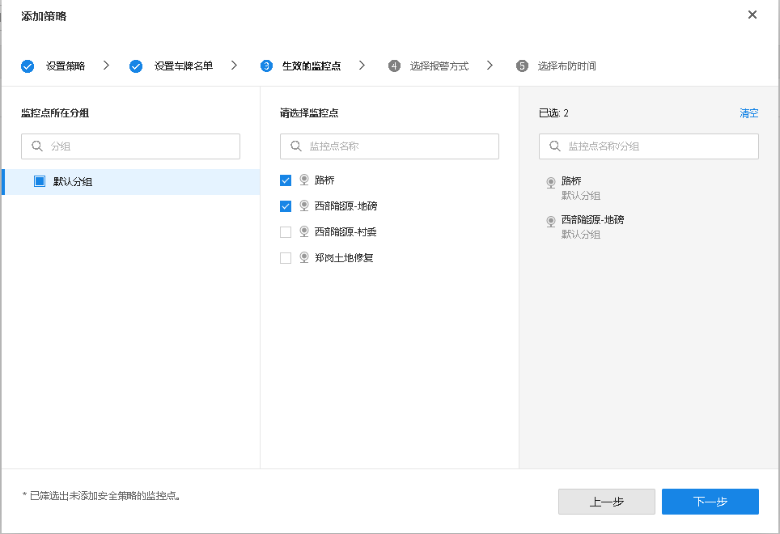
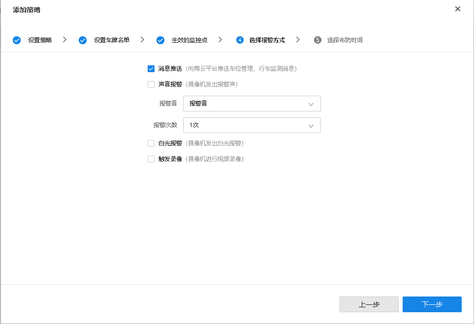
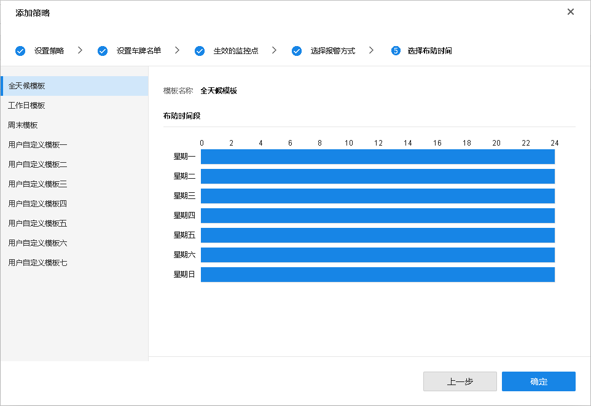

# 车牌黑白名单

**进入页面：项目 >> 监控管理 >> 车辆管理 >> 车牌黑白名单**，可以对车牌设置布防策略。

#### 编辑布防时间模板

点击右上角<布防时间模板>，可自定义时间模板，点击后方按钮，可将设置复制到其他日期。

#### 添加布防策略

点击右上角<添加策略>，选择名单类型，输入策略名称，点击<下一步>。

勾选分组下的需要设置的车牌号码，点击<下一步>。

勾线生效的监控点，点击<下一步>。

选择报警方式，点击<下一步>。

选择布防时间，点击<确定>。

