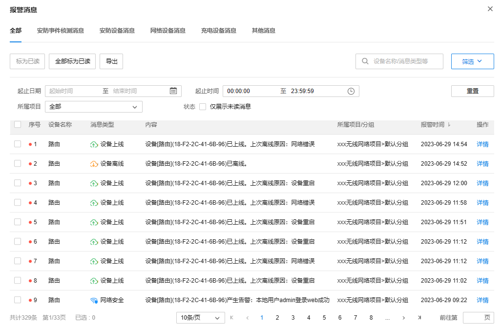
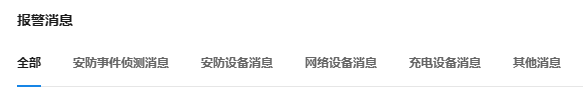
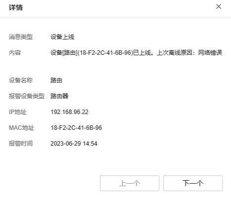

# 消息

登录进入 TP-LINK 商用云平台，点击页面上方<消息>进入报警消息界面。

|   
---|---  
标为已读| 将选中报警消息（可多选）标为已读。  
全部标为已读| 将列表内所有报警消息标为已读。  
导出| 将报警消息以列表形式导出到本地。  
搜索| 可根据设备名称及消息类型等信息对列表内报警消息进行搜索。  
筛选| 可根据起止时间、所属项目及消息状态等信息对列表内报警消息进行筛选。  
  
在报警消息页面上方，可选择查看全部报警消息，或根据类型查看报警消息，报警消息分为：安防事件侦测消息、安防设备消息、网络设备消息、充电设备消息及其他消息。

在报警消息列表中，点击<详情>可查看报警信息详情，包括消息类型、内容、设备名称、报警设备类型、IP 地址、MAC 地址及报警时间等信息。

