# AAA

#### 账号管理

**1** 、认证账号：编辑认证账号信息

**进入页面的方法：项目** **> >** **网络管理** **> >** **云认证计费** **> >** **AAA**

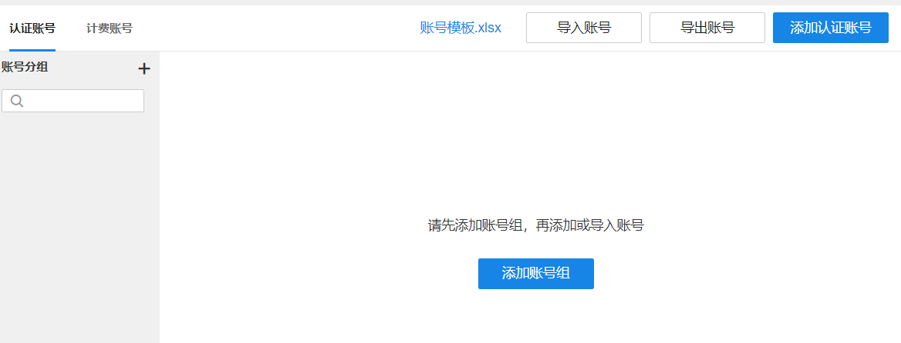

配置流程：

**添加账号组：** 点击<添加账号组>进行配置，填写账号组名称；点击<关联权限>，点击<添加权限>，填写具体信息。

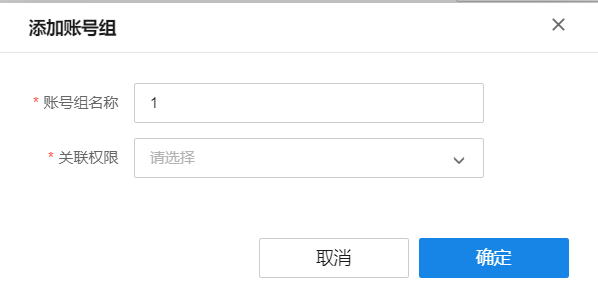

|   
---|---  
账号组名称| 自定义的账号组名称。  
  
**配置关联权限** ：设置账号组内账号的使用权限，包括终端允许使用的带宽、允许同时上线的终端数等

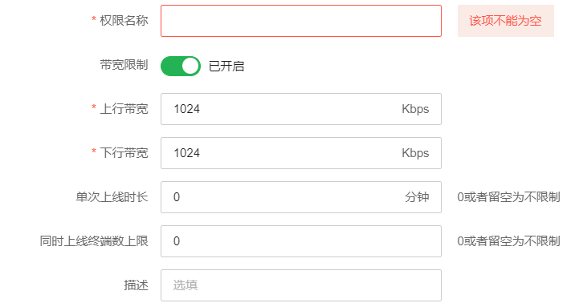

|   
---|---  
权限名称| 自定义的权限名称。  
带宽限制| 设置用户允许使用的最大上/下行带宽，0 表示不限制。  
单次上线时长| 每次认证后允许用户上网的时长。  
同时上线终端数上限| 最多允许同时使用该账号登录的终端数量。  
描述| 自定义的备注信息  
  
**添加认证账号** ：自定义认证账号信息

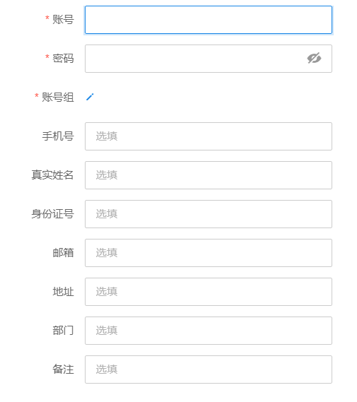

|   
---|---  
账号| 用户认证登录的账号。  
密码| 用于认证登录的密码。  
账号组| 选择该自定义账号所属的账号组。  
  
**导入账号** /**导出账号** ：点击<导入账号>、<导出账号>可批量导入、导出所有账号信息。

**认证账号状态栏介绍：**

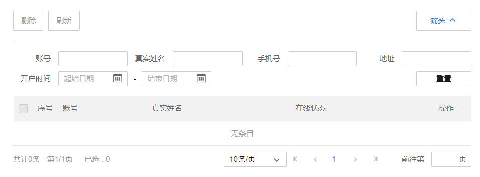

点击<筛选>可对认证账号进行筛选，可自定义根据账号、真实姓名、手机号、地址以及开户时间来筛选。

**2、** **计费账号：编辑计费账号信息，分为自助注册账号和自定义账号组**

（1）自助注册账号：由用户自行注册账号，在商云上将自助账号组关联套餐即可

配置方法：

点击<编辑>按钮将账号组关联套餐。

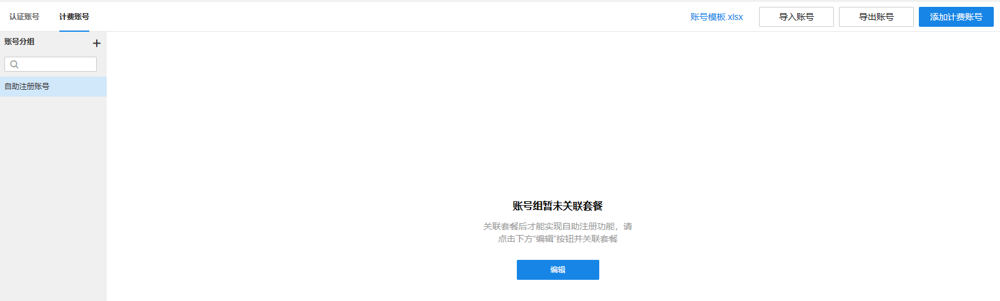

点击<请选择>，配置账号关联的套餐。

选择要绑定到自助账号的套餐，并调整排序，排序靠前的套餐在自助系统优先展示。

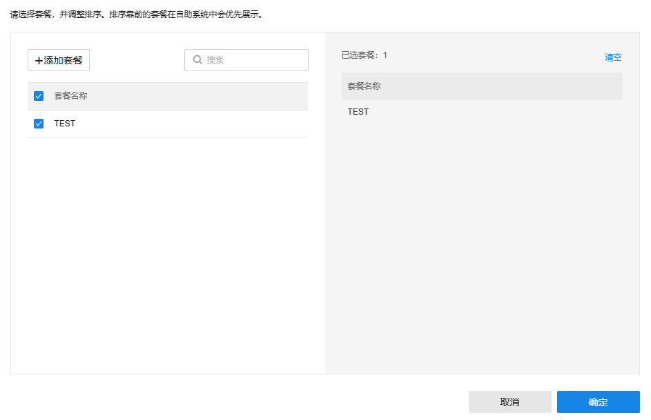

点击<确定>完成配置。绑定套餐后可编辑账号字段，可自定义用户自助注册账号时需要填写的信息，并选择是否将相关信息同步到用户自助系统中。

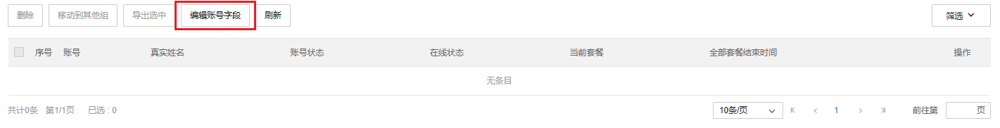

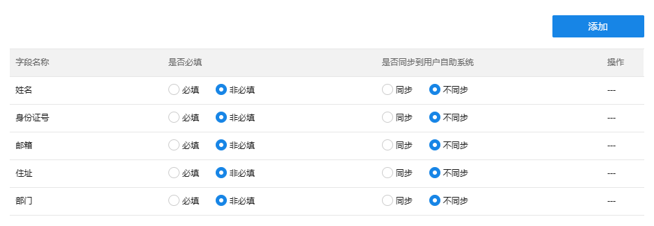

（2）自定义账号组：由项目管理员手动注册的账号组

配置方法：

在账号分组中点击<+>按钮，添加账户组。

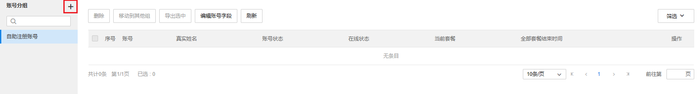

配置账号组名称，点击<请选择>配置关联的套餐。

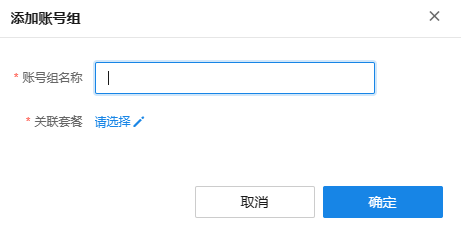

选择要绑定到自定义账号组的套餐，并调整排序，排序靠前的套餐在自助系统优先展示。

点击<确定>完成配置。绑定套餐后可编辑账号字段，可选择自定义账号时需要填写的信息，并选择是否将相关信息同步到用户自助系统中。

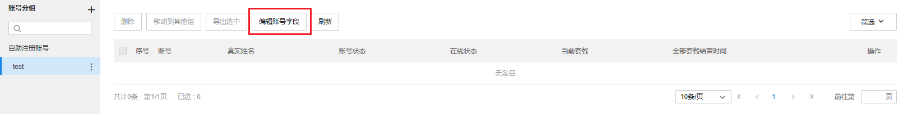

#### 权限管理

**编辑和修改权限策略的配置**

**进入页面的方法：项目** **> >** **网络管理** **> >** **云认证计费** **> >** **AAA >>** **权限管理**

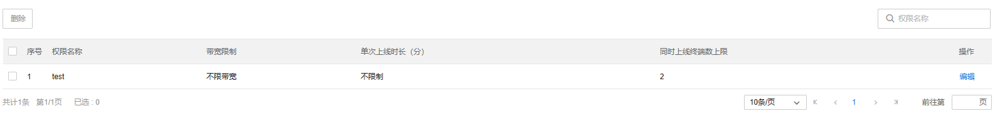

|   
---|---  
权限名称| 自定义的权限名称。  
带宽限制| 设置用户允许使用的最大上/下行带宽，0 表示不限制。  
单次上线时长| 每次认证后允许用户上网的时长。  
同时上线终端数上限| 最多允许同时使用该账号登录的终端数量。  
描述| 自定义的备注信息。  
  
#### 套餐管理

**编辑和修改用户套餐的配置**

**进入页面的方法：项目** **> >** **网络管理** **> >** **云认证计费** **> >** **AAA >>** **套餐管理**

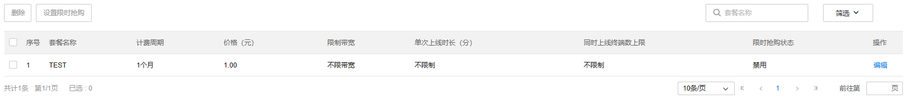

配置步骤：

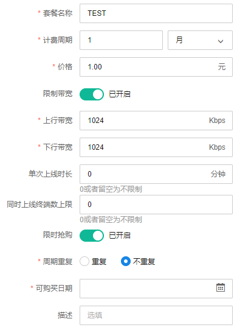

|   
---|---  
套餐名称| 自定义的套餐名称。  
计费周期| 套餐可使用的时长，可选时间周期为年、月、日、小时。  
价格| 套餐的价格。  
限制带宽| 限制用户可使用的上下行带宽。  
单次上线时长| 每次认证后允许用户上网的时长。  
同时上线终端数上限| 最多允许同时使用该账号登录的终端数量。  
限时抢购| 设置套餐的优惠策略。  
周期重复| 设置显示抢购是否重复周期。  
  
#### 黑名单

**编辑和修改认证的黑名单，黑名单内的账号** /**设备无线认证上网**

进入页面的方法：项目 >> 网络管理 >> 云认证计费 >> AAA >> 黑名单

  1. 账号黑名单：配置账号黑名单，黑名单支持导入导出

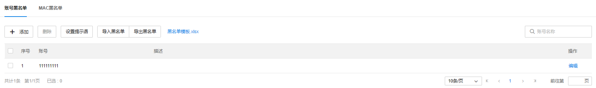

**配置步骤：**

点击<添加>，编辑要拉黑的账号信息，点击<确定>完成配置。

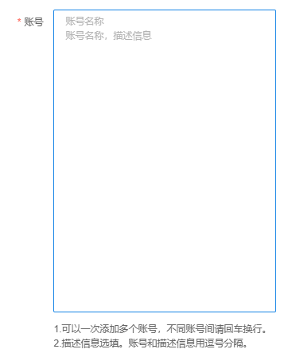

点击<设置提示语>可自定义修改黑名单内账号登录时的提示语。

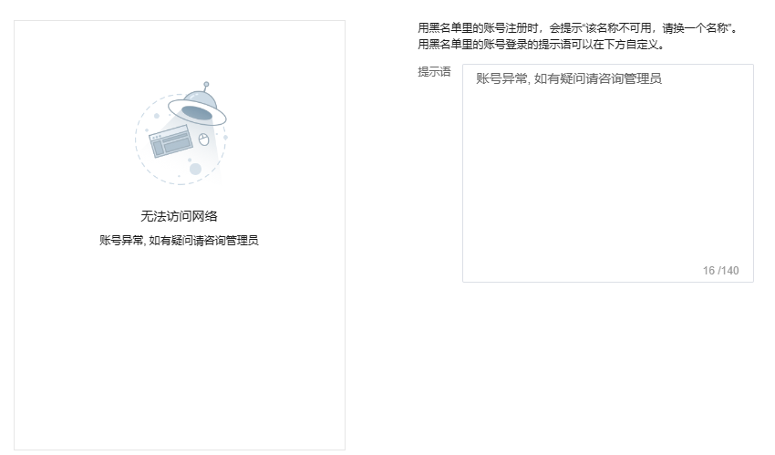

  2. MAC 黑名单：配置 MAC 黑名单，黑名单支持导入导出。

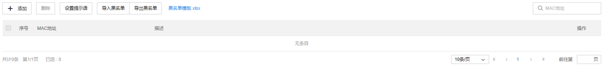

**配置步骤：**

点击<添加>， 编辑要拉黑的设备 MAC 信息，点击<确定>完成配置。

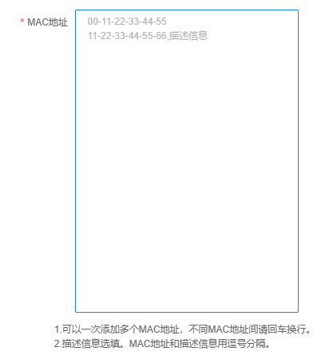

点击<设置提示语>可自定义修改 MAC 黑名单内的终端登录时的提示语。

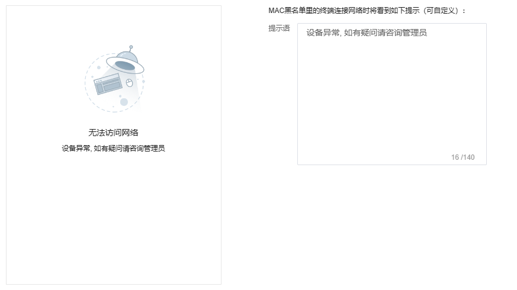
