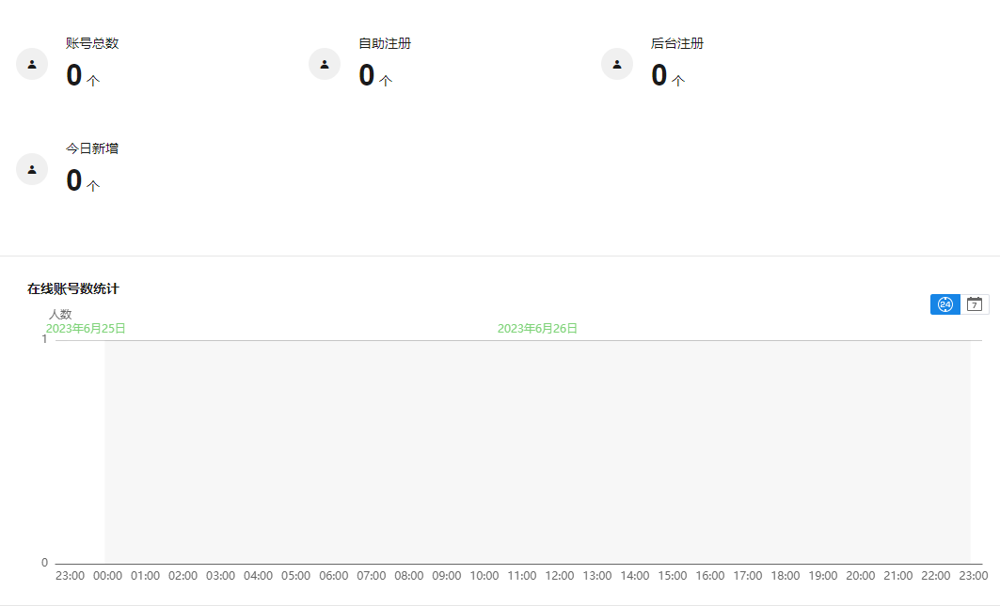
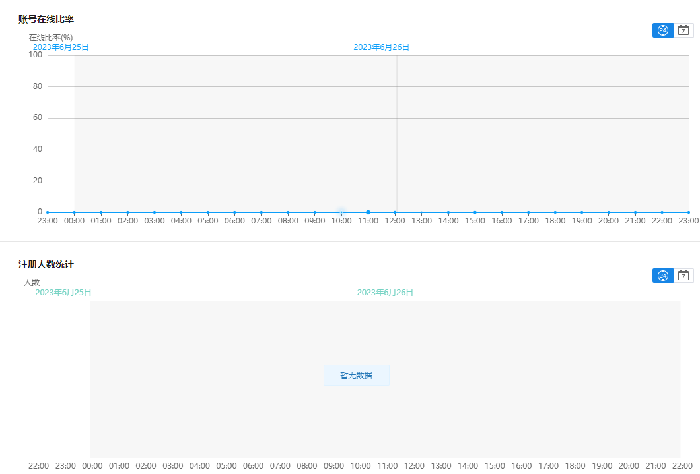
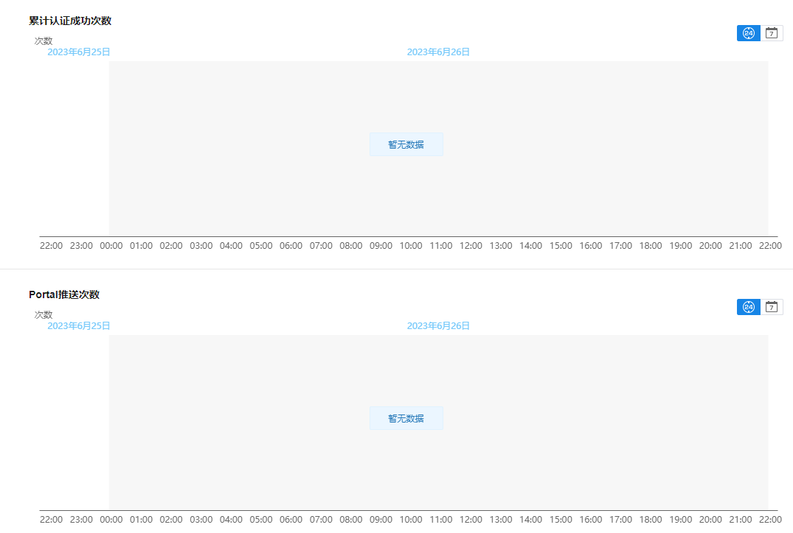
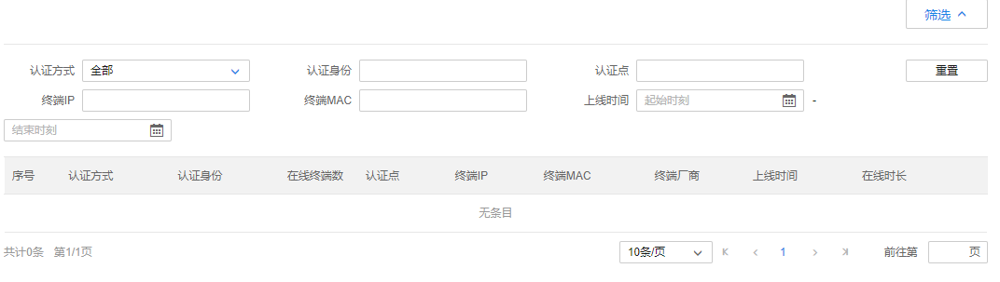
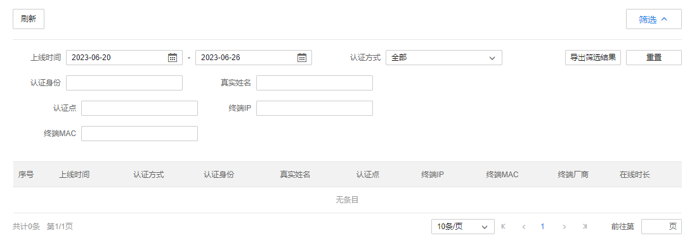
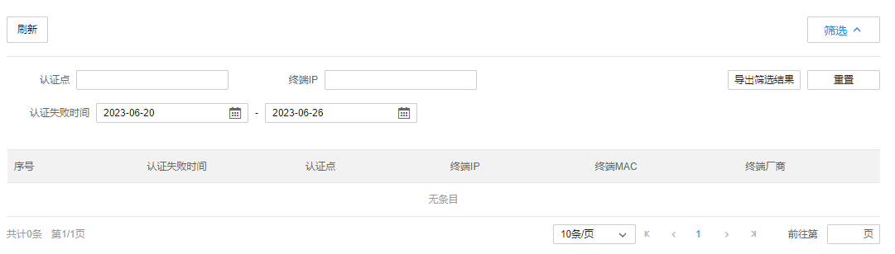
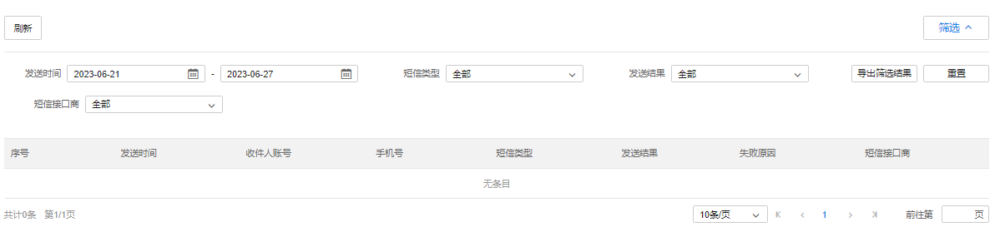
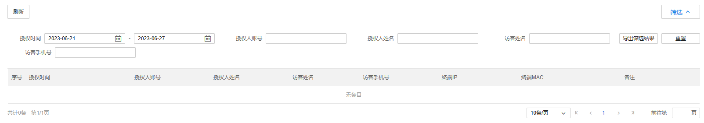
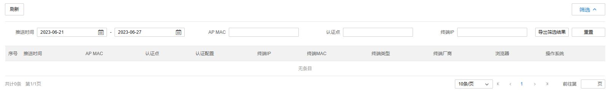

# 云认证数据

#### 统计分析

对当前的在线人数、账号在线比率、注册人数、累计认证成功次数进行数据统计。

#### 在线账号

**进入页面的方法：云认证数据 >> 在线账号**

可查看当前所有在线账号，及其认证方式、认证身份、在线终端数、终端 IP、终端 MAC、终端厂商、上线时间和在线时长，也可通过认证方式等条目来筛选记录结果。

点击<导出筛选结果>可将筛选后的记录批量导出。

点击<重置>，将恢复默认状态。

#### 上网记录

**进入页面的方法：云认证数据 >>上网记录**

可查看不同账户的上线时间、认证方式、认证身份、终端 IP、终端 MAC、认证点、终端厂商和在线时长等信息，也可通过上线时间等条目来筛选记录结果。

认证点：绑定认证配置的网络设备。

点击<导出筛选结果>可将筛选后的记录批量导出

点击<重置>，将恢复默认状态。

#### 认证失败记录

**进入页面的方法：云认证数据 >> 认证失败记录**

可查看当前所有认证失败记录，及其认证失败时间、认证点、终端 IP、终端 MAC、终端厂商，也可通过认证点等条目来筛选记录结果。

点击<导出筛选结果>可将筛选后的记录批量导出

点击<重置>，将恢复默认状态。

#### 短信记录

**进入页面的方法：云认证数据 >>短信记录**

可查看当前所有短信认证账号记录，及其收件人账号、短信类型、发送时间、发送结果、失败原因和短信接口商，也可通过短信类型等条目来筛选记录结果。

点击<导出筛选结果>可将筛选后的记录批量导出。

点击<重置>，将恢复默认状态。

#### 访客授权记录

**进入页面的方法：云认证数据 >>访客授权记录**

可查看当前所有访客授权记录，可通过授权人账号、授权人姓名、访客姓名等条目来筛选记录结果。

点击<导出筛选结果>可将筛选后的记录批量导出

点击<重置>，将恢复默认状态。

#### Portal 推送记录

进入页面的方法：云认证数据 >> Portal 推送记录

可查看当前所有 Portal 推送记录，及其收件人账号、短信类型、发送时间、发送结果、失败原因和短信接口商，也可通过短信类型等条目来筛选记录结果。

点击<导出筛选结果>可将筛选后的记录批量导出

点击<重置>，将恢复默认状态。
