# 云认证配置

#### 组合认证

##### 认证策略

在指定的时间、指定的地点（SSID、认证点、AP 组）、对指定的用户组（IP 组）采用指定的认证配置。

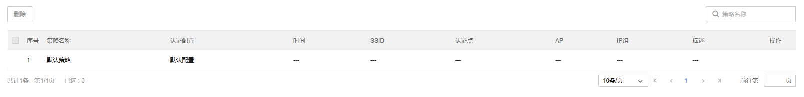

**配置方法：**

点击<添加认证策略>，选择认证配置，绑定 SSID，并选择认证策略需要匹配的条件。点击<确定>完成配置。

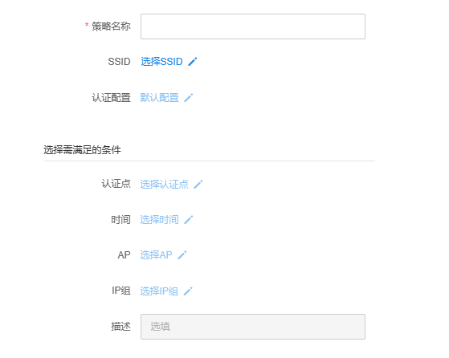

> 说明：
> 
> 默认认证策略优先级最低，当其他策略都未命中时，默认策略才会生效。默认策略不支持删除和编辑操作，如需修改默认策略的认证配置，请在“云认证配置-认证配置”页将指定认证配置设为默认。

##### 认证配置

**进入页面的方法：项目 >> 网络管理 >> 云认证计费 >> 云认证配置 >> 组合认证 >> 认证配置**

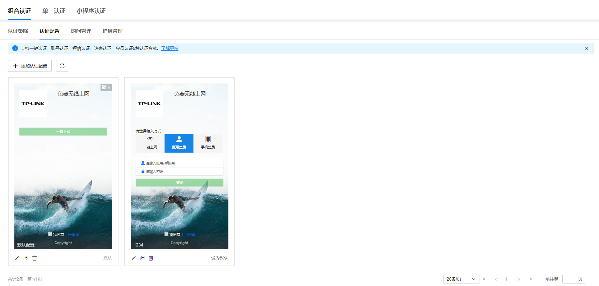

编辑该默认配置，可以启用无感知认证和自助系统。

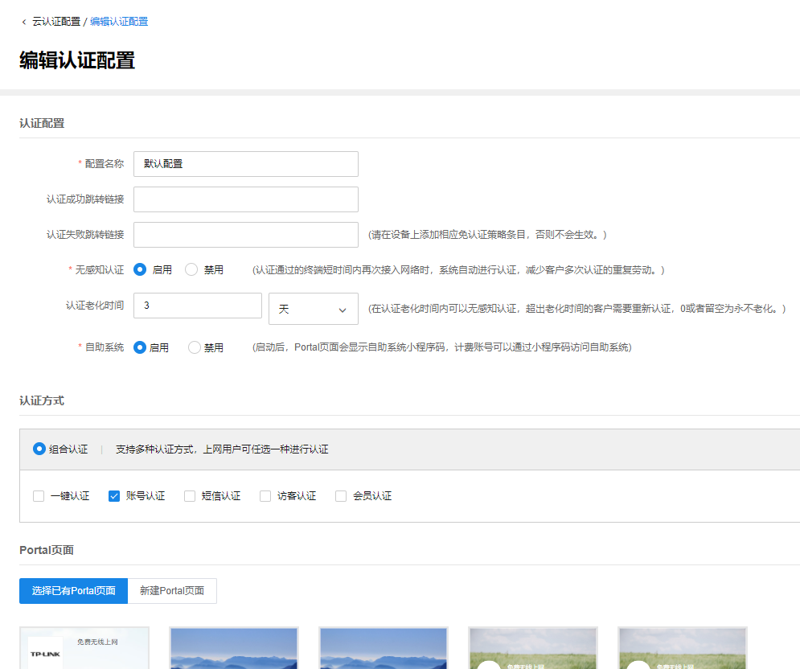

认证方式选择账号认证，并新建 Portal 页面。

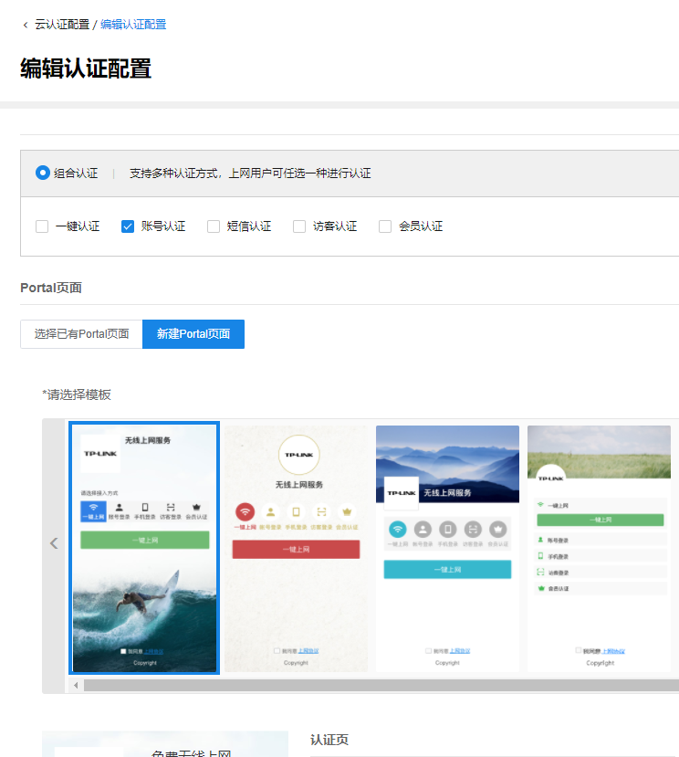

选定一个 Portal 页面模板后，就可以对认证页和认证成功页进行配置。

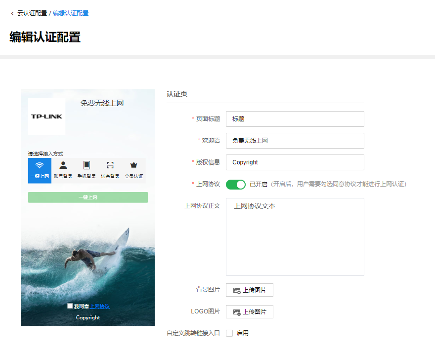

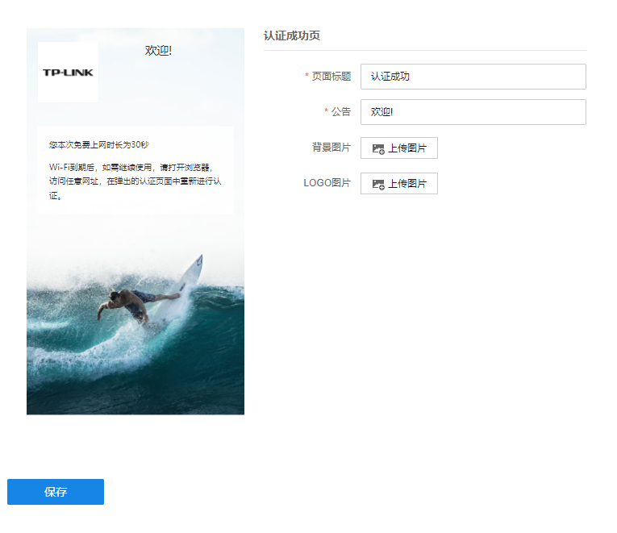

##### 时间管理

自定义设置希望认证计费配置生效的时间

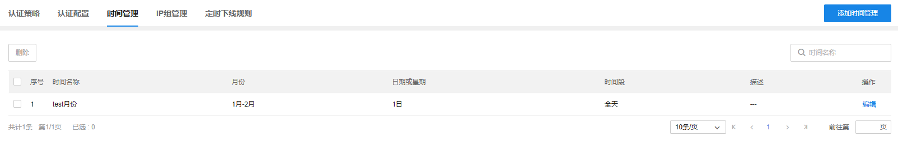

**配置方法：**

点击<添加时间管理>，配置时间名称以及具体规则。

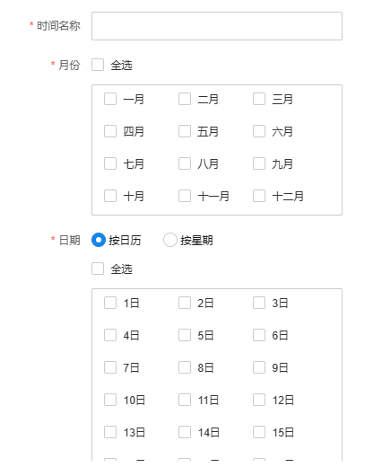

##### IP 组管理

自定义需要进行认证的 IP 地址组。

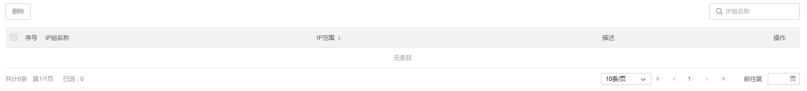

点击<添加 IP 组>，填写 IP 组名称以及需要进行认证的 IP 地址段，有 IP 地址段或 IP+掩码两种输入方式。

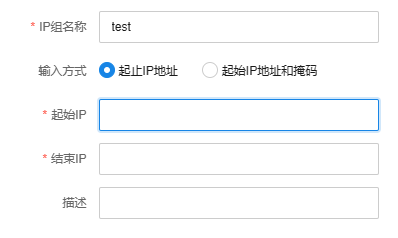

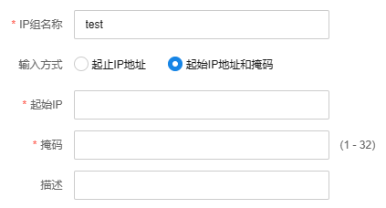

#### 单一认证

##### 单一认证配置

对符合特定条件（SSID、VLAN/接口）的终端用户，采用看视频认证、答题认证的认证配置。

**进入页面的方法：项目** **> >** **网络管理** **> >** **云认证计费** **> >** **云认证配置** **> >** **单一认证** >>**单一认证配置** 。

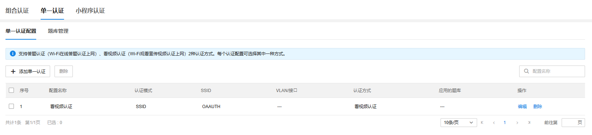

点击<添加单一认证>，即可进入如下单一认证的配置界面。

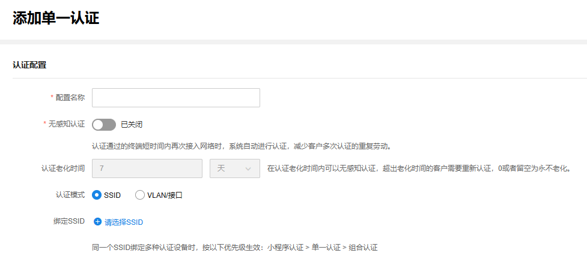

单一认证的基本配置：

单一认证可以选择基于的认证模式，包括 SSID 模式和 VLAN/接口模式。

SSID 模式，即 SSID 作为单一认证配置的匹配条件，需要绑定 SSID；

VLAN/接口模式，即 VLAN/接口作为单一认证配置的匹配条件，需要绑定 VLAN/接口。

> 说明：
> 
> 同一个 SSID 绑定多种认证设备时，按以下优先级生效：小程序认证 > 单一认证 > 组合认证。

单一认证的认证方式：

单一认证包括答题认证和看视频认证两种，顾名思义，同一条单一认证配置，只能选择一种认证方式，不可以进行组合。

l 答题认证，即终端用户在上网认证前，需要进行指定的答题操作，完成后方可认证成功；

l 看视频认证，即终端用户在上网认证前，需要强制观看一段指定的视频，完成后方可认证成功；

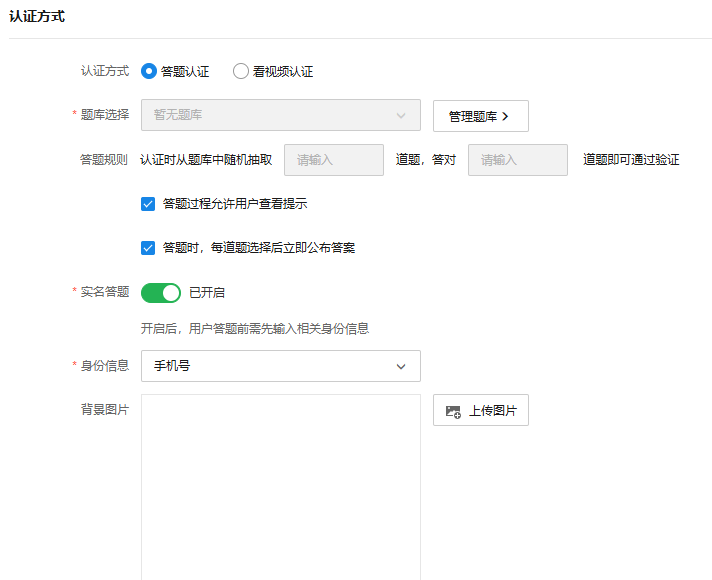

> 说明：
> 
> l 答题认证需要事先编辑好题库，然后选择需要的题库。具体题库的创建与管理等操作，可以前往 **单一认证** >>**题库管理** 。
> 
> l 对于看视频认证，本功能仅支持 URL 格式的视频，需要预先准备好视频地址，并填入看视频认证的视频地址填写框中。需注意的是，仅支持 HTTPS 的视频 URL 且需要为该 URL 地址添加免认证策略条目，否则不会生效。

##### 题库管理

题库管理主要用于答题认证，作为答题认证中题库的所有来源和依据，可以进行题库的添加和编辑管理操作，并提供一定的用户答题记录分析功能。

初次使用题库管理时，需要先添加题库。

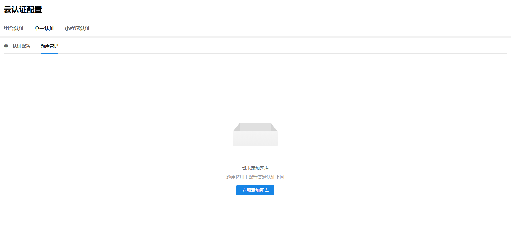

创建好题库后，可以点击<添加题目>按钮进行题目的自定义添加。对于批量添加操作，该功能支持批量导入题目。

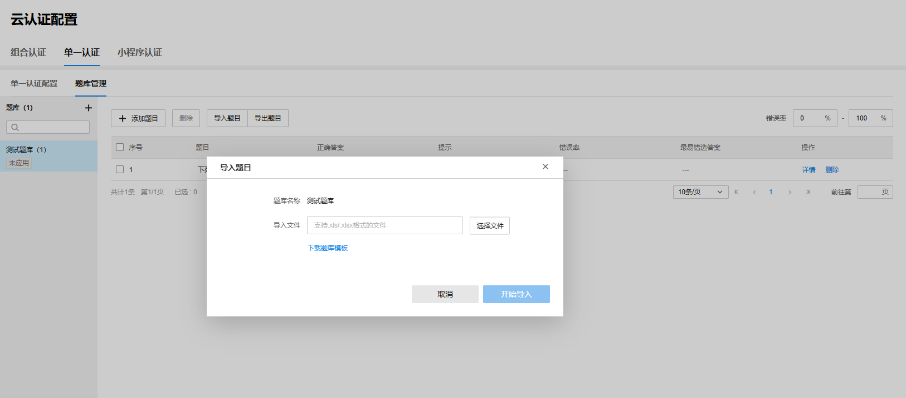

> 说明：
> 
> 批量导入题目前，需要事先下载题库的模板，严格按照题库模板中的格式对题库文件进行编辑，以免格式错乱导致系统识别有误。

点击题目列表右侧操作栏的<详情>按钮，可以查看终端上网用户对该道题目的答题情况。

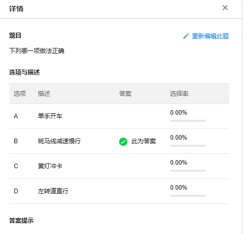

#### 小程序认证

##### 小程序认证概述

小程序认证，是指对符合特定条件（SSID、VLAN/接口）的终端用户，借助微信小程序进行认证上网的认证方式。

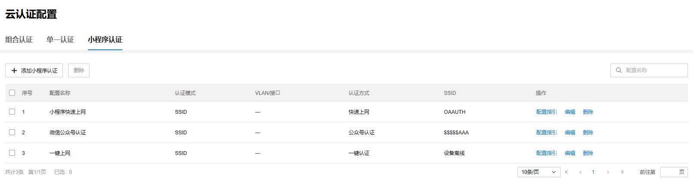

小程序认证配置完成后，会在小程序认证列表页面新增一个配置条目，针对某个配置条目，可以进行查看配置指引、编辑以及删除等操作。

说明：

l 公众号认证的配置指引样式如下，具体操作步骤可参考公众号认证设置教程

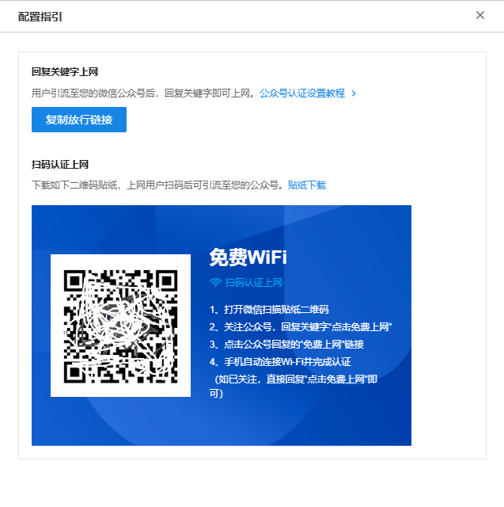

l 其他认证方式的配置指引样式如下，可以下载对应小程序二维码，打印贴纸便于用户扫码进行上网。支持在指定的公众号中内嵌认证的小程序跳转地址，详情可参见微信公众平台设置教程。

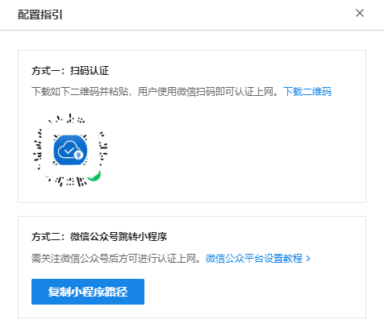

##### 添加/编辑小程序认证

**进入页面的方法：项目** **> >** **网络管理** **> >** **云认证计费** **> >** **云认证配置** **> >** **小程序认证** >>**添加小程序认证**

小程序认证配置主要分四部分：

认证配置、认证方式、Portal 页面、绑定 SSID

l **认证配置**

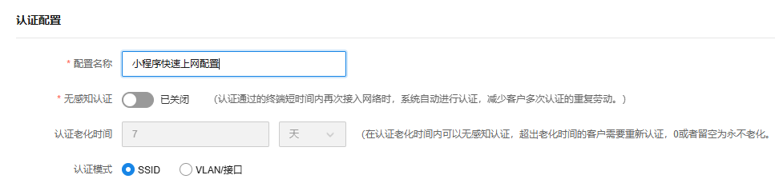

小程序认证可以选择基于的认证模式，包括 SSID 模式和 VLAN/接口模式。

SSID 模式，即 SSID 作为小程序认证配置的匹配条件，需要绑定 SSID；

VLAN/接口模式，即 VLAN/接口作为小程序认证配置的匹配条件，需要绑定 VLAN/接口。

l **认证方式**

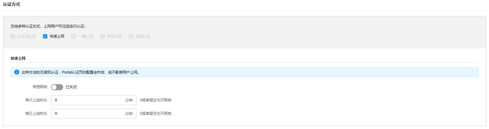

支持公众号认证、快速上网、一键认证、账号认证、短信认证等认证方式。

> 说明：
> 
> （1） 公众号认证，上网用户需要关注指定的公众号后即可快速上网。需要配置指定的公众号的相关信息，包括公众号名称、公众号二维码、关键字、认证 token 等。选择了公众号认证，不可和其他认证方式组合勾选。
> 
> （2） 快速上网，上网用户直接扫描二维码打开小程序即可快速上网，无需其他操作。选择了快速上网，不可和其他认证方式组合勾选。快速上网认证配置完成后，系统会生成二维码。二维码的下载路径如下：小程序认证-小程序认证配置条目列表-操作-配置指引。
> 
> （3） 一键认证、账号认证、短信认证，三者之间可以组合勾选，与组合认证-认证配置中对应的认证方式相同。值得注意的是，此处的一键认证、账号认证、短信认证都是在小程序中进行的，必须借助小程序完成上述认证流程。

#### 定时下线规则

配置终端统一下线的定时规则。

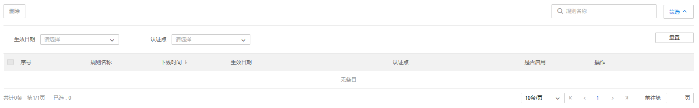

点击<添加 IP 组>，填写规则名称、下线时间和生效日期，并选择需要生效该规则的认证点。

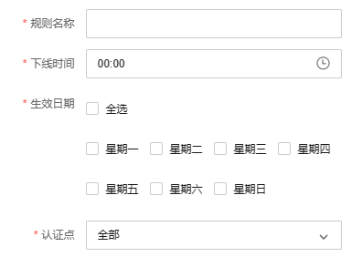
