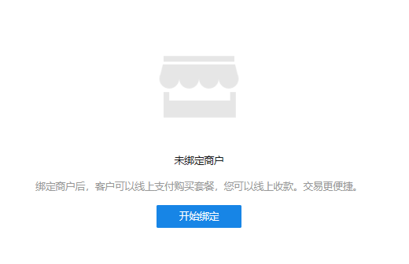
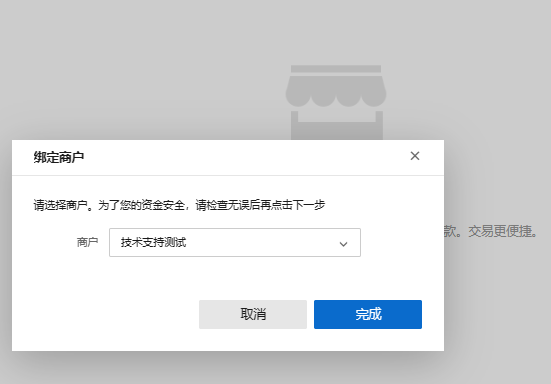
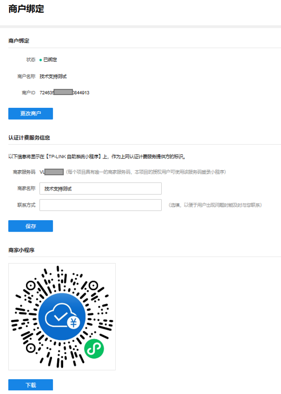
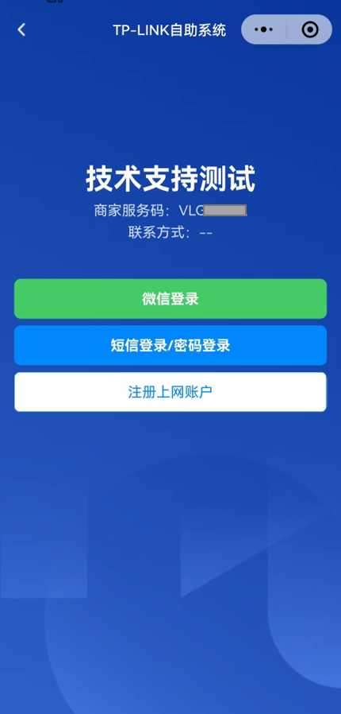

# 商户绑定

**进入页面的方法：项目 >>网络管理>>云认证计费>>商户绑定**

点击开始绑定，选择需要绑定的商户。

完成绑定后，所绑定的商户信息将在该页面展示。

|   
---|---  
商户绑定| 查看目前项目绑定的商户具体名称与 ID，可更改商户  
认证计费服务信息| 商家服务码、商家名称、联系方式的信息将显示在【TP-LINK 自助系统小程序】上，作为上网认证计费服务提供方的标识，联系方式可选填。  
商家小程序| 生成的云认证小程序码，可直接下载通过扫码进入用户自助系统。  
  
扫描商家小程序，呈现的页面将展现认证计费服务信息。

