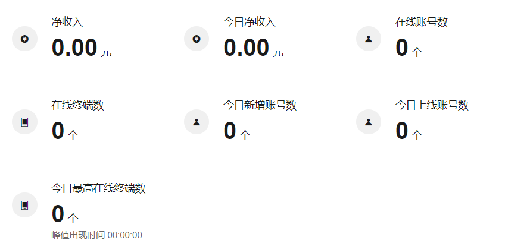
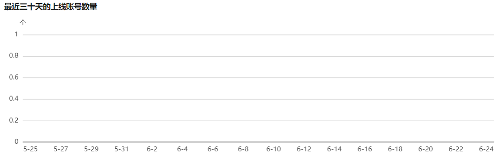
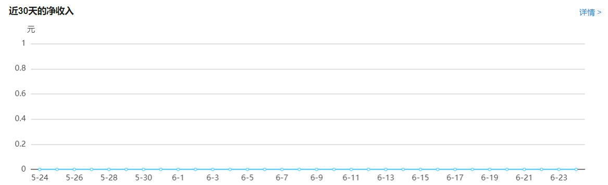
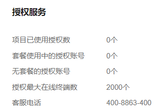

# 概览

可查看云认证计费运营概况。

**进入页面的方法：项目 >>** **网络管理** **> >** **云认证计费** **> >** **概览**

**数据概览：**

|   
---|---  
净收入| 云认证计费项目累计净收入。  
今日净收入| 当日云认证计费项目累计净收入。  
在线终端数| 当前在线终端的数量。  
今日新增账号数| 当日新增的账号数量。  
今日上线账号数| 当日曾上过线的账号数量  
今日最高在线终端数| 展示当日同时在线终端的最高数量，并记录在线终端数峰值的时间。  
  
**最近三十天的上线账号数量** ：展示近三十天上线账号的数量变化趋势。

**账号类型** ：展示在线终端的认证账号类型

点击<详情>可跳转至 云认证计费 >> AAA >> 账号管理 栏目，详见 [AAA](<um_5_5_3>)。

**近 30 天的净收入** ：展示云认证计费项目近 30 天的净收入变化趋势

点击<详情>可跳转至 云认证计费>>营帐管理>>营业报表栏目，详见 [营帐管理](<um_5_5_4>)。

**授权服务** ：展示项目的账号授权信息

