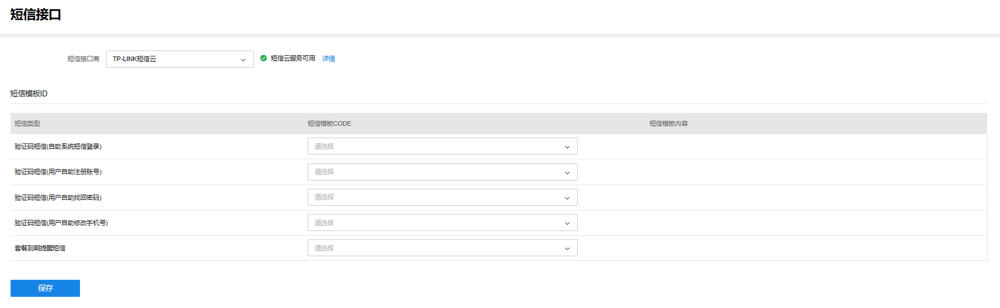
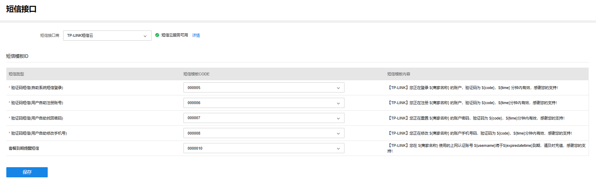

# 短信接口

**进入页面的方法：项目 >> 网络管理 >> 云认证计费 >> 短信接口**

短信接口商选择 TP-LINK 短信云，短信模板 ID 均为固定模板，可根据实际需求选择开启。

|   
---|---  
自助系统短信登录| 允许用户在自助系统通过短信进行登录。  
用户自助找回密码| 允许用户在忘记密码时，通过自助系统绑定的手机号等信息进行密码找回。  
用户自助注册账号| 允许用户在自助系统自主注册账号。  
用户自助修改手机号| 允许用户在自助系统修改手机号。  
套餐到期提醒短信| 当用户所拥有的套餐即将到期时，发送短信提醒。
