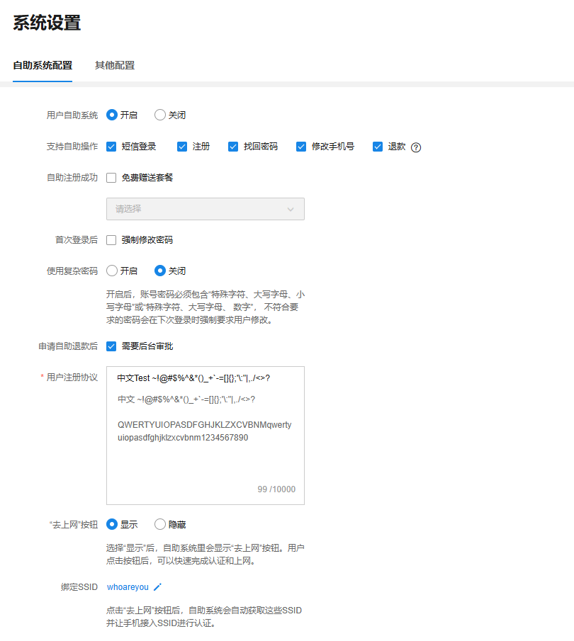
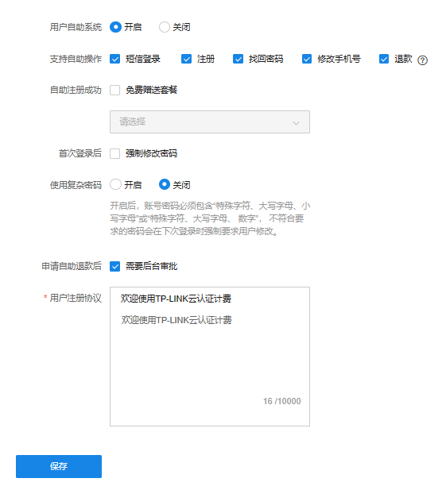
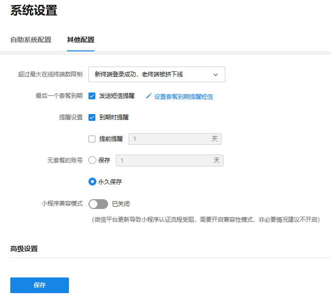

# 系统设置

#### 自助系统配置

**进入页面的方法：项目 >> 网络管理 >> 云认证计费 >> 系统设置 >> 自助系统配置**

如需让用户能自主进行账号注册、短信登录、找回密码、修改手机号、购买套餐、查看套餐状态等可开启用户自助系统。

#### 其他配置

**进入页面的方法：项目 >> 网络管理 >> 云认证计费 >> 系统设置 >> 其他配置**

1） 超过云认证最大在线终端数限制，系统默认是新终端登录成功，老终端被挤下线。如有需要，可以设置成新终端无法登录。

2） 套餐到期提醒功能，可以在此页面设置最后一个套餐到期提醒。需要消耗短信，可以按需选择是否开启。

3） 无套餐账号清除功能，即部分用户实际注册了账号，占用了云认证计费的授权点位，但是没有购买或使用套餐，可以设置保留一定时间后删除此类账号，恢复被占用的点位。

4） 小程序兼容模式，微信平台更新导致小程序认证流程受阻，需要开启兼容性模式，非必要情况建议不开启。
